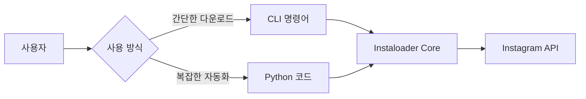
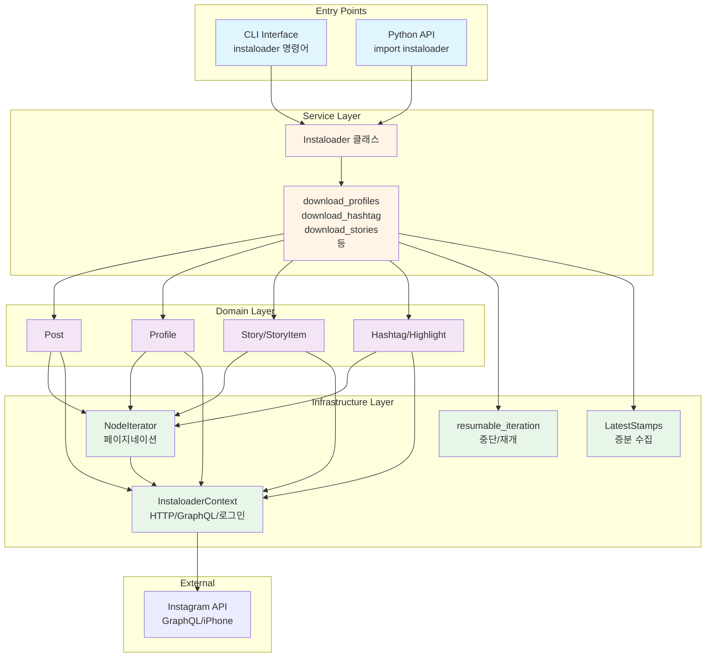
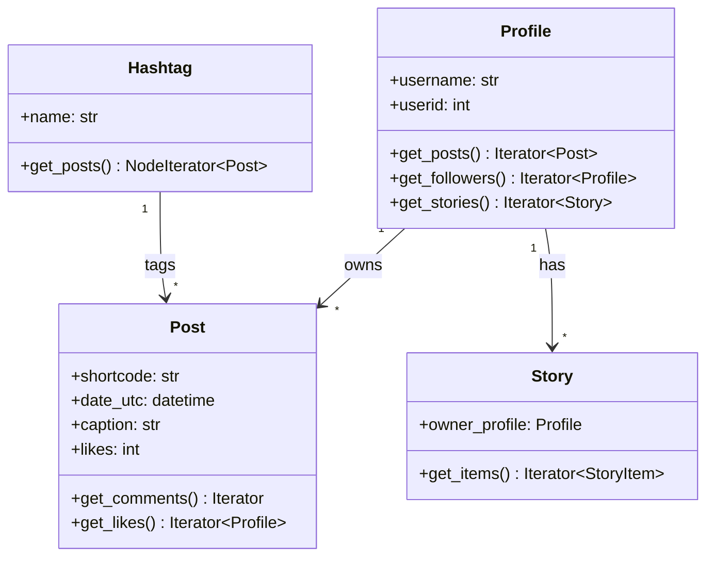
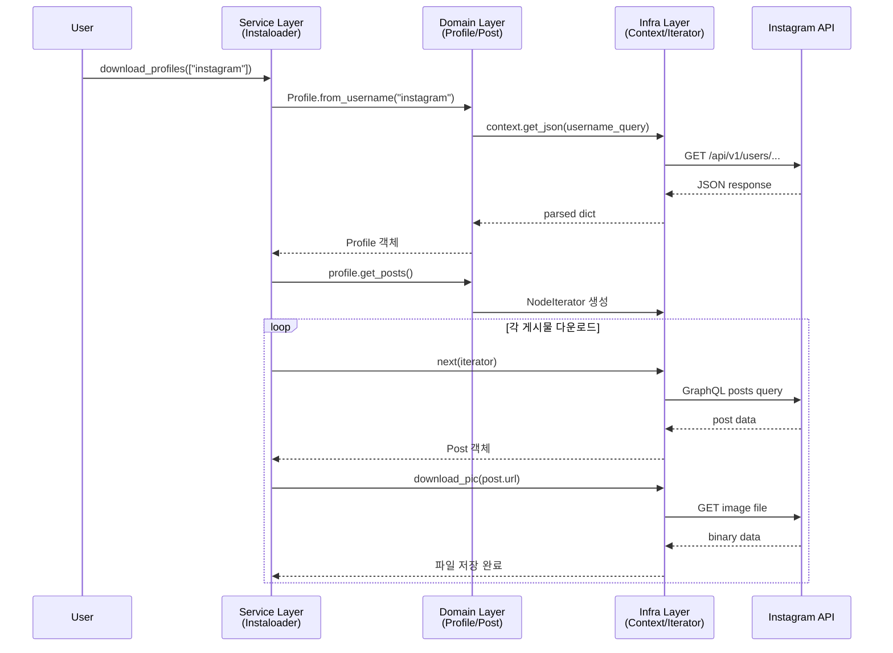
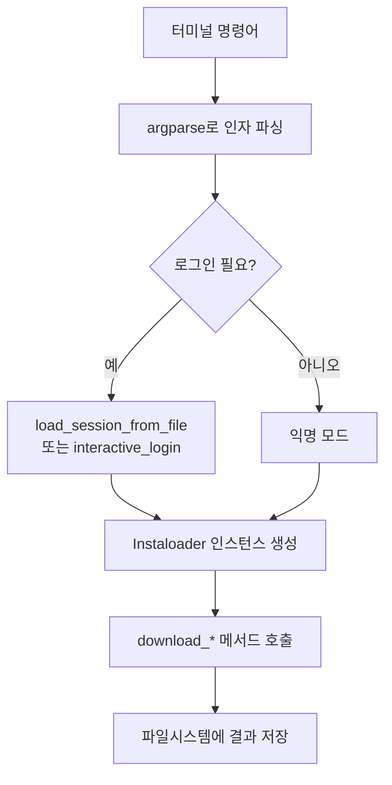
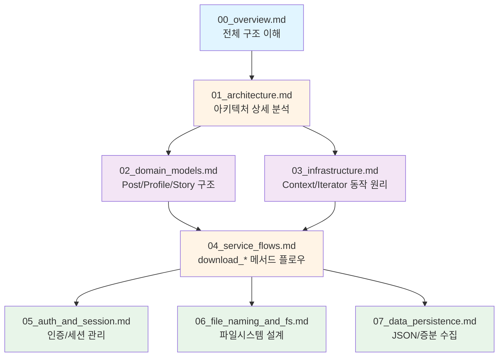

# Instaloader 프로젝트 개요

> **학습 목표**
> - Instaloader의 전체 아키텍처와 설계 철학 이해하기
> - 3-Tier 레이어 구조(Service/Domain/Infra)의 책임 분리 원칙 파악하기
> - CLI와 Python API 모드의 차이점과 활용 방법 학습하기

## 1. Instaloader란 무엇인가?

### 1.1 프로젝트 정의

**Instaloader**는 Instagram의 게시물, 스토리, 프로필 정보 등을 다운로드하는 오픈소스 도구임.
다음 두 가지 사용 모드를 제공함:

1. **CLI 도구**: 터미널에서 명령어로 즉시 다운로드
2. **Python 라이브러리**: 복잡한 워크플로우를 위한 프로그래밍 인터페이스



### 1.2 핵심 특징

| 특징 | 설명 |
|-----|------|
| **메타데이터 보존** | 캡션, 댓글, 위치, 좋아요 수 등 모든 정보 저장 |
| **증분 다운로드** | 이전 실행 이후 새 게시물만 다운로드 (시간/비용 절감) |
| **재개 기능** | 중단된 다운로드를 자동으로 이어서 실행 |
| **유연한 필터링** | 날짜, 타입, 커스텀 조건으로 대상 선택 |
| **프로필 추적** | 사용자 이름 변경 자동 감지 및 폴더명 동기화 |

### 1.3 실전 활용 사례

```python
# 사례 1: 마케팅 분석용 데이터 수집
# - 경쟁사 계정의 게시물 트렌드 분석
# - 해시태그별 인기 콘텐츠 연구

# 사례 2: 아카이빙
# - 개인 Instagram 백업
# - 특정 이벤트/캠페인 기록 보존

# 사례 3: 연구/교육
# - 소셜 미디어 연구용 데이터셋 구축
# - 컴퓨터 비전 학습용 이미지 수집
```

---

## 2. 3-Tier 아키텍처 개관

Instaloader는 **관심사의 분리(Separation of Concerns)** 원칙에 따라 세 개의 레이어로 설계됨.

### 2.1 레이어 구조 다이어그램



### 2.2 각 레이어의 책임과 역할

#### 🔵 Service Layer (서비스 레이어)

**책임**: 비즈니스 로직 조율 및 사용자 요구사항 처리

| 요소 | 설명 | 주요 메서드 |
|-----|------|-----------|
| `Instaloader` 클래스 | 다운로드 전략 총괄 | `download_profiles()`<br/>`download_hashtag()`<br/>`download_stories()`<br/>`download_feed_posts()` |
| 옵션 관리 | 파일명 패턴, 필터링 규칙 설정 | `dirname_pattern`<br/>`filename_pattern`<br/>`post_filter` |
| 에러 처리 | 실패 시 재시도/로깅 전략 | `error_catcher`<br/>`raise_errors` |

**핵심 질문**: "무엇을 어떻게 다운로드할 것인가?"

#### 🟣 Domain Layer (도메인 레이어)

**책임**: Instagram 엔티티의 Python 객체 표현



**특징**:
- 각 도메인 객체는 **데이터와 행위**를 함께 캡슐화
- Lazy Loading: 필요한 시점에만 추가 API 호출
- Context 의존: 모든 네트워크 작업은 `InstaloaderContext`를 통해 수행

#### 🟢 Infrastructure Layer (인프라 레이어)

**책임**: 기술적 복잡성 추상화

| 컴포넌트 | 역할 | 해결하는 문제 |
|---------|------|-------------|
| `InstaloaderContext` | HTTP 세션/인증 관리 | "어떻게 Instagram과 통신하는가?" |
| `NodeIterator` | GraphQL 페이지네이션 | "대량 데이터를 어떻게 효율적으로 가져오는가?" |
| `resumable_iteration` | 중단/재개 메커니즘 | "네트워크 장애 시 처음부터 다시 시작해야 하는가?" |
| `LatestStamps` | 타임스탬프 추적 | "이미 다운로드한 항목을 어떻게 건너뛰는가?" |

---

### 2.3 레이어 간 데이터 흐름 예시

**시나리오**: 사용자가 `instagram` 프로필의 게시물 10개를 다운로드



**핵심 포인트**:
1. Service는 Domain 객체만 다루고, HTTP 세부사항을 모름
2. Domain 객체는 자신의 데이터 접근 로직을 캡슐화
3. Infra는 재사용 가능한 기술 컴포넌트를 제공

---

## 3. 두 가지 사용 모드 심층 비교

### 3.1 CLI 모드: 빠른 일회성 작업

**사용 예시**:
```bash
# 기본 사용: 프로필 전체 다운로드
instaloader nike

# 옵션 활용: 최근 20개만, 비디오 제외
instaloader --fast-update --no-videos --count 20 nike

# 해시태그 다운로드
instaloader "#photography"

# 스토리 다운로드 (로그인 필요)
instaloader --login myaccount --stories nike
```

**CLI 실행 플로우**:


**장점**: 간단, 스크립트화 용이, 초보자 친화적
**단점**: 복잡한 필터링/커스터마이징 제한적

### 3.2 Python API 모드: 유연한 자동화

**패턴 1: 기본 다운로드**
```python
import instaloader

# 1. 인스턴스 생성 및 설정
loader = instaloader.Instaloader(
    dirname_pattern="{profile}",
    filename_pattern="{date_utc}_UTC_{shortcode}",
    download_comments=True,
    download_geotags=True,
    compress_json=False
)

# 2. 세션 로드 (선택적)
try:
    loader.load_session_from_file("myaccount")
except FileNotFoundError:
    loader.login("myaccount", "password")
    loader.save_session_to_file()

# 3. 다운로드 실행
loader.download_profile("nike", profile_pic=False, posts=True)
```

**패턴 2: 커스텀 필터링**
```python
import instaloader
from datetime import datetime

L = instaloader.Instaloader()

# 특정 기간의 게시물만 다운로드
profile = instaloader.Profile.from_username(L.context, "travel_blogger")

target_date = datetime(2024, 1, 1)
for post in profile.get_posts():
    if post.date_utc < target_date:
        break  # 날짜 이전 게시물이면 중단

    # 좋아요가 1000개 이상인 게시물만
    if post.likes >= 1000:
        L.download_post(post, target=profile.username)
```

**패턴 3: 데이터 수집 및 분석**
```python
import instaloader
import pandas as pd

L = instaloader.Instaloader()
profile = instaloader.Profile.from_username(L.context, "influencer")

# 메타데이터만 수집 (이미지 다운로드 X)
L.download_pictures = False

data = []
for post in profile.get_posts():
    data.append({
        'date': post.date_utc,
        'likes': post.likes,
        'comments': post.comments,
        'caption': post.caption,
        'is_video': post.is_video
    })

    if len(data) >= 100:  # 최근 100개만
        break

df = pd.DataFrame(data)
print(df.describe())
```

**비교표**:

| 측면 | CLI 모드 | Python API 모드 |
|-----|---------|----------------|
| **진입장벽** | 낮음 (명령어만 익히면 됨) | 중간 (Python 지식 필요) |
| **유연성** | 제한적 (옵션으로만 제어) | 매우 높음 (코드로 모든 제어) |
| **자동화** | 가능 (셸 스크립트) | 우수 (Python 생태계 활용) |
| **디버깅** | 어려움 (로그만 확인) | 쉬움 (중단점, 변수 검사) |
| **적합한 작업** | 단순 다운로드, 백업 | 복잡한 워크플로우, 데이터 분석 |

---

## 4. 설계 철학과 학습 포인트

### 4.1 왜 이런 구조를 선택했는가?

#### ✅ 관심사의 분리 (Separation of Concerns)
```
[ Service ]  → "무엇을 할 것인가" (What)
[ Domain  ]  → "Instagram 엔티티란 무엇인가" (What)
[ Infra   ]  → "기술적으로 어떻게 할 것인가" (How)
```

**이점**:
- 각 레이어를 독립적으로 테스트 가능
- Instagram API 변경 시 Infra 레이어만 수정
- 비즈니스 로직(Service) 변경 시 Domain/Infra는 영향 없음

#### ✅ 의존성 역전 원칙 (Dependency Inversion)
```python
# ❌ 나쁜 예: Profile이 HTTP 라이브러리에 직접 의존
class Profile:
    def get_posts(self):
        response = requests.get("https://instagram.com/...")
        return parse(response)

# ✅ 좋은 예: Profile은 Context 인터페이스에만 의존
class Profile:
    def get_posts(self):
        data = self.context.graphql_query(...)
        return NodeIterator(data, ...)
```

Context를 Mock으로 교체하면 Instagram 서버 없이도 테스트 가능!

#### ✅ Iterator 패턴으로 메모리 효율성
```python
# Instagram 프로필에 게시물 10,000개가 있다면?
# 한 번에 모두 로드하면 메모리 부족!

# Instaloader의 해결책: Iterator 사용
for post in profile.get_posts():  # 필요한 만큼만 로드
    process(post)  # 하나씩 처리 후 메모리 해제
```

### 4.2 다른 프로젝트에 적용 가능한 패턴

| 패턴 | Instaloader 적용 | 응용 가능한 분야 |
|-----|-----------------|----------------|
| **Facade 패턴** | `Instaloader` 클래스가 복잡한 내부를 단순 API로 제공 | 복잡한 라이브러리/API 래핑 |
| **Repository 패턴** | Domain 객체가 데이터 접근 로직 캡슐화 | 데이터베이스 추상화 레이어 |
| **Strategy 패턴** | `post_filter`, `takewhile` 같은 콜백으로 동작 커스터마이징 | 다양한 알고리즘 교체 필요 시 |
| **Memento 패턴** | `FrozenNodeIterator`로 상태 저장/복원 | Undo/Redo 기능 구현 |

---

## 5. 문서 로드맵

이 강의 시리즈는 다음과 같이 구성됨:



### 학습 순서 권장

1. **초급** (Instaloader 사용하기)
   - [00_overview.md](00_overview.md) ← 현재 문서
   - [05_auth_and_session.md](05_auth_and_session.md)
   - [CLI 사용 예제 실습]

2. **중급** (Python API로 자동화)
   - [02_domain_models.md](02_domain_models.md)
   - [04_service_flows.md](04_service_flows.md)
   - [Custom 스크립트 작성 실습]

3. **고급** (내부 구조 이해 및 확장)
   - [01_architecture.md](01_architecture.md)
   - [03_infrastructure.md](03_infrastructure.md)
   - [07_data_persistence.md](07_data_persistence.md)

---

## 6. 요약 및 다음 단계

### 핵심 개념 복습

1. **Instaloader = CLI + Library**: 단순 다운로드부터 복잡한 자동화까지 지원
2. **3-Tier 아키텍처**: Service/Domain/Infra 레이어의 명확한 책임 분리
3. **Iterator 기반 설계**: 메모리 효율적인 대량 데이터 처리
4. **재개 가능성**: `resumable_iteration` + `LatestStamps`로 증분 수집

### 다음 문서에서 배울 내용

**01_architecture.md**에서는:
- 모듈 간 의존성 그래프 상세 분석
- 실제 코드 레벨에서 레이어가 어떻게 협력하는지 실행 추적
- `NodeIterator`의 페이지네이션 메커니즘 심층 이해

### 실습 과제

```python
# 과제 1: CLI로 프로필 다운로드 후 파일 구조 관찰
# 1. 터미널에서 실행: instaloader --fast-update --count 5 instagram
# 2. 생성된 파일들을 확인하고 각 파일의 역할 추론하기

# 과제 2: Python API로 커스텀 필터링 구현
# 요구사항: 특정 프로필에서 "여름(summer)" 단어가 포함된 캡션을 가진 게시물만 다운로드
# 힌트: post.caption, post_filter 활용

# 과제 3: 아키텍처 다이어그램 직접 그려보기
# 질문: Profile.get_posts()를 호출했을 때 어떤 레이어들이 어떤 순서로 실행되는가?
```