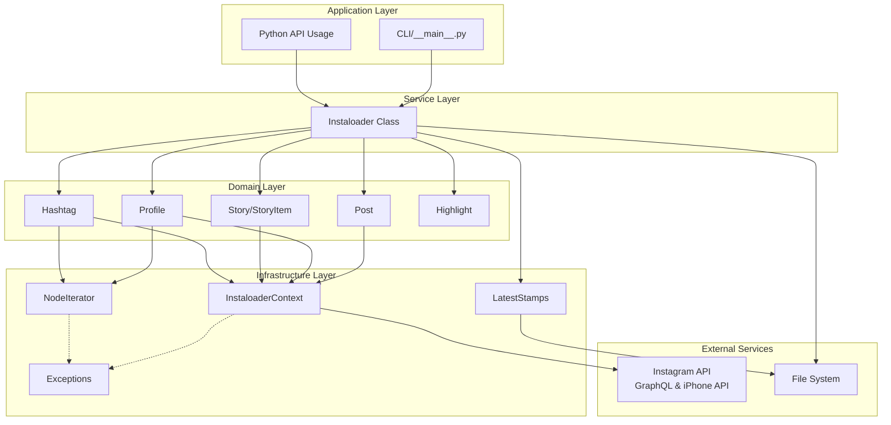
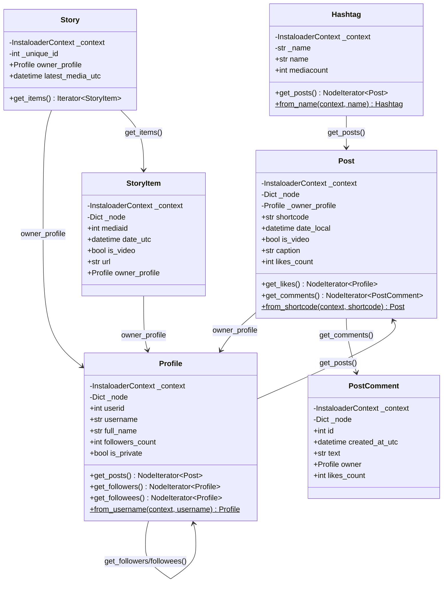
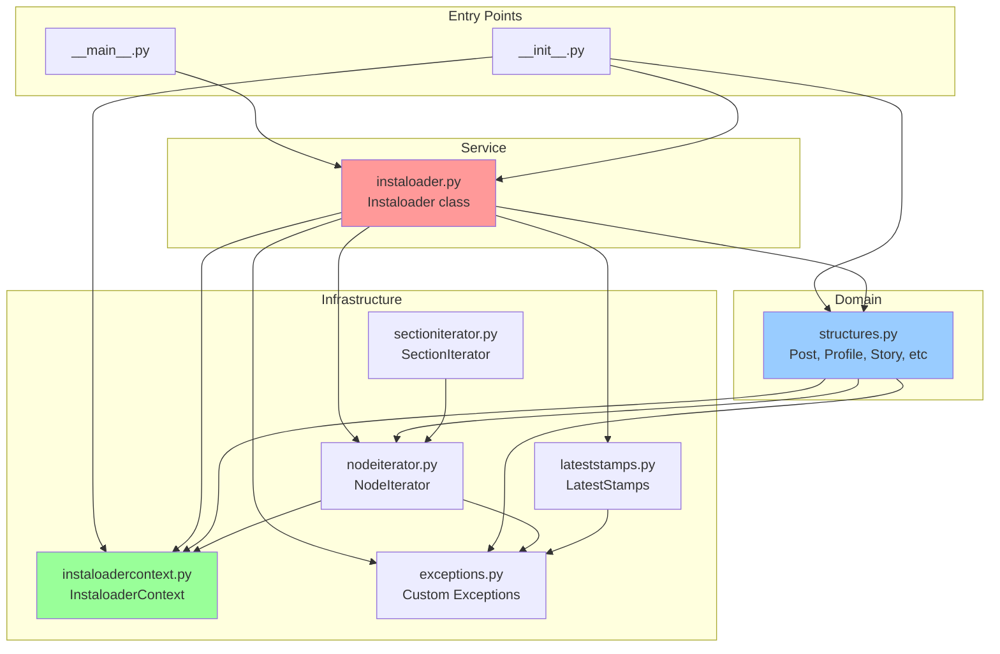
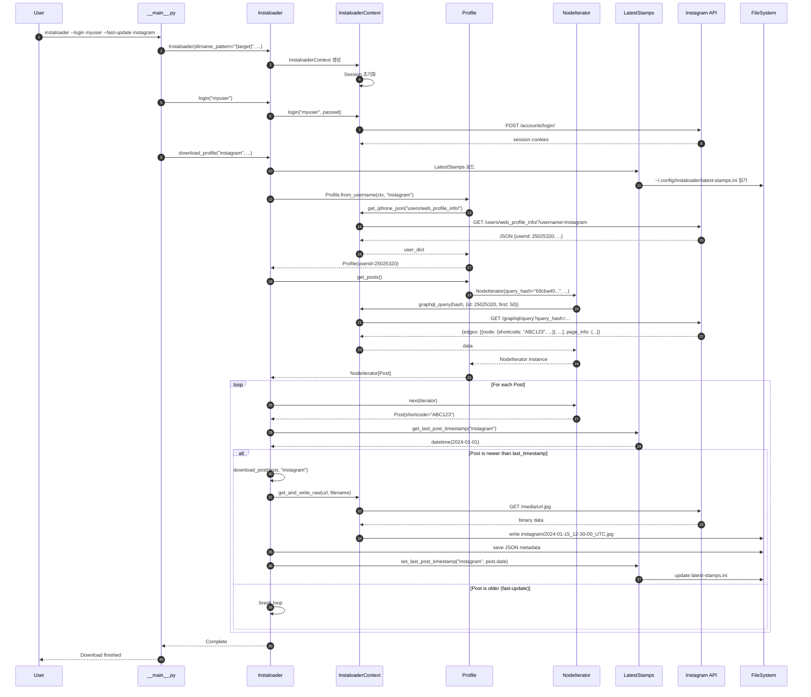
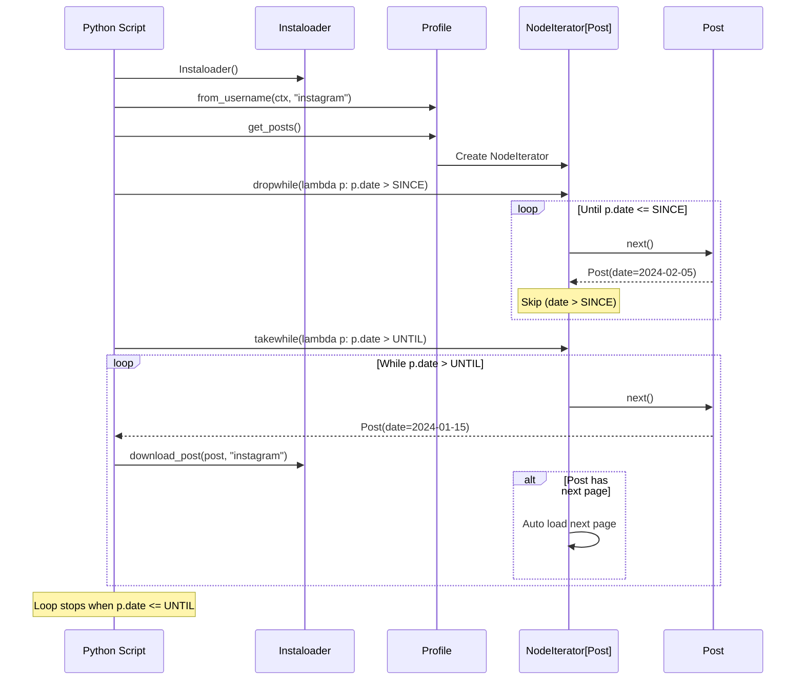
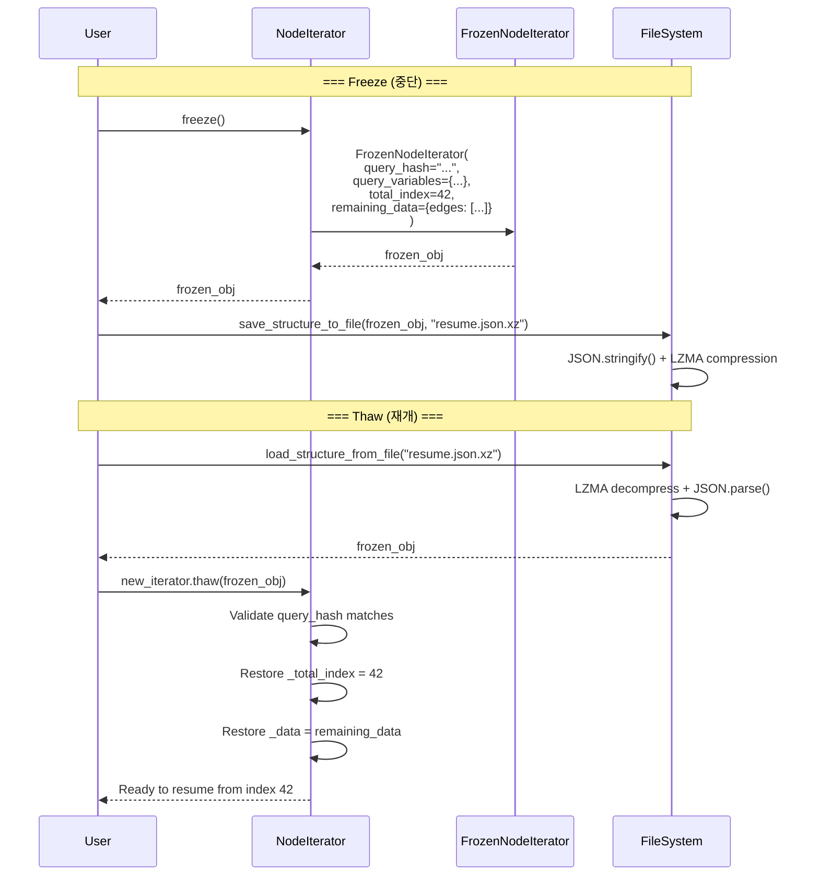

# Instaloader 아키텍처 심층 분석

## 목차
1. [개요](#1-개요)
2. [레이어별 아키텍처](#2-레이어별-아키텍처)
3. [핵심 컴포넌트 상세](#3-핵심-컴포넌트-상세)
4. [실행 시나리오 분석](#4-실행-시나리오-분석)
5. [설계 철학과 패턴](#5-설계-철학과-패턴)
6. [실습 예제](#6-실습-예제)

---

## 1. 개요

### 1.1 Instaloader란?

Instaloader는 Instagram 콘텐츠를 다운로드하고 아카이브하는 Python 라이브러리로, CLI 도구와 프로그래밍 API를 모두 제공합니다.

**핵심 특징:**
- 프로필, 해시태그, 스토리, 릴스 등 다양한 콘텐츠 유형 지원
- 증분 다운로드 (이미 받은 것은 스킵)
- 중단/재개 기능 (resume capability)
- 메타데이터 보존 (JSON 형식)
- Rate limiting 및 에러 핸들링

### 1.2 아키텍처 개요도



---

## 2. 레이어별 아키텍처

Instaloader는 **3-Tier 레이어드 아키텍처**를 채택하고 있습니다.

### 2.1 Service Layer (서비스 계층)

| 항목 | 내용 |
|------|------|
| **위치** | `/workspace/instaloader/instaloader/instaloader.py` |
| **핵심 클래스** | `Instaloader` |
| **라인 수** | ~2000 lines |
| **책임** | - 고수준 다운로드 오케스트레이션<br/>- 파일 저장 로직<br/>- 증분 업데이트 관리<br/>- 에러 처리 및 재시도 |

#### 주요 메서드와 역할

```python
# 실제 코드 구조 (instaloader.py 175-200라인 참조)
class Instaloader:
    """Instaloader Class - Instagram 콘텐츠 다운로더"""

    def __init__(self, quiet=False, user_agent=None,
                 dirname_pattern="{target}",
                 filename_pattern="{date_utc}_UTC", ...):
        """
        초기화 파라미터:
        - quiet: 로그 출력 여부
        - user_agent: HTTP User-Agent 헤더
        - dirname_pattern: 디렉토리 네이밍 패턴
        - filename_pattern: 파일 네이밍 패턴
        - download_pictures/videos: 다운로드할 미디어 타입
        - max_connection_attempts: 재시도 횟수
        """
        self.context = InstaloaderContext(...)
        self.dirname_pattern = dirname_pattern
        # ...
```

**주요 다운로드 메서드:**

| 메서드 | 기능 | 반환값 |
|--------|------|--------|
| `download_post(post, target)` | 단일 포스트 다운로드 | bool |
| `download_profile(profile_name, ...)` | 프로필 전체 다운로드 | None |
| `download_hashtag(hashtag, ...)` | 해시태그 포스트 다운로드 | None |
| `download_stories(userids, ...)` | 스토리 다운로드 | None |
| `download_storyitem(item, target)` | 스토리 아이템 다운로드 | bool |

**왜 이렇게 설계했는가?**
- **단일 책임 원칙**: 각 메서드는 하나의 콘텐츠 타입만 처리
- **템플릿 메서드 패턴**: 공통 로직은 내부 메서드로 추출 (`_get_structure_filename`, `_filter_post` 등)
- **의존성 주입**: Context를 외부에서 주입받아 테스트 용이성 확보

---

### 2.2 Domain Layer (도메인 계층)

| 항목 | 내용 |
|------|------|
| **위치** | `/workspace/instaloader/instaloader/structures.py` |
| **핵심 클래스** | `Post`, `Profile`, `Story`, `StoryItem`, `Hashtag`, `Highlight` |
| **라인 수** | ~2100 lines |
| **책임** | - Instagram 엔티티 모델링<br/>- Lazy Loading 데이터 접근<br/>- 비즈니스 로직 (shortcode ↔ mediaid 변환 등) |

#### 핵심 도메인 클래스

##### Post (라인 165-863)

```python
class Post:
    """Instagram 포스트 구조체

    생성 방법:
    1. Profile.get_posts() 이터레이터에서
    2. Post.from_shortcode(context, "ABC123xyz")
    3. Post.from_mediaid(context, 1234567890)
    """

    def __init__(self, context: InstaloaderContext,
                 node: Dict[str, Any],
                 owner_profile: Optional['Profile'] = None):
        self._context = context
        self._node = node  # Instagram API 응답 dict
        self._owner_profile = owner_profile
        self._full_metadata_dict = None  # Lazy loading용

    @property
    def shortcode(self) -> str:
        """포스트 고유 ID (URL: instagram.com/p/{shortcode}/)"""
        return self._node['shortcode']

    @property
    def date_local(self) -> datetime:
        """포스트 생성 시각 (로컬 타임존)"""
        return datetime.fromtimestamp(self._node['taken_at_timestamp'])

    @property
    def owner_profile(self) -> 'Profile':
        """포스트 작성자 프로필 (Lazy Loading)"""
        if not self._owner_profile:
            self._owner_profile = Profile(self._context,
                                          self._field('owner'))
        return self._owner_profile

    def get_likes(self) -> NodeIterator['Profile']:
        """좋아요 누른 사람 목록 (페이지네이션 자동 처리)"""
        return NodeIterator(
            self._context,
            '1cb6ec562846122743b61e492c85999f',  # GraphQL query hash
            lambda d: d['data']['shortcode_media']['edge_liked_by'],
            lambda n: Profile(self._context, n),
            {'shortcode': self.shortcode}
        )
```

**핵심 설계 특징:**
- **Lazy Loading**: `_full_metadata`는 실제 접근시에만 API 호출
- **캐싱**: 한번 로드한 데이터는 인스턴스에 보관
- **타입 변환**: `shortcode_to_mediaid`, `mediaid_to_shortcode` 등 유틸리티 제공

##### Profile (라인 864-1393)

```python
class Profile:
    """Instagram 프로필

    생성:
    profile = Profile.from_username(L.context, "instagram")
    """

    @classmethod
    def from_username(cls, context: InstaloaderContext,
                      username: str) -> 'Profile':
        """유저명으로 프로필 조회"""
        # iPhone API 우선 시도
        profile = cls._from_iphone_struct_user_info(context, username)
        if profile:
            return profile
        # 실패시 GraphQL 사용
        # ...

    def get_posts(self) -> NodeIterator[Post]:
        """프로필의 모든 포스트 (최신순)"""
        return NodeIterator(
            self._context,
            '69cba40317214236af40e7efa697781d',
            lambda d: d['data']['user']['edge_owner_to_timeline_media'],
            lambda n: Post(self._context, n, self),
            {'id': self.userid}
        )

    def get_followers(self) -> NodeIterator['Profile']:
        """팔로워 목록"""
        # 로그인 필요
        if not self._context.is_logged_in:
            raise LoginRequiredException("...")
        # ...
```

#### 도메인 모델 관계도



---

### 2.3 Infrastructure Layer (인프라 계층)

#### InstaloaderContext (핵심 인프라)

| 항목 | 내용 |
|------|------|
| **위치** | `/workspace/instaloader/instaloader/instaloadercontext.py` |
| **라인** | 66-800+ |
| **책임** | HTTP 통신, GraphQL 쿼리, 세션 관리, Rate Limiting |

```python
class InstaloaderContext:
    """Instagram API 통신 핵심 클래스"""

    def __init__(self, sleep=True, quiet=False,
                 user_agent=None,
                 max_connection_attempts=3,
                 request_timeout=300.0,
                 rate_controller=None):
        """
        주요 속성:
        - _session: requests.Session 객체
        - username, user_id: 로그인 정보
        - _rate_controller: Rate limiting 제어
        - iphone_headers: iPhone API용 헤더
        """
        self.user_agent = user_agent or default_user_agent()
        self._session = self.get_anonymous_session()
        self._rate_controller = rate_controller or RateController(self)
        self.iphone_headers = default_iphone_headers()

    def get_json(self, path: str, params: Dict,
                 host: str = 'www.instagram.com',
                 session: Optional[requests.Session] = None) -> Dict:
        """GraphQL/REST API JSON 응답 획득

        자동 처리:
        - Rate limiting (429 응답시 대기)
        - 재시도 (max_connection_attempts까지)
        - 에러 핸들링 (ConnectionException 등)
        """
        # ...

    def graphql_query(self, query_hash: str,
                      variables: Dict) -> Dict:
        """GraphQL Query 실행

        Args:
            query_hash: Instagram GraphQL endpoint hash
            variables: query 파라미터
        """
        return self.get_json('graphql/query', params={
            'query_hash': query_hash,
            'variables': json.dumps(variables)
        })

    def login(self, user: str, passwd: str):
        """Instagram 로그인"""
        # 세션 쿠키 획득 로직
        # ...
```

**설계 포인트:**
- **세션 관리**: `requests.Session`을 래핑하여 쿠키 자동 관리
- **Rate Control**: `RateController` 클래스로 요청 간격 조절
- **에러 핸들링**: 특정 HTTP 상태코드마다 커스텀 예외 발생

#### NodeIterator (페이지네이션 추상화)

```python
class NodeIterator(Iterator[T]):
    """GraphQL 페이지네이션 자동 처리 이터레이터

    특징:
    1. Freeze/Thaw: 중단/재개 가능
    2. 자동 페이지 로딩: has_next_page 확인 후 자동 로드
    3. 타입 안전: Generic 타입 지원
    """

    def __init__(self, context: InstaloaderContext,
                 query_hash: str,
                 edge_extractor: Callable,
                 node_wrapper: Callable,
                 query_variables: Dict = None):
        """
        Args:
            edge_extractor: GraphQL 응답에서 edges 추출
            node_wrapper: node dict를 도메인 객체로 변환
        """
        self._context = context
        self._query_hash = query_hash
        self._edge_extractor = edge_extractor
        self._node_wrapper = node_wrapper
        self._query_variables = query_variables or {}
        self._data = self._query()  # 첫 페이지 로드

    def __next__(self) -> T:
        """다음 아이템 반환 (페이지 자동 로딩)"""
        while not self._data['edges']:
            if not self._data['page_info']['has_next_page']:
                raise StopIteration
            # 다음 페이지 로드
            self._data = self._query()

        edge = self._data['edges'].pop(0)
        return self._node_wrapper(edge['node'])

    def freeze(self) -> FrozenNodeIterator:
        """현재 상태 직렬화 (중단용)"""
        return FrozenNodeIterator(
            query_hash=self._query_hash,
            query_variables=self._query_variables,
            total_index=self._total_index,
            remaining_data=self._data,
            # ...
        )

    def thaw(self, frozen: FrozenNodeIterator):
        """저장된 상태에서 재개"""
        self._total_index = frozen.total_index
        self._data = frozen.remaining_data
        # ...
```

**왜 이렇게 설계했는가?**
- **추상화**: Instagram GraphQL의 복잡한 페이지네이션 로직을 숨김
- **재사용성**: Profile.get_posts(), Hashtag.get_posts() 등 공통 로직
- **중단/재개**: 긴 작업을 언제든 멈추고 나중에 이어서 가능

#### LatestStamps (증분 다운로드)

```python
class LatestStamps:
    """마지막 다운로드 시점 추적 (INI 파일 기반)

    저장 위치: ~/.config/instaloader/latest-stamps.ini
    """

    def __init__(self, latest_stamps_file: str):
        self.data = configparser.ConfigParser()
        self.data.read(latest_stamps_file)

    def get_last_post_timestamp(self, profile_name: str) -> datetime:
        """프로필의 마지막 포스트 다운로드 시각"""
        try:
            return datetime.strptime(
                self.data.get(profile_name, 'post-timestamp'),
                '%Y-%m-%dT%H:%M:%S.%f%z'
            )
        except:
            return datetime.fromtimestamp(0, timezone.utc)

    def set_last_post_timestamp(self, profile_name: str,
                                timestamp: datetime):
        """타임스탬프 저장"""
        self.data.set(profile_name, 'post-timestamp',
                      timestamp.strftime('%Y-%m-%dT%H:%M:%S.%f%z'))
        with open(self.file, 'w') as f:
            self.data.write(f)
```

---

## 3. 핵심 컴포넌트 상세

### 3.1 파일 구조 맵

```
instaloader/
├── instaloader/
│   ├── __init__.py              # 패키지 exports
│   ├── __main__.py              # CLI 엔트리포인트 (line 25-800)
│   ├── instaloader.py           # Service Layer (line 175-2000)
│   ├── structures.py            # Domain Layer (line 165-2100)
│   │   ├── Post                 # line 165-863
│   │   ├── Profile              # line 864-1393
│   │   ├── StoryItem            # line 1394-1632
│   │   ├── Story                # line 1633-1748
│   │   ├── Highlight            # line 1749-1842
│   │   └── Hashtag              # line 1843-2000
│   ├── instaloadercontext.py    # Infra: HTTP/API (line 66-800)
│   ├── nodeiterator.py          # Infra: Pagination (line 37-200)
│   ├── sectioniterator.py       # Infra: Section Pagination
│   ├── lateststamps.py          # Infra: Incremental DB (line 8-150)
│   └── exceptions.py            # 예외 정의 (30+ custom exceptions)
```

### 3.2 모듈 의존성 상세 다이어그램



**의존성 분석:**
- `instaloader.py`는 모든 계층에 의존 (Orchestrator 역할)
- `structures.py`는 Infrastructure만 의존 (Domain 순수성 유지)
- `exceptions.py`는 의존성 없음 (최하위 모듈)

---

## 4. 실행 시나리오 분석

### 4.1 CLI 실행: 전체 프로필 다운로드

**명령어:**
```bash
instaloader --login myuser --fast-update instagram
```

**상세 시퀀스 다이어그램:**



**주요 단계 설명:**

| 단계 | 컴포넌트 | 설명 |
|------|---------|------|
| 1-4 | Initialization | Instaloader 인스턴스 생성, Context/Session 초기화 |
| 5-8 | Authentication | Instagram 로그인, 세션 쿠키 획득 |
| 9-10 | Stamps Loading | 이전 다운로드 시점 확인 (증분 업데이트용) |
| 11-16 | Profile Fetch | Username → Profile 객체 변환 (iPhone API 사용) |
| 17-22 | Posts Iterator | GraphQL로 포스트 목록 획득 (페이지네이션 자동) |
| 23-35 | Download Loop | 각 포스트를 다운로드하고 타임스탬프 업데이트 |

### 4.2 Python API: 특정 기간 포스트 다운로드

**코드:**
```python
from datetime import datetime
from itertools import dropwhile, takewhile
import instaloader

L = instaloader.Instaloader()

# 프로필 가져오기
profile = instaloader.Profile.from_username(L.context, "instagram")

# 포스트 이터레이터
posts = profile.get_posts()

# 날짜 필터링 (2024-01-01 ~ 2024-01-31)
SINCE = datetime(2024, 1, 31)
UNTIL = datetime(2024, 1, 1)

# dropwhile: SINCE보다 최신 포스트 스킵
# takewhile: UNTIL까지만 가져오기
filtered_posts = takewhile(
    lambda p: p.date > UNTIL,
    dropwhile(lambda p: p.date > SINCE, posts)
)

for post in filtered_posts:
    print(f"Downloading {post.shortcode} from {post.date}")
    L.download_post(post, target="instagram")
```

**실행 흐름 다이어그램:**



### 4.3 중단/재개 시나리오

**중단 시 코드:**
```python
import instaloader
from instaloader import FrozenNodeIterator, save_structure_to_file

L = instaloader.Instaloader()
profile = instaloader.Profile.from_username(L.context, "instagram")
post_iterator = profile.get_posts()

try:
    for post in post_iterator:
        L.download_post(post, target="instagram")
except KeyboardInterrupt:
    # 현재 상태 저장
    frozen = post_iterator.freeze()
    save_structure_to_file(frozen, "resume_data.json.xz")
    print("Saved resume point")
```

**재개 시 코드:**
```python
import instaloader
from instaloader import load_structure_from_file

L = instaloader.Instaloader()
profile = instaloader.Profile.from_username(L.context, "instagram")
post_iterator = profile.get_posts()

# 저장된 상태 복원
frozen = load_structure_from_file("resume_data.json.xz")
post_iterator.thaw(frozen)

# 이어서 다운로드
for post in post_iterator:
    L.download_post(post, target="instagram")
```

**Freeze/Thaw 내부 구조:**



---

## 5. 설계 철학과 패턴

### 5.1 왜 이렇게 설계했는가?

#### 1) Layered Architecture (계층화)

**목적:**
- 관심사의 분리 (Separation of Concerns)
- 테스트 용이성
- 유지보수성

**구현 예시:**

| 레이어 | 의존 방향 | 이유 |
|--------|----------|------|
| Service → Domain | OK | 서비스는 도메인 로직 사용 |
| Service → Infra | OK | 서비스는 인프라 기능 사용 |
| Domain → Infra | OK | 도메인은 Context를 통해 데이터 로드 |
| Infra → Domain | **NO** | 인프라는 도메인을 모름 (순환 의존 방지) |

#### 2) Lazy Loading Pattern

**목적:**
- 불필요한 API 호출 방지
- 메모리 효율성

**Post 클래스 예시:**
```python
class Post:
    @property
    def caption(self) -> str:
        """게시글 본문 (Lazy)"""
        # 처음 접근시에만 _full_metadata 로드
        return self._field('edge_media_to_caption', 'edges', 0,
                          'node', 'text')

    def _field(self, *keys):
        """중첩 dict 접근 헬퍼"""
        if keys[0] not in self._node:
            # 데이터가 없으면 API 호출
            self._obtain_metadata()
        # ...
```

**효과:**
```python
# Case 1: caption 미사용 → API 호출 0회
post = Post.from_shortcode(ctx, "ABC")
print(post.shortcode)  # _node에 이미 있음

# Case 2: caption 사용 → API 호출 1회
post = Post.from_shortcode(ctx, "ABC")
print(post.caption)  # _obtain_metadata() 호출
print(post.likes_count)  # 재사용 (추가 호출 없음)
```

#### 3) Iterator Pattern + Generator

**목적:**
- 메모리 효율적인 대량 데이터 처리
- Instagram API의 페이지네이션 자동화

**NodeIterator 핵심 로직:**
```python
def __next__(self) -> T:
    while True:
        # 현재 페이지에 데이터가 있으면 반환
        if self._data['edges']:
            edge = self._data['edges'].pop(0)
            self._total_index += 1
            return self._node_wrapper(edge['node'])

        # 다음 페이지가 있으면 자동 로드
        if self._data['page_info']['has_next_page']:
            self._data = self._query()
            continue

        # 더 이상 데이터 없음
        raise StopIteration
```

**사용자 입장에서는 무한 이터레이터처럼 보임:**
```python
# 1000개 포스트가 있어도 메모리는 50개씩만 로드
for post in profile.get_posts():
    process(post)
```

#### 4) Context Pattern

**목적:**
- HTTP 세션, 인증 정보, Rate Limiter 등 공통 자원을 하나의 객체로 관리
- 테스트 시 Mock Context 주입 가능

**설계:**
```python
# Bad: 각 클래스가 독립적으로 HTTP 요청
class Post:
    def get_likes(self):
        response = requests.get(...)  # 세션 관리 어려움

# Good: Context를 통한 중앙 관리
class Post:
    def __init__(self, context: InstaloaderContext):
        self._context = context

    def get_likes(self):
        data = self._context.graphql_query(...)  # 통일된 인터페이스
```

### 5.2 적용된 디자인 패턴 요약

| 패턴 | 적용 위치 | 설명 |
|------|----------|------|
| **Facade** | `Instaloader` 클래스 | 복잡한 내부 로직을 `download_profile()` 등 간단한 API로 제공 |
| **Iterator** | `NodeIterator` | GraphQL 페이지네이션 추상화 |
| **Lazy Loading** | `Post._full_metadata` | 필요시에만 추가 데이터 로드 |
| **Factory Method** | `Post.from_shortcode()` | 다양한 생성 방법 제공 |
| **Strategy** | `RateController` | Rate limiting 알고리즘 교체 가능 |
| **Template Method** | `Instaloader._download_*()` | 공통 다운로드 흐름 정의 |
| **Decorator** | `@_requires_login` | 로그인 필요 메서드 표시 |
| **Memento** | `FrozenNodeIterator` | Iterator 상태 저장/복원 |

---

## 6. 실습 예제

### 6.1 기초: 단일 포스트 다운로드

```python
import instaloader

# 1. Instaloader 인스턴스 생성
L = instaloader.Instaloader(
    download_comments=True,  # 댓글도 다운로드
    save_metadata=True,      # JSON 메타데이터 저장
    compress_json=True       # JSON을 XZ로 압축
)

# 2. shortcode로 포스트 가져오기
post = instaloader.Post.from_shortcode(L.context, "ABC123xyz")

# 3. 포스트 정보 출력
print(f"작성자: {post.owner_username}")
print(f"날짜: {post.date_local}")
print(f"좋아요: {post.likes} likes")
print(f"본문: {post.caption[:100]}...")

# 4. 다운로드
L.download_post(post, target="single_post")
```

**생성되는 파일:**
```
single_post/
├── 2024-01-15_12-30-00_UTC.jpg         # 이미지
├── 2024-01-15_12-30-00_UTC.json.xz     # 메타데이터
└── 2024-01-15_12-30-00_UTC.txt         # 캡션
```

### 6.2 중급: 특정 조건 필터링

```python
import instaloader

L = instaloader.Instaloader()

# 로그인 (private 프로필 접근 위해)
L.login("your_username")

# 프로필 가져오기
profile = instaloader.Profile.from_username(L.context, "some_user")

# 조건: 좋아요 10,000개 이상 + 비디오만
for post in profile.get_posts():
    if post.likes >= 10000 and post.is_video:
        print(f"Downloading {post.shortcode} ({post.likes} likes)")
        L.download_post(post, target=f"{profile.username}_popular_videos")

    # 최근 100개만 검사
    if post.date < datetime(2024, 1, 1):
        break
```

### 6.3 고급: 여러 프로필의 스토리 일괄 다운로드

```python
import instaloader

L = instaloader.Instaloader()
L.login("your_username")

# 다운로드할 프로필 목록
usernames = ["user1", "user2", "user3"]

for username in usernames:
    profile = instaloader.Profile.from_username(L.context, username)

    try:
        # 해당 프로필의 스토리 가져오기
        stories = L.get_stories(userids=[profile.userid])

        for story in stories:
            for item in story.get_items():
                # 스토리 아이템 다운로드
                L.download_storyitem(item, target=f"stories/{username}")
                print(f"Downloaded story from {username}: {item.mediaid}")

    except instaloader.exceptions.PrivateProfileNotFollowedException:
        print(f"Cannot access {username}'s story (private or not following)")
```

### 6.4 실전: 해시태그 모니터링 시스템

```python
import instaloader
from datetime import datetime, timedelta
import time

class HashtagMonitor:
    def __init__(self, hashtag: str, check_interval: int = 3600):
        """
        Args:
            hashtag: 모니터링할 해시태그
            check_interval: 체크 간격 (초)
        """
        self.hashtag = hashtag
        self.check_interval = check_interval
        self.L = instaloader.Instaloader()
        self.seen_posts = set()  # 이미 본 포스트 추적

    def check_new_posts(self):
        """새 포스트 확인"""
        hashtag_obj = instaloader.Hashtag.from_name(self.L.context,
                                                     self.hashtag)

        # 최근 1시간 내 포스트만
        cutoff_time = datetime.now() - timedelta(hours=1)

        new_posts = []
        for post in hashtag_obj.get_posts():
            if post.date_utc < cutoff_time:
                break  # 더 오래된 포스트는 스킵

            if post.shortcode not in self.seen_posts:
                new_posts.append(post)
                self.seen_posts.add(post.shortcode)

        return new_posts

    def run(self):
        """모니터링 루프"""
        print(f"Monitoring #{self.hashtag}...")

        while True:
            try:
                new_posts = self.check_new_posts()

                for post in new_posts:
                    print(f"[NEW] {post.owner_username}: {post.caption[:50]}")
                    self.L.download_post(post,
                                        target=f"hashtag_{self.hashtag}")

                print(f"Checked at {datetime.now()}, found {len(new_posts)} new posts")
                time.sleep(self.check_interval)

            except KeyboardInterrupt:
                print("Monitoring stopped")
                break
            except Exception as e:
                print(f"Error: {e}")
                time.sleep(60)

# 사용
monitor = HashtagMonitor("python", check_interval=1800)  # 30분마다
monitor.run()
```

### 6.5 전문가: 커스텀 Rate Controller

```python
import instaloader
from datetime import datetime
import time

class AggressiveRateController(instaloader.RateController):
    """더 빠른 다운로드를 위한 커스텀 Rate Controller"""

    def sleep(self, secs: float):
        """원래 대기 시간의 50%만 대기"""
        time.sleep(secs * 0.5)

    def handle_429(self, query_type: str):
        """429 에러 처리"""
        print(f"Rate limited on {query_type}, waiting 60s...")
        time.sleep(60)

# 커스텀 Rate Controller 사용
L = instaloader.Instaloader(
    rate_controller=lambda ctx: AggressiveRateController(ctx)
)

# 주의: 너무 공격적이면 IP 차단 위험!
```

### 6.6 디버깅: Verbose 로깅

```python
import instaloader
import logging

# Instaloader 내부 로그 활성화
logging.basicConfig(level=logging.DEBUG)

L = instaloader.Instaloader(quiet=False)

# Context의 모든 HTTP 요청 로그
original_get_json = L.context.get_json

def logged_get_json(path, **kwargs):
    print(f"[HTTP GET] {path} {kwargs}")
    result = original_get_json(path, **kwargs)
    print(f"[HTTP RESPONSE] {len(str(result))} bytes")
    return result

L.context.get_json = logged_get_json

# 이제 모든 API 호출이 로그로 출력됨
profile = instaloader.Profile.from_username(L.context, "instagram")
```

---

## 7. 학습 체크리스트

### 7.1 아키텍처 이해도 확인

- [ ] Service/Domain/Infra 레이어의 역할을 설명할 수 있는가?
- [ ] `Instaloader` 클래스가 Facade 패턴인 이유를 설명할 수 있는가?
- [ ] `Post`, `Profile` 등 도메인 클래스가 `InstaloaderContext`에 의존하는 이유는?
- [ ] `NodeIterator`가 해결하는 문제는 무엇인가?

### 7.2 코드 레벨 질문

1. **Q**: `Post.from_shortcode()`와 `Post(context, node)`의 차이는?
   **A**: `from_shortcode`는 shortcode만으로 Post 생성 (API 호출 필요), `Post()`는 이미 있는 node dict 사용

2. **Q**: `Profile.get_posts()`가 반환하는 것은?
   **A**: `NodeIterator[Post]` - 실제 Post 객체가 아닌 이터레이터

3. **Q**: Lazy Loading이 일어나는 시점은?
   **A**: `Post.caption`, `Post.location` 등 `_field()`를 호출하는 property 접근 시

4. **Q**: `LatestStamps`는 어떤 문제를 해결하는가?
   **A**: 이미 다운로드한 콘텐츠를 재다운로드하지 않도록 (증분 업데이트)

### 7.3 실습 과제

**초급:**
- [ ] 특정 프로필의 최근 10개 포스트만 다운로드하는 스크립트 작성

**중급:**
- [ ] 여러 프로필의 좋아요 수 Top 5 포스트를 찾는 프로그램
- [ ] 중단/재개 기능을 활용한 대용량 다운로드 스크립트

**고급:**
- [ ] 커스텀 `RateController` 구현 (예: 시간대별 차등 속도)
- [ ] `Post` 클래스를 상속받아 추가 분석 기능 구현

---

## 8. 참고 자료

### 8.1 핵심 파일 위치 요약

| 컴포넌트 | 파일 경로 | 주요 라인 |
|---------|----------|----------|
| Service | `/workspace/instaloader/instaloader/instaloader.py` | 175-2000 |
| Domain - Post | `/workspace/instaloader/instaloader/structures.py` | 165-863 |
| Domain - Profile | `/workspace/instaloader/instaloader/structures.py` | 864-1393 |
| Infra - Context | `/workspace/instaloader/instaloader/instaloadercontext.py` | 66-800 |
| Infra - Iterator | `/workspace/instaloader/instaloader/nodeiterator.py` | 37-200 |
| Infra - Stamps | `/workspace/instaloader/instaloader/lateststamps.py` | 8-150 |

### 8.2 추가 학습 자료

- **공식 문서**: [instaloader.github.io](https://instaloader.github.io)
- **코드 예제**: `/workspace/instaloader/docs/codesnippets/`
- **GraphQL 분석**: Instagram의 GraphQL 엔드포인트 연구

### 8.3 다음 단계

이 문서는 아키텍처 전체를 조망했습니다. 더 깊은 이해를 위해:
- `02_domain_models.md`: 각 도메인 클래스의 상세 분석
- `03_infrastructure.md`: Context, Iterator의 내부 구현
- `04_api_patterns.md`: Instagram API 통신 패턴 분석

---

**문서 버전**: 2.0
**최종 수정**: 2025-11-18
**대상**: 대학 소프트웨어 공학 수업 / 고급 Python 개발자