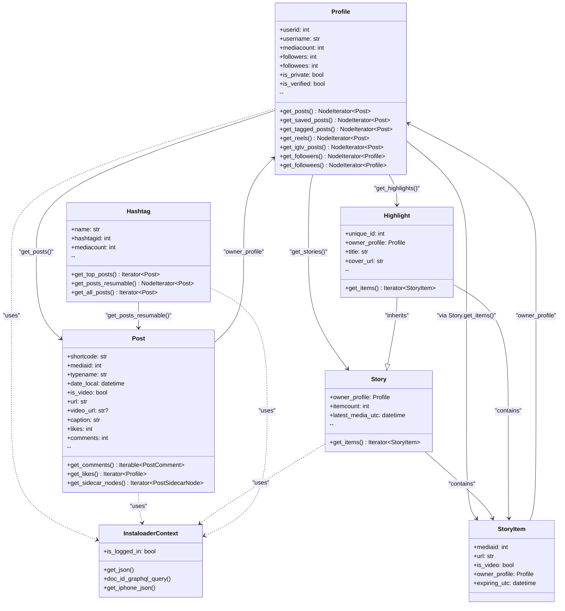
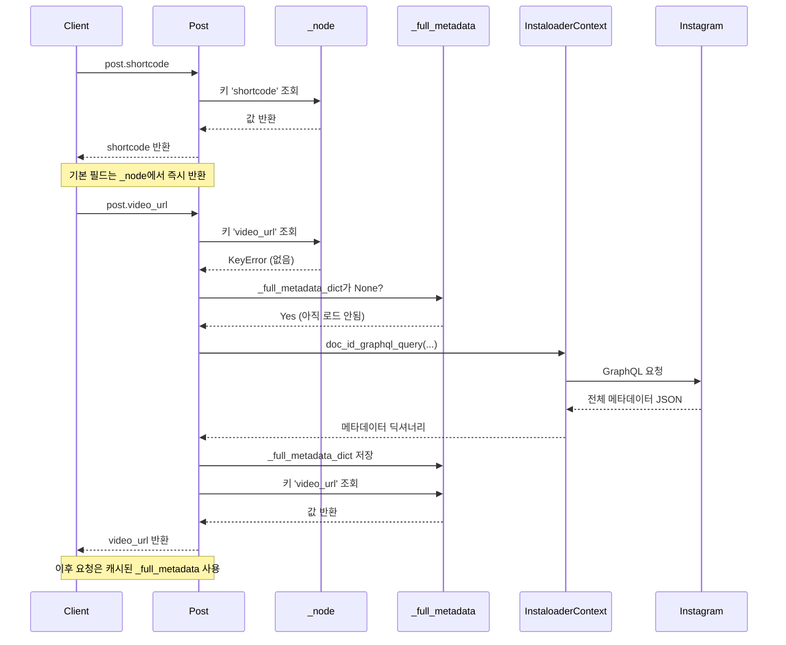
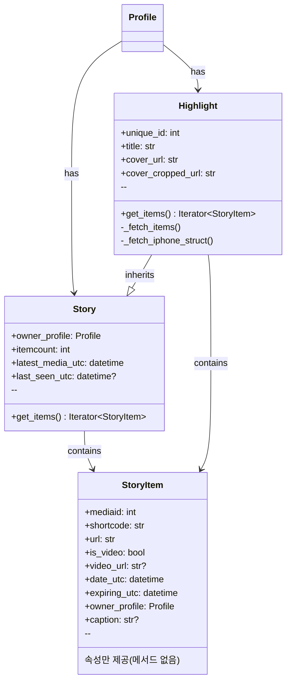
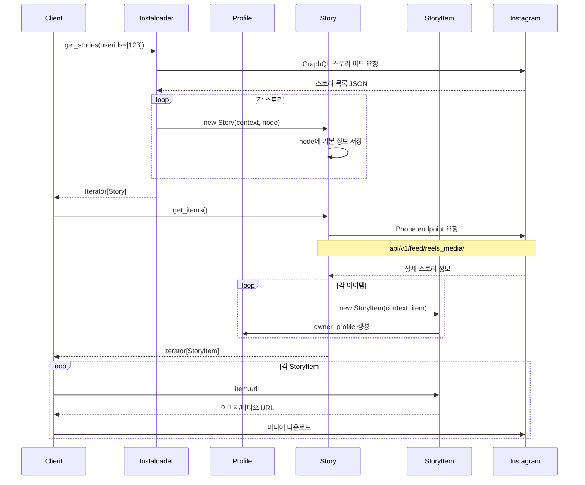
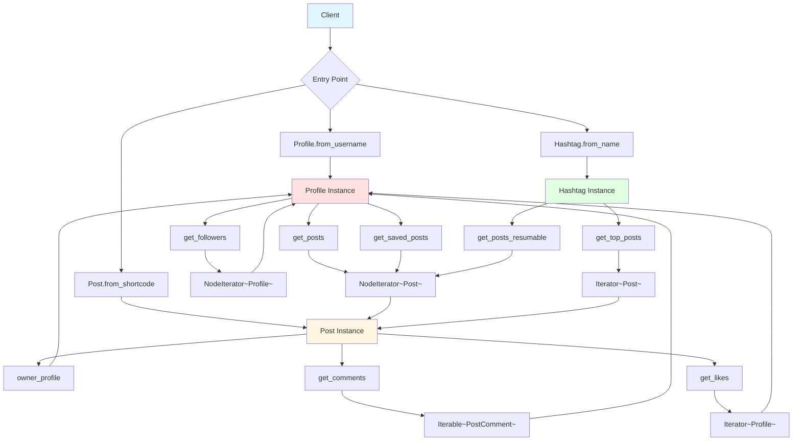
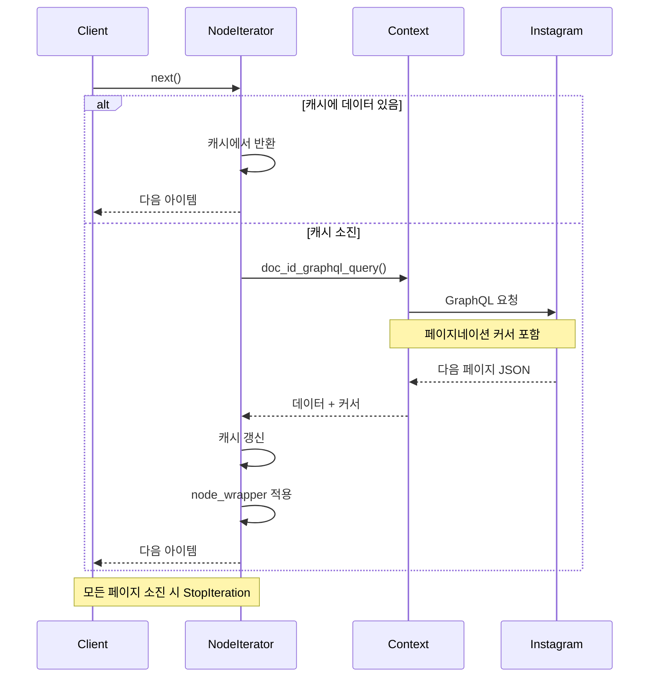

# 도메인 모델 심층 분석 (Post / Profile / Story / Hashtag)

이 문서는 Instaloader의 도메인 모델들을 중심으로, Instagram 상의 엔티티를 어떻게 Python 객체로 추상화했는지 심층적으로 분석합니다.

---

## 1. 전체 도메인 모델 관계 개요

### 1.1 핵심 도메인 클래스

Instaloader의 주요 도메인 클래스들은 다음과 같습니다:

- **`Post`**: Instagram 게시물 한 개를 표현
- **`Profile`**: Instagram 사용자 계정을 표현
- **`Story` / `StoryItem`**: 스토리 묶음과 개별 스토리 항목을 표현
- **`Highlight`**: 하이라이트 스토리 묶음을 표현
- **`Hashtag`**: 해시태그를 표현
- **보조 구조체**: `TopSearchResults`, `PostLocation`, `TitlePic` 등

### 1.2 도메인 모델 간 관계도



### 1.3 공통 설계 패턴

모든 도메인 모델은 다음과 같은 공통 패턴을 따릅니다:

1. **`InstaloaderContext` 의존성**: 모든 네트워크 요청은 context를 통해 수행
2. **Lazy Loading**: 필요한 시점에만 추가 메타데이터를 로드
3. **Iterator 패턴**: 대량 데이터는 `NodeIterator` 또는 일반 Iterator로 제공
4. **팩토리 메서드**: `from_username`, `from_shortcode` 등의 클래스 메서드로 생성

---

## 2. Post 모델 심층 분석

### 2.1 Post의 역할과 생성 패턴

`Post`는 Instagram 게시물 하나를 표현하는 핵심 도메인 객체입니다.

#### 생성 방법

| 메서드 | 설명 | 사용 예시 |
|--------|------|----------|
| `Post.from_shortcode()` | shortcode로부터 직접 생성 | 단일 게시물 다운로드 |
| `Post.from_mediaid()` | mediaid로부터 생성 | 숫자 ID를 알 때 사용 |
| `Post.from_iphone_struct()` | iPhone endpoint 응답으로부터 생성 | 내부적으로 사용 |
| `Profile.get_posts()` | 프로필의 게시물 iterator | 프로필 크롤링 |
| `Hashtag.get_posts_resumable()` | 해시태그의 게시물 iterator | 해시태그 크롤링 |

#### 생성 예시 코드

```python
from instaloader import Instaloader, Post

L = Instaloader()

# 방법 1: shortcode로 직접 생성
post = Post.from_shortcode(L.context, "CXyZ123abcd")
print(f"Post owner: {post.owner_username}")

# 방법 2: mediaid로 생성
mediaid = Post.shortcode_to_mediaid("CXyZ123abcd")
post = Post.from_mediaid(L.context, mediaid)

# 방법 3: 프로필의 게시물 iterator에서 가져오기
from instaloader import Profile
profile = Profile.from_username(L.context, "instagram")
for post in profile.get_posts():
    print(f"Post {post.shortcode}: {post.likes} likes")
    if post.date_utc.year < 2020:
        break  # 2020년 이전 게시물은 중단
```

### 2.2 핵심 필드와 속성

#### 필드 분류표

| 카테고리 | 필드명 | 타입 | 설명 | Lazy Loading |
|---------|--------|------|------|-------------|
| **식별자** | `shortcode` | str | URL에 사용되는 짧은 코드 | ❌ |
| | `mediaid` | int | shortcode의 10진수 표현 | ❌ |
| **시간** | `date_local` | datetime | 로컬 타임존 생성 시각 | ❌ |
| | `date_utc` | datetime | UTC 생성 시각 | ❌ |
| **미디어** | `typename` | str | GraphImage/GraphVideo/GraphSidecar | ❌ |
| | `is_video` | bool | 동영상 여부 | ❌ |
| | `url` | str | 이미지/썸네일 URL | ❌ |
| | `video_url` | str? | 동영상 URL (영상인 경우) | ✅ |
| | `mediacount` | int | 사이드카 미디어 개수 | ❌ |
| **텍스트** | `caption` | str? | 게시물 캡션 | ❌ |
| | `caption_hashtags` | List[str] | 캡션 내 해시태그 목록 | ❌ |
| | `caption_mentions` | List[str] | 캡션 내 멘션 목록 | ❌ |
| | `pcaption` | str | 파일명 안전 캡션 (30자 제한) | ❌ |
| **소셜** | `likes` | int | 좋아요 수 | ❌ |
| | `comments` | int | 댓글 수 (답글 포함) | ❌ |
| | `viewer_has_liked` | bool? | 뷰어의 좋아요 여부 | ❌ |
| **위치** | `location` | PostLocation? | 위치 정보 (로그인 필요) | ✅ |
| **관계** | `owner_profile` | Profile | 게시물 소유자 프로필 | ❌ |
| | `tagged_users` | List[str] | 태그된 사용자 목록 | ✅ |
| **광고** | `is_sponsored` | bool | 스폰서 게시물 여부 | ✅ |
| | `sponsor_users` | List[Profile] | 스폰서 사용자 목록 | ✅ |

### 2.3 주요 메서드 사용 예시

#### 2.3.1 댓글 가져오기

```python
from instaloader import Instaloader, Post

L = Instaloader()
# 로그인 필요 (댓글 접근은 인증 필요)
L.login("username", "password")

post = Post.from_shortcode(L.context, "CXyZ123abcd")

# 모든 댓글 순회
for comment in post.get_comments():
    print(f"@{comment.owner.username}: {comment.text}")
    print(f"  Likes: {comment.likes_count}, Created: {comment.created_at_utc}")

    # 댓글의 답글 순회
    for answer in comment.answers:
        print(f"  ↳ @{answer.owner.username}: {answer.text}")
```

#### 2.3.2 좋아요 누른 사용자 가져오기

```python
# 로그인 필요
L.login("username", "password")

post = Post.from_shortcode(L.context, "CXyZ123abcd")

# 좋아요 누른 사용자 최대 100명까지
from itertools import islice
for profile in islice(post.get_likes(), 100):
    print(f"@{profile.username} ({profile.full_name})")
    if profile.is_verified:
        print("  ✓ Verified account")
```

#### 2.3.3 사이드카 게시물 처리

```python
post = Post.from_shortcode(L.context, "CXyZ123abcd")

if post.typename == "GraphSidecar":
    print(f"This post has {post.mediacount} media items")

    # 각 사이드카 노드 순회
    for idx, sidecar_node in enumerate(post.get_sidecar_nodes(), 1):
        if sidecar_node.is_video:
            print(f"  [{idx}] Video: {sidecar_node.video_url}")
        else:
            print(f"  [{idx}] Image: {sidecar_node.display_url}")
```

### 2.4 Lazy Loading 동작 원리

Post는 성능 최적화를 위해 Lazy Loading 패턴을 사용합니다.

#### 시퀀스 다이어그램



#### 내부 구조

```python
class Post:
    def __init__(self, context, node, owner_profile=None):
        self._context = context
        self._node = node  # 최소한의 초기 데이터
        self._full_metadata_dict = None  # 전체 메타데이터 (Lazy Load)
        self._owner_profile = owner_profile

    def _field(self, *keys):
        """
        1. _node에서 먼저 찾음
        2. 없으면 _full_metadata를 로드하고 찾음
        """
        try:
            # Step 1: _node에서 조회
            d = self._node
            for key in keys:
                d = d[key]
            return d
        except KeyError:
            # Step 2: _full_metadata에서 조회 (필요 시 로드)
            d = self._full_metadata  # 이 시점에 GraphQL 요청 발생
            for key in keys:
                d = d[key]
            return d

    @property
    def _full_metadata(self):
        if not self._full_metadata_dict:
            # GraphQL doc_id 쿼리로 전체 메타데이터 로드
            pic_json = self._context.doc_id_graphql_query(
                "8845758582119845", {"shortcode": self.shortcode}
            )["data"]["xdt_shortcode_media"]
            self._full_metadata_dict = pic_json
        return self._full_metadata_dict
```

### 2.5 실전 활용 패턴

#### 패턴 1: 특정 조건의 게시물만 필터링

```python
from datetime import datetime
from instaloader import Instaloader, Profile

L = Instaloader()
profile = Profile.from_username(L.context, "natgeo")

# 2023년 게시물 중 좋아요 10만 이상인 게시물만 다운로드
for post in profile.get_posts():
    if post.date_utc.year != 2023:
        continue

    if post.likes >= 100000:
        print(f"Downloading {post.shortcode} ({post.likes} likes)")
        L.download_post(post, target="natgeo_popular")
```

#### 패턴 2: 게시물 메타데이터 수집

```python
import csv
from instaloader import Instaloader, Profile

L = Instaloader()
profile = Profile.from_username(L.context, "instagram")

# CSV로 게시물 통계 저장
with open("instagram_posts.csv", "w", newline="", encoding="utf-8") as f:
    writer = csv.writer(f)
    writer.writerow(["Shortcode", "Date", "Type", "Likes", "Comments", "Caption"])

    for post in profile.get_posts():
        writer.writerow([
            post.shortcode,
            post.date_utc.isoformat(),
            post.typename,
            post.likes,
            post.comments,
            post.caption[:50] if post.caption else ""  # 캡션 50자만
        ])

        # 최근 100개만
        if profile.get_posts().__next__  # iterator 카운터
            pass  # 실제로는 enumerate 등으로 카운트
```

#### 패턴 3: 시간 범위 필터링

```python
from datetime import datetime
from itertools import dropwhile, takewhile

L = Instaloader()
posts = Profile.from_username(L.context, "instagram").get_posts()

SINCE = datetime(2023, 1, 1)
UNTIL = datetime(2023, 12, 31)

# 2023년 1월~12월 사이의 게시물만 다운로드
for post in takewhile(lambda p: p.date_utc > UNTIL,
                     dropwhile(lambda p: p.date_utc > SINCE, posts)):
    print(f"{post.date_utc}: {post.shortcode}")
    L.download_post(post, "instagram_2023")
```

---

## 3. Profile 모델 심층 분석

### 3.1 Profile의 역할과 생성 패턴

`Profile`은 Instagram 사용자 계정을 표현하며, Instaloader의 대부분의 작업은 이 객체를 시작점으로 합니다.

#### 생성 방법

| 메서드 | 설명 | 요구사항 |
|--------|------|----------|
| `Profile.from_username()` | username으로 생성 | 가장 일반적 |
| `Profile.from_id()` | userid로 생성 | 추가 요청 필요 |
| `Profile.own_profile()` | 로그인한 자신의 프로필 | 로그인 필요 |
| `Profile.from_iphone_struct()` | iPhone endpoint 응답으로 생성 | 내부 사용 |

#### 생성 예시

```python
from instaloader import Instaloader, Profile

L = Instaloader()

# 방법 1: username으로 생성 (가장 일반적)
profile = Profile.from_username(L.context, "instagram")
print(f"User ID: {profile.userid}")
print(f"Full name: {profile.full_name}")

# 방법 2: userid로 생성
profile_by_id = Profile.from_id(L.context, 25025320)

# 방법 3: 자신의 프로필 (로그인 필요)
L.login("your_username", "your_password")
my_profile = Profile.own_profile(L.context)
print(f"My username: {my_profile.username}")
```

### 3.2 중요한 속성 분류

#### 속성 분류표

| 카테고리 | 속성명 | 타입 | 설명 | 로그인 필요 |
|---------|--------|------|------|------------|
| **기본 정보** | `userid` | int | 정수 사용자 ID | ❌ |
| | `username` | str | 소문자 사용자 이름 | ❌ |
| | `full_name` | str | 프로필 표시 이름 | ❌ |
| | `biography` | str | 자기소개 | ❌ |
| **계정 상태** | `is_private` | bool | 비공개 계정 여부 | ❌ |
| | `is_verified` | bool | 인증 계정 여부 | ❌ |
| | `is_business_account` | bool | 비즈니스 계정 여부 | ❌ |
| | `blocked_by_viewer` | bool | 뷰어가 차단했는지 | ✅ |
| | `has_blocked_viewer` | bool | 뷰어를 차단했는지 | ✅ |
| | `followed_by_viewer` | bool | 뷰어가 팔로우 중인지 | ✅ |
| | `follows_viewer` | bool | 뷰어를 팔로우 중인지 | ✅ |
| **통계** | `mediacount` | int | 타임라인 게시물 수 | ❌ |
| | `igtvcount` | int | IGTV 게시물 수 | ❌ |
| | `followers` | int | 팔로워 수 | ❌ |
| | `followees` | int | 팔로잉 수 | ❌ |
| **미디어** | `profile_pic_url` | str | 고해상도 프로필 사진 URL | ❌ |
| | `external_url` | str? | 프로필 링크 | ❌ |
| **스토리** | `has_public_story` | bool | 공개 스토리 보유 여부 | ❌ |
| | `has_viewable_story` | bool | 뷰어가 볼 수 있는 스토리 여부 | ✅ |

### 3.3 연관 데이터 접근 메서드

#### 메서드 분류표

| 카테고리 | 메서드 | 반환 타입 | 설명 | 로그인 필요 |
|---------|--------|----------|------|------------|
| **게시물** | `get_posts()` | NodeIterator[Post] | 타임라인 게시물 | ❌ (공개 계정) |
| | `get_saved_posts()` | NodeIterator[Post] | 저장된 게시물 | ✅ (자신만) |
| | `get_tagged_posts()` | NodeIterator[Post] | 태그된 게시물 | ❌ (공개 계정) |
| | `get_reels()` | NodeIterator[Post] | 릴스 게시물 | ❌ (공개 계정) |
| | `get_igtv_posts()` | NodeIterator[Post] | IGTV 게시물 | ❌ (공개 계정) |
| **네트워크** | `get_followers()` | NodeIterator[Profile] | 팔로워 목록 | ✅ |
| | `get_followees()` | NodeIterator[Profile] | 팔로잉 목록 | ✅ |
| | `get_similar_accounts()` | Iterator[Profile] | 유사 계정 | ✅ |
| **해시태그** | `get_followed_hashtags()` | NodeIterator[Hashtag] | 팔로우 중인 해시태그 | ✅ (자신만) |

### 3.4 주요 메서드 사용 예시

#### 3.4.1 프로필 정보 출력

```python
from instaloader import Instaloader, Profile

L = Instaloader()
profile = Profile.from_username(L.context, "cristiano")

# 기본 정보
print(f"Username: @{profile.username}")
print(f"Full name: {profile.full_name}")
print(f"User ID: {profile.userid}")
print(f"Bio: {profile.biography}")

# 통계
print(f"\n=== Statistics ===")
print(f"Posts: {profile.mediacount:,}")
print(f"Followers: {profile.followers:,}")
print(f"Following: {profile.followees:,}")

# 계정 상태
print(f"\n=== Account Status ===")
print(f"Private: {profile.is_private}")
print(f"Verified: {profile.is_verified}")
print(f"Business: {profile.is_business_account}")

# 링크
if profile.external_url:
    print(f"Website: {profile.external_url}")
```

#### 3.4.2 팔로워/팔로잉 분석

```python
# 로그인 필요
L.login("username", "password")
profile = Profile.from_username(L.context, "your_target")

# 팔로워 목록 (최대 100명)
from itertools import islice

print("=== Top 100 Followers ===")
for follower in islice(profile.get_followers(), 100):
    verified = "✓" if follower.is_verified else " "
    print(f"[{verified}] @{follower.username} - {follower.full_name}")

# 팔로잉 중 인증 계정만 필터링
print("\n=== Verified Accounts Following ===")
verified_followees = [
    f for f in profile.get_followees()
    if f.is_verified
]
for followee in verified_followees:
    print(f"@{followee.username}")
```

#### 3.4.3 Ghost Followers 찾기

```python
# 나를 팔로우하지 않는 사람 찾기
L.login("username", "password")
my_profile = Profile.own_profile(L.context)

print("Building follower set...")
followers = set(f.username for f in my_profile.get_followers())

print("Finding ghost followers...")
ghost_followers = []
for followee in my_profile.get_followees():
    if followee.username not in followers:
        ghost_followers.append(followee)
        print(f"@{followee.username} doesn't follow you back")

print(f"\nTotal ghost followers: {len(ghost_followers)}")
```

### 3.5 실전 활용 패턴

#### 패턴 1: 프로필 백업

```python
import json
from instaloader import Instaloader, Profile

L = Instaloader()
L.login("username", "password")

profile = Profile.from_username(L.context, "target_user")

# 모든 게시물 다운로드
for post in profile.get_posts():
    L.download_post(post, target=profile.username)

# 프로필 사진 다운로드
L.download_profilepic(profile)

# 스토리 다운로드 (24시간 내 소멸)
L.download_stories(userids=[profile.userid])

# 하이라이트 다운로드
L.download_highlights(profile)
```

#### 패턴 2: 프로필 비교 분석

```python
def analyze_profile(username):
    """프로필 통계 분석"""
    profile = Profile.from_username(L.context, username)

    posts = list(profile.get_posts())

    if not posts:
        return None

    total_likes = sum(p.likes for p in posts)
    total_comments = sum(p.comments for p in posts)
    avg_likes = total_likes / len(posts)
    avg_comments = total_comments / len(posts)

    # 참여율 계산 (engagement rate)
    engagement_rate = ((total_likes + total_comments) / len(posts)) / profile.followers * 100

    return {
        "username": username,
        "followers": profile.followers,
        "posts": len(posts),
        "avg_likes": avg_likes,
        "avg_comments": avg_comments,
        "engagement_rate": engagement_rate
    }

# 여러 프로필 비교
influencers = ["cristiano", "leomessi", "therock"]
for influencer in influencers:
    stats = analyze_profile(influencer)
    print(f"\n@{stats['username']}")
    print(f"  Followers: {stats['followers']:,}")
    print(f"  Avg Likes: {stats['avg_likes']:,.0f}")
    print(f"  Engagement Rate: {stats['engagement_rate']:.2f}%")
```

---

## 4. Story / StoryItem / Highlight 모델

### 4.1 모델 구조 개요

Instagram의 스토리 관련 기능은 세 가지 모델로 표현됩니다.



### 4.2 StoryItem 상세

#### StoryItem 필드

| 필드명 | 타입 | 설명 |
|--------|------|------|
| `mediaid` | int | 스토리 미디어 ID |
| `shortcode` | str | 짧은 코드 |
| `url` | str | 이미지 또는 썸네일 URL |
| `is_video` | bool | 동영상 여부 |
| `video_url` | str? | 동영상 URL (is_video가 True일 때) |
| `date_local` | datetime | 로컬 타임존 생성 시각 |
| `date_utc` | datetime | UTC 생성 시각 |
| `expiring_local` | datetime | 로컬 타임존 만료 시각 |
| `expiring_utc` | datetime | UTC 만료 시각 (24시간 후) |
| `owner_profile` | Profile | 소유자 프로필 |
| `owner_username` | str | 소유자 username |
| `owner_id` | int | 소유자 user ID |
| `caption` | str? | 캡션 텍스트 |
| `caption_hashtags` | List[str] | 캡션 내 해시태그 |
| `caption_mentions` | List[str] | 캡션 내 멘션 |

#### StoryItem 사용 예시

```python
from instaloader import Instaloader

L = Instaloader()
L.login("username", "password")

# 특정 사용자의 스토리 가져오기
stories = L.get_stories(userids=[25025320])  # Instagram 공식 계정 ID

for story in stories:
    print(f"\n=== Story from @{story.owner_username} ===")
    print(f"Items: {story.itemcount}")
    print(f"Latest: {story.latest_media_utc}")

    for item in story.get_items():
        media_type = "Video" if item.is_video else "Photo"
        print(f"  [{media_type}] Posted at {item.date_utc}")
        print(f"    Expires at: {item.expiring_utc}")

        if item.caption:
            print(f"    Caption: {item.caption[:50]}...")
```

### 4.3 Story 상세

#### Story 필드

| 필드명 | 타입 | 설명 |
|--------|------|------|
| `owner_profile` | Profile | 스토리 소유자 |
| `owner_username` | str | 소유자 username |
| `owner_id` | int | 소유자 user ID |
| `itemcount` | int | 스토리 아이템 개수 |
| `latest_media_utc` | datetime | 가장 최근 스토리 시각 |
| `latest_media_local` | datetime | 로컬 타임존 최근 스토리 시각 |
| `last_seen_utc` | datetime? | 마지막 조회 시각 (자신의 스토리만) |

### 4.4 Highlight 상세

Highlight는 Story를 상속하며, 24시간이 지나도 프로필에 영구 보관되는 스토리 모음입니다.

#### Highlight 추가 필드

| 필드명 | 타입 | 설명 |
|--------|------|------|
| `unique_id` | int | Highlight 고유 ID |
| `title` | str | Highlight 제목 |
| `cover_url` | str | 커버 이미지 URL |
| `cover_cropped_url` | str | 크롭된 커버 이미지 URL |

#### Highlight 사용 예시

```python
from instaloader import Instaloader, Profile

L = Instaloader()
L.login("username", "password")

profile = Profile.from_username(L.context, "instagram")

# 프로필의 모든 하이라이트 다운로드
for highlight in L.get_highlights(profile):
    print(f"\n=== Highlight: {highlight.title} ===")
    print(f"ID: {highlight.unique_id}")
    print(f"Owner: @{highlight.owner_username}")
    print(f"Items: {highlight.itemcount}")

    # 각 하이라이트 아이템 다운로드
    for item in highlight.get_items():
        print(f"  Item {item.mediaid}: {item.url}")

# Instaloader의 편의 메서드 사용
L.download_highlights(profile)
```

### 4.5 스토리 처리 시퀀스 다이어그램



### 4.6 실전 활용 패턴

#### 패턴 1: 스토리 자동 백업

```python
import schedule
import time
from instaloader import Instaloader

def backup_stories():
    """팔로우 중인 모든 사용자의 스토리 백업"""
    L = Instaloader()
    L.login("username", "password")

    # 자동으로 팔로우 중인 사용자의 스토리 다운로드
    L.download_stories(
        userids=L.followees,  # 팔로우 중인 사용자
        fast_update=True      # 이미 다운로드한 것은 스킵
    )
    print(f"Stories backed up at {time.ctime()}")

# 1시간마다 실행
schedule.every(1).hours.do(backup_stories)

while True:
    schedule.run_pending()
    time.sleep(60)
```

#### 패턴 2: 하이라이트 분석

```python
from collections import Counter

def analyze_highlights(username):
    """사용자의 하이라이트 분석"""
    L = Instaloader()
    profile = Profile.from_username(L.context, username)

    highlights = list(L.get_highlights(profile))

    print(f"=== Highlights Analysis for @{username} ===")
    print(f"Total highlights: {len(highlights)}")

    total_items = sum(h.itemcount for h in highlights)
    print(f"Total items: {total_items}")

    # 가장 긴 하이라이트
    if highlights:
        longest = max(highlights, key=lambda h: h.itemcount)
        print(f"\nLongest highlight: '{longest.title}' ({longest.itemcount} items)")

        # 제목 키워드 빈도
        words = []
        for h in highlights:
            words.extend(h.title.lower().split())

        common_words = Counter(words).most_common(5)
        print(f"\nMost common title keywords:")
        for word, count in common_words:
            print(f"  {word}: {count}")

analyze_highlights("cristiano")
```

---

## 5. Hashtag 모델

### 5.1 Hashtag의 역할

`Hashtag`는 특정 해시태그를 나타내며, 해당 태그가 달린 게시물들을 탐색할 수 있습니다.

#### 생성 방법

```python
from instaloader import Instaloader, Hashtag

L = Instaloader()

# '#' 없이 해시태그 이름으로 생성
hashtag = Hashtag.from_name(L.context, "python")
print(f"#{hashtag.name}")
print(f"Total posts: {hashtag.mediacount:,}")
```

### 5.2 주요 속성

| 속성명 | 타입 | 설명 |
|--------|------|------|
| `name` | str | 해시태그 이름 (소문자, # 제외) |
| `hashtagid` | int | 해시태그 ID |
| `profile_pic_url` | str | 해시태그 아이콘 URL |
| `description` | str? | 해시태그 설명 |
| `mediacount` | int | 해당 태그 게시물 수 |
| `allow_following` | bool | 팔로우 가능 여부 |
| `is_following` | bool | 현재 팔로우 중인지 (로그인 필요) |

### 5.3 게시물 접근 메서드

| 메서드 | 반환 타입 | 설명 | 추천 여부 |
|--------|----------|------|----------|
| `get_top_posts()` | Iterator[Post] | 인기 게시물 | ✅ |
| `get_posts()` | Iterator[Post] | 최근 게시물 (deprecated) | ❌ |
| `get_posts_resumable()` | NodeIterator[Post] | 재개 가능한 최근 게시물 | ✅ |
| `get_all_posts()` | Iterator[Post] | 인기 + 최근 모두 | ✅ |

### 5.4 사용 예시

#### 예시 1: 해시태그 게시물 다운로드

```python
from instaloader import Instaloader, Hashtag

L = Instaloader()
hashtag = Hashtag.from_name(L.context, "programming")

print(f"Downloading posts from #{hashtag.name}")
print(f"Total posts: {hashtag.mediacount:,}")

# 최근 100개 게시물 다운로드
count = 0
for post in hashtag.get_posts_resumable():
    if count >= 100:
        break

    L.download_post(post, target=f"#{hashtag.name}")
    count += 1
    print(f"Downloaded {count}/100: {post.shortcode}")
```

#### 예시 2: 인기 게시물 분석

```python
from instaloader import Hashtag
from statistics import mean

L = Instaloader()
hashtag = Hashtag.from_name(L.context, "python")

# 인기 게시물 통계
top_posts = list(hashtag.get_top_posts())

if top_posts:
    avg_likes = mean(p.likes for p in top_posts)
    avg_comments = mean(p.comments for p in top_posts)

    print(f"=== Top Posts Statistics for #{hashtag.name} ===")
    print(f"Count: {len(top_posts)}")
    print(f"Average likes: {avg_likes:,.0f}")
    print(f"Average comments: {avg_comments:,.0f}")

    # 가장 인기 있는 게시물
    most_liked = max(top_posts, key=lambda p: p.likes)
    print(f"\nMost liked post:")
    print(f"  @{most_liked.owner_username}")
    print(f"  Likes: {most_liked.likes:,}")
    print(f"  URL: https://instagram.com/p/{most_liked.shortcode}/")
```

#### 예시 3: 여러 해시태그 비교

```python
def compare_hashtags(tags):
    """여러 해시태그의 통계 비교"""
    L = Instaloader()

    results = []
    for tag_name in tags:
        try:
            hashtag = Hashtag.from_name(L.context, tag_name)
            top_posts = list(hashtag.get_top_posts())

            if top_posts:
                avg_engagement = mean(p.likes + p.comments for p in top_posts)

                results.append({
                    "tag": tag_name,
                    "mediacount": hashtag.mediacount,
                    "avg_engagement": avg_engagement
                })
        except Exception as e:
            print(f"Error with #{tag_name}: {e}")

    # 인기도순 정렬
    results.sort(key=lambda r: r["mediacount"], reverse=True)

    print("=== Hashtag Comparison ===")
    for r in results:
        print(f"#{r['tag']:20s} | Posts: {r['mediacount']:>10,} | Avg Engagement: {r['avg_engagement']:>10,.0f}")

compare_hashtags(["python", "javascript", "java", "cpp", "golang"])
```

### 5.5 실전 활용 패턴

#### 패턴 1: 트렌딩 해시태그 모니터링

```python
from datetime import datetime, timedelta
import time

def monitor_trending_hashtag(tag_name, duration_hours=1):
    """해시태그의 새 게시물 실시간 모니터링"""
    L = Instaloader()
    hashtag = Hashtag.from_name(L.context, tag_name)

    seen_posts = set()
    end_time = datetime.now() + timedelta(hours=duration_hours)

    print(f"Monitoring #{tag_name} for {duration_hours} hour(s)...")

    while datetime.now() < end_time:
        for post in hashtag.get_posts_resumable():
            # 최근 10분 이내 게시물만
            if (datetime.now() - post.date_utc).seconds > 600:
                break

            if post.shortcode not in seen_posts:
                seen_posts.add(post.shortcode)
                print(f"NEW POST: @{post.owner_username} - {post.likes} likes")

                # 특정 조건에 알림 (예: 좋아요 1000개 이상)
                if post.likes > 1000:
                    print(f"  🔥 VIRAL ALERT! {post.likes:,} likes")

        time.sleep(60)  # 1분마다 확인

monitor_trending_hashtag("breakingnews", duration_hours=2)
```

#### 패턴 2: 경쟁사 해시태그 분석

```python
def analyze_competitor_hashtags(brands):
    """여러 브랜드 해시태그의 사용자 참여도 분석"""
    L = Instaloader()

    for brand in brands:
        hashtag = Hashtag.from_name(L.context, brand.lower())
        posts = list(islice(hashtag.get_posts_resumable(), 50))  # 최근 50개

        if not posts:
            continue

        # UGC (User Generated Content) 비율 계산
        ugc_count = sum(1 for p in posts if p.owner_username != brand.lower())
        ugc_ratio = ugc_count / len(posts) * 100

        # 평균 참여도
        avg_engagement = mean(p.likes + p.comments for p in posts)

        print(f"\n=== #{brand} ===")
        print(f"Total posts: {hashtag.mediacount:,}")
        print(f"UGC ratio: {ugc_ratio:.1f}%")
        print(f"Avg engagement (recent 50): {avg_engagement:,.0f}")

        # Top contributor
        top_contributor = max(posts, key=lambda p: p.likes)
        print(f"Top contributor: @{top_contributor.owner_username} ({top_contributor.likes:,} likes)")

analyze_competitor_hashtags(["Nike", "Adidas", "Puma"])
```

---

## 6. 도메인 모델 간 상호작용

### 6.1 전체 데이터 흐름 다이어그램



### 6.2 Lazy Loading 전략 비교

| 모델 | 초기 데이터 소스 | 전체 메타데이터 소스 | 트리거 시점 |
|------|----------------|-------------------|-----------|
| **Post** | `_node` (최소 정보) | GraphQL doc_id 쿼리 | `video_url`, `location` 등 접근 시 |
| **Profile** | `_node` (username만) | iPhone endpoint | `from_username()` 호출 즉시 |
| **Hashtag** | `_node` (name만) | iPhone endpoint + GraphQL | `from_name()` 호출 즉시 |
| **Story** | GraphQL 스토리 피드 | iPhone endpoint | `get_items()` 호출 시 |
| **Highlight** | GraphQL highlight 정보 | iPhone endpoint | `get_items()` 호출 시 |

### 6.3 Iterator 패턴 활용

Instaloader는 대량 데이터를 효율적으로 처리하기 위해 Iterator 패턴을 광범위하게 사용합니다.

#### NodeIterator 동작 원리



#### Iterator 사용 예시

```python
from instaloader import Instaloader, Profile
from itertools import islice

L = Instaloader()
profile = Profile.from_username(L.context, "nasa")

# 방법 1: 전체 순회 (메모리 효율적)
for post in profile.get_posts():
    print(post.shortcode)
    if post.date_utc.year < 2020:
        break  # 조건에 맞지 않으면 중단

# 방법 2: 특정 개수만 가져오기
first_10_posts = list(islice(profile.get_posts(), 10))

# 방법 3: 조건부 필터링
video_posts = [
    post for post in islice(profile.get_posts(), 100)
    if post.is_video
]

# 방법 4: 재개 가능한 다운로드 (fast_update)
# Instaloader는 NodeIterator를 내부적으로 사용하여
# 이전에 다운로드한 위치부터 재개 가능
L.download_profile(profile, fast_update=True)
```

---

## 7. 보조 구조체 및 유틸리티

### 7.1 TopSearchResults

Instagram의 검색 기능을 래핑하는 구조체입니다.

#### 주요 메서드

| 메서드 | 반환 타입 | 설명 |
|--------|----------|------|
| `get_profiles()` | Iterator[Profile] | 검색된 프로필 목록 |
| `get_hashtags()` | Iterator[Hashtag] | 검색된 해시태그 목록 |
| `get_locations()` | Iterator[PostLocation] | 검색된 위치 목록 |
| `get_prefixed_usernames()` | List[str] | 접두사 일치 username 목록 |

#### 사용 예시

```python
from instaloader import Instaloader
from instaloader.structures import TopSearchResults

L = Instaloader()
search = TopSearchResults(L.context, "python")

print("=== Profiles ===")
for profile in search.get_profiles():
    print(f"@{profile.username} - {profile.full_name}")

print("\n=== Hashtags ===")
for hashtag in search.get_hashtags():
    print(f"#{hashtag.name} ({hashtag.mediacount:,} posts)")
```

### 7.2 PostLocation

위치 정보를 나타내는 NamedTuple입니다.

#### 필드

| 필드명 | 타입 | 설명 |
|--------|------|------|
| `id` | int | 위치 ID |
| `name` | str | 위치 이름 |
| `slug` | str | URL 친화적 이름 |
| `has_public_page` | bool? | 공개 페이지 존재 여부 |
| `lat` | float? | 위도 |
| `lng` | float? | 경도 |

#### 사용 예시

```python
from instaloader import Instaloader, Post

L = Instaloader()
L.login("username", "password")  # 위치 정보는 로그인 필요

post = Post.from_shortcode(L.context, "CXyZ123abcd")

if post.location:
    loc = post.location
    print(f"Location: {loc.name}")
    if loc.lat and loc.lng:
        print(f"Coordinates: {loc.lat}, {loc.lng}")
        print(f"Google Maps: https://maps.google.com/?q={loc.lat},{loc.lng}")
```

### 7.3 PostSidecarNode

사이드카 게시물의 개별 미디어를 나타내는 NamedTuple입니다.

#### 필드

| 필드명 | 타입 | 설명 |
|--------|------|------|
| `is_video` | bool | 동영상 여부 |
| `display_url` | str | 이미지 또는 썸네일 URL |
| `video_url` | str? | 동영상 URL (is_video가 True일 때) |

### 7.4 PostComment / PostCommentAnswer

댓글과 답글을 나타냅니다.

#### PostComment 속성

| 속성명 | 타입 | 설명 |
|--------|------|------|
| `id` | int | 댓글 ID |
| `text` | str | 댓글 텍스트 |
| `created_at_utc` | datetime | UTC 생성 시각 |
| `owner` | Profile | 댓글 작성자 |
| `likes_count` | int | 좋아요 수 |
| `answers` | Iterator[PostCommentAnswer] | 답글 목록 |

---

## 8. 고급 활용 패턴

### 8.1 데이터 분석 파이프라인

```python
import pandas as pd
from datetime import datetime, timedelta
from instaloader import Instaloader, Profile

def create_engagement_dataframe(username, days=30):
    """최근 N일간의 게시물 참여도 데이터프레임 생성"""
    L = Instaloader()
    profile = Profile.from_username(L.context, username)

    cutoff_date = datetime.now() - timedelta(days=days)

    data = []
    for post in profile.get_posts():
        if post.date_utc < cutoff_date:
            break

        data.append({
            "shortcode": post.shortcode,
            "date": post.date_utc,
            "type": post.typename,
            "likes": post.likes,
            "comments": post.comments,
            "engagement": post.likes + post.comments,
            "is_video": post.is_video,
            "caption_length": len(post.caption) if post.caption else 0,
            "hashtag_count": len(post.caption_hashtags)
        })

    df = pd.DataFrame(data)

    # 추가 계산
    df["engagement_rate"] = df["engagement"] / profile.followers * 100
    df["day_of_week"] = df["date"].dt.day_name()
    df["hour"] = df["date"].dt.hour

    return df

# 분석 실행
df = create_engagement_dataframe("cristiano", days=90)

# 통계 출력
print("=== Engagement Statistics ===")
print(f"Mean engagement: {df['engagement'].mean():,.0f}")
print(f"Median engagement: {df['engagement'].median():,.0f}")
print(f"\nBest day: {df.groupby('day_of_week')['engagement'].mean().idxmax()}")
print(f"Best hour: {df.groupby('hour')['engagement'].mean().idxmax()}:00")

# 동영상 vs 사진
video_engagement = df[df['is_video']]['engagement'].mean()
photo_engagement = df[~df['is_video']]['engagement'].mean()
print(f"\nVideo avg: {video_engagement:,.0f}")
print(f"Photo avg: {photo_engagement:,.0f}")
```

### 8.2 멀티 프로필 비교

```python
def compare_profiles_detailed(usernames):
    """여러 프로필의 상세 비교"""
    L = Instaloader()

    results = []

    for username in usernames:
        try:
            profile = Profile.from_username(L.context, username)

            # 최근 20개 게시물 분석
            posts = list(islice(profile.get_posts(), 20))

            if not posts:
                continue

            avg_likes = mean(p.likes for p in posts)
            avg_comments = mean(p.comments for p in posts)
            video_ratio = sum(1 for p in posts if p.is_video) / len(posts) * 100

            # 게시 빈도 (최근 20개 게시물의 평균 간격)
            if len(posts) >= 2:
                time_diffs = [(posts[i].date_utc - posts[i+1].date_utc).days
                             for i in range(len(posts)-1)]
                avg_posting_interval = mean(time_diffs)
            else:
                avg_posting_interval = 0

            results.append({
                "username": username,
                "followers": profile.followers,
                "following": profile.followees,
                "posts": profile.mediacount,
                "avg_likes": avg_likes,
                "avg_comments": avg_comments,
                "engagement_rate": (avg_likes + avg_comments) / profile.followers * 100,
                "video_ratio": video_ratio,
                "posting_interval_days": avg_posting_interval,
                "is_verified": profile.is_verified,
                "is_business": profile.is_business_account
            })

        except Exception as e:
            print(f"Error with @{username}: {e}")

    # DataFrame으로 변환
    df = pd.DataFrame(results)
    df = df.sort_values("engagement_rate", ascending=False)

    return df

# 사용 예시
influencers = ["cristiano", "leomessi", "therock", "kyliejenner", "arianagrande"]
comparison_df = compare_profiles_detailed(influencers)
print(comparison_df.to_string())
```

### 8.3 콘텐츠 추천 시스템

```python
from collections import Counter

def recommend_hashtags(profile_username, n=10):
    """프로필의 게시물 분석을 통한 해시태그 추천"""
    L = Instaloader()
    profile = Profile.from_username(L.context, profile_username)

    # 최근 50개 게시물의 해시태그 수집
    all_hashtags = []
    for post in islice(profile.get_posts(), 50):
        all_hashtags.extend(post.caption_hashtags)

    # 빈도 계산
    hashtag_freq = Counter(all_hashtags)

    # 가장 많이 사용된 해시태그
    common = hashtag_freq.most_common(n)

    print(f"=== Top {n} hashtags for @{profile_username} ===")
    for tag, count in common:
        # 해시태그의 인기도 확인
        try:
            hashtag = Hashtag.from_name(L.context, tag)
            print(f"#{tag:20s} | Used: {count:2d} times | Total posts: {hashtag.mediacount:>10,}")
        except:
            print(f"#{tag:20s} | Used: {count:2d} times | (unavailable)")

recommend_hashtags("natgeo", n=15)
```

---

## 9. 성능 최적화 팁

### 9.1 Iterator 조기 종료

```python
# ❌ 비효율: 전체 리스트 생성 후 슬라이싱
posts = list(profile.get_posts())[:10]

# ✅ 효율: islice로 필요한 만큼만
from itertools import islice
posts = list(islice(profile.get_posts(), 10))
```

### 9.2 조건부 메타데이터 로딩

```python
# ❌ 비효율: 모든 게시물의 전체 메타데이터 로드
for post in profile.get_posts():
    _ = post.location  # 매번 추가 GraphQL 요청 발생

# ✅ 효율: 필요한 경우만 로드
for post in profile.get_posts():
    if post.likes > 10000:  # 기본 필드만 사용
        # 조건 충족 시에만 추가 메타데이터 로드
        if post.location:
            print(post.location.name)
```

### 9.3 캐싱 활용

```python
from functools import lru_cache

@lru_cache(maxsize=100)
def get_profile_cached(context, username):
    """프로필 캐싱으로 중복 요청 방지"""
    return Profile.from_username(context, username)

# 같은 프로필을 여러 번 요청해도 한 번만 로드됨
profile1 = get_profile_cached(L.context, "instagram")
profile2 = get_profile_cached(L.context, "instagram")  # 캐시 히트
```

---

## 10. 요약

### 10.1 핵심 개념 정리

1. **도메인 모델 = Instagram 엔티티의 객체화**
   - Post, Profile, Story, Hashtag 등이 Instagram의 주요 개념을 캡슐화

2. **Lazy Loading = 성능 최적화**
   - 필요한 시점에만 추가 데이터를 로드하여 네트워크 요청 최소화

3. **Iterator 패턴 = 메모리 효율성**
   - 대량 데이터를 한 번에 로드하지 않고 순차적으로 처리

4. **InstaloaderContext = 중앙화된 네트워크 관리**
   - 모든 API 요청은 context를 통해 수행되어 세션 관리 일관성 유지

### 10.2 모델별 주요 용도

| 모델 | 주요 용도 | 핵심 메서드 |
|------|----------|-----------|
| **Post** | 게시물 분석, 다운로드 | `get_comments()`, `get_likes()`, `get_sidecar_nodes()` |
| **Profile** | 사용자 분석, 크롤링 | `get_posts()`, `get_followers()`, `get_followees()` |
| **Story** | 24시간 스토리 백업 | `get_items()` |
| **Highlight** | 영구 스토리 아카이브 | `get_items()` |
| **Hashtag** | 트렌드 분석, 태그 모니터링 | `get_posts_resumable()`, `get_top_posts()` |

### 10.3 다음 단계

이 문서는 도메인 모델의 구조와 사용법을 다뤘습니다. 더 깊은 이해를 위해서는:

- **`03_infrastructure.md`**: InstaloaderContext, NodeIterator 등 인프라 레이어 분석
- **`04_service_flows.md`**: 실제 다운로드 플로우와 서비스 레벨 로직
- **실습 프로젝트**: 위의 예시 코드를 기반으로 자신만의 분석 도구 개발

---

**마지막 업데이트**: 2025-11-18
**Instaloader 버전**: 4.15+
