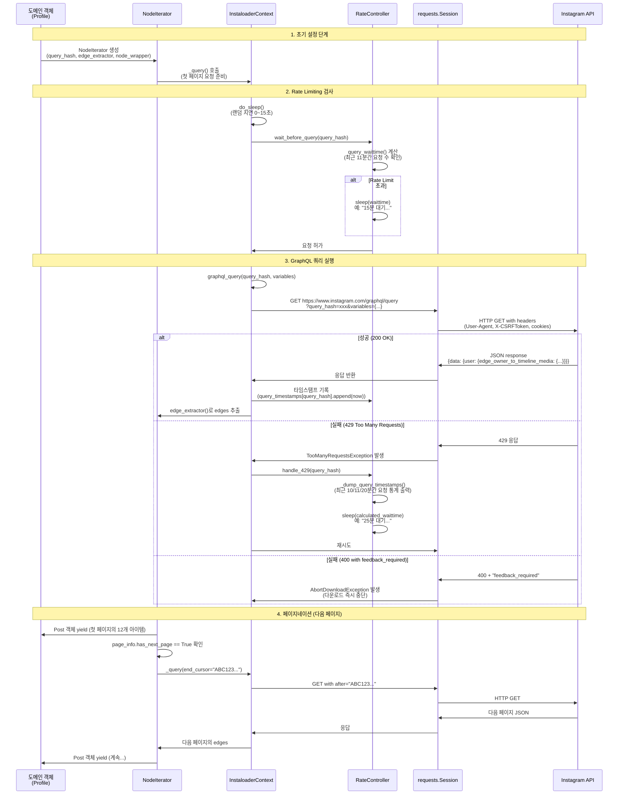
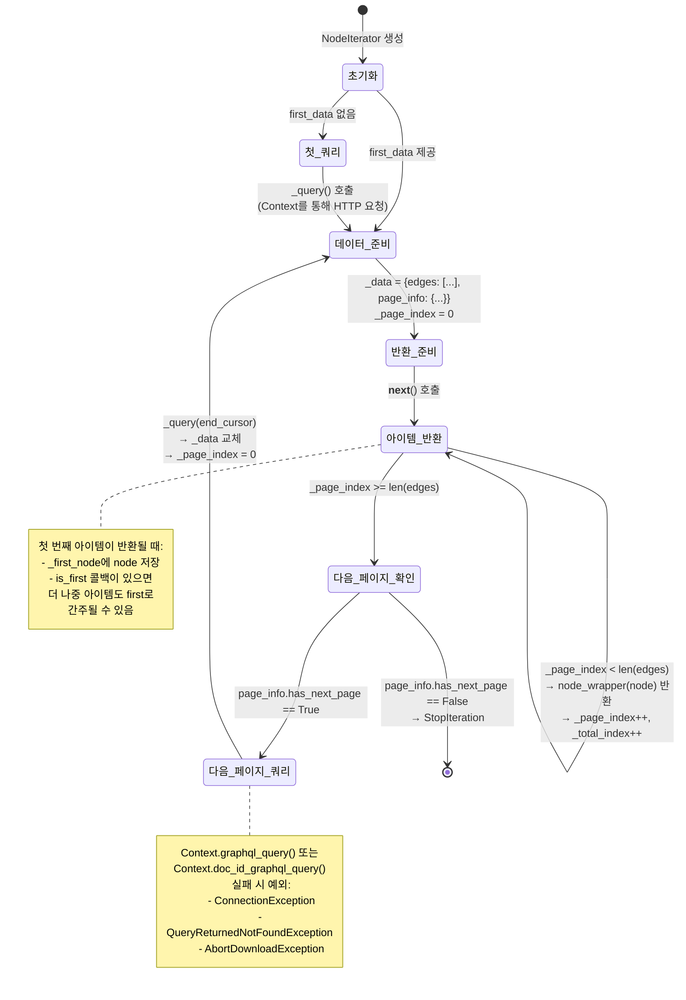
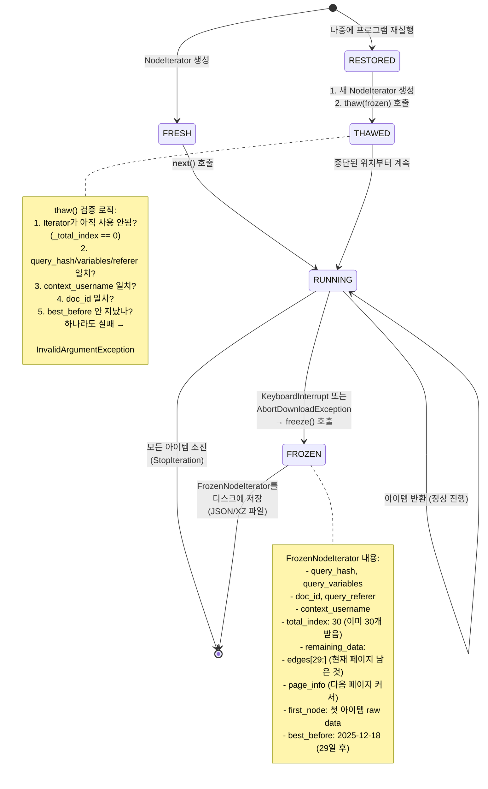
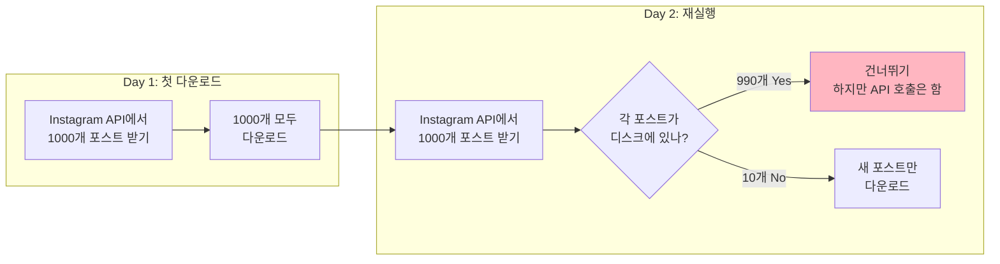
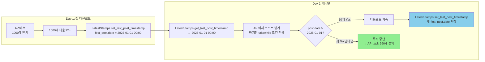
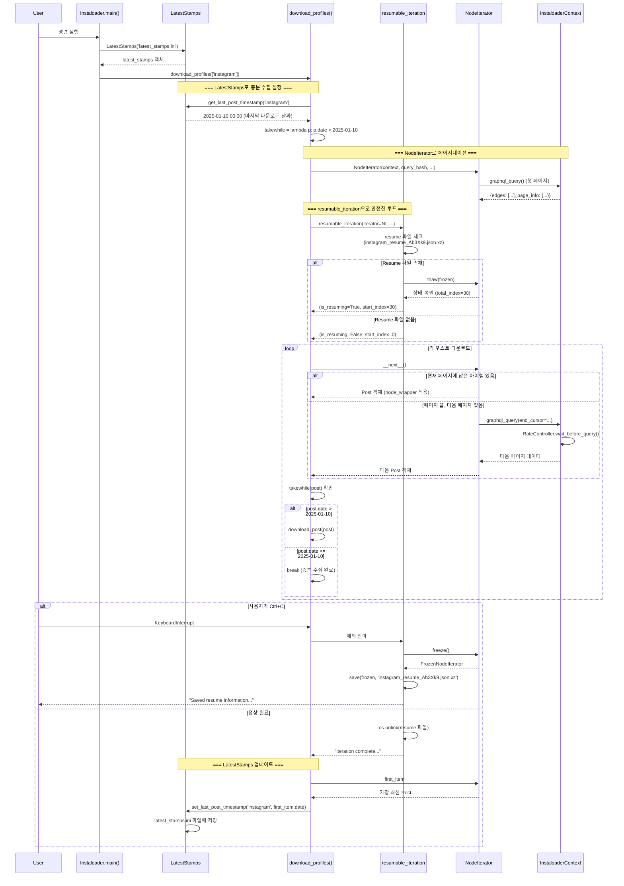

# 인프라스트럭처 레이어 상세 분석

**핵심 질문**: Instaloader는 어떻게 Instagram의 복잡한 API를 추상화하고, 대규모 데이터 수집을 안정적으로 수행할 수 있을까?

이 문서는 Instaloader의 인프라 레이어를 구성하는 4개의 핵심 컴포넌트를 다룹니다:
- **InstaloaderContext**: HTTP 통신과 세션 관리의 중앙 허브
- **NodeIterator**: GraphQL 페이지네이션의 통일된 추상화
- **resumable_iteration**: 중단/재개 가능한 안전한 반복 메커니즘
- **LatestStamps**: 증분 수집을 위한 로컬 타임스탬프 저장소

---

## 1. InstaloaderContext: 통신 인프라의 중앙 허브

### 1.1 왜 Context 객체가 필요한가?

**문제**: Instagram API는 여러 엔드포인트(GraphQL query_hash, doc_id, iPhone JSON)를 제공하며, 각각 다른 인증 방식, 헤더 설정, rate limit 정책을 가집니다.

**해결**: InstaloaderContext는 모든 HTTP 통신을 단일 인터페이스로 통합하여 다음을 제공합니다:

1. **중앙화된 세션 관리**: 쿠키, CSRF 토큰, 인증 헤더를 일관되게 관리
2. **API 버전 추상화**: 도메인 모델이 API 변경에 영향받지 않도록 격리
3. **자동 재시도 및 rate limiting**: 네트워크 오류와 429 응답에 대한 지능형 처리
4. **테스트 용이성**: Context를 mock으로 교체하여 단위 테스트 가능

### 1.2 HTTP 요청 흐름 상세 다이어그램

다음 시퀀스 다이어그램은 `Profile.get_posts()`를 호출했을 때 실제 HTTP 요청이 어떻게 흐르는지 보여줍니다:



### 1.3 핵심 메서드 해부

#### 1.3.1 `get_json()`: 모든 HTTP 요청의 기반

```python
# instaloadercontext.py 라인 386-496
def get_json(self, path: str, params: Dict[str, Any],
             host: str = 'www.instagram.com',
             session: Optional[requests.Session] = None,
             _attempt=1,
             use_post: bool = False) -> Dict[str, Any]:
    """
    핵심 기능:
    1. 요청 유형 감지: GraphQL query_hash / doc_id / iPhone / 기타
    2. Rate limiting: _rate_controller.wait_before_query() 호출
    3. HTTP 요청 실행: GET 또는 POST
    4. 에러 처리:
       - 400 + feedback_required → AbortDownloadException
       - 404 → QueryReturnedNotFoundException
       - 429 → TooManyRequestsException → 자동 재시도
       - 기타 → ConnectionException → max_connection_attempts까지 재시도
    5. 리다이렉트 처리: /accounts/login으로 가면 LoginRequiredException
    """
```

**동작 예시**:
```python
# 사용자 코드
context = InstaloaderContext()
context.login('username', 'password')

# GraphQL 쿼리
try:
    response = context.graphql_query(
        query_hash='d6f4427fbe92d846298cf93df0b937d3',
        variables={'user_id': '123456'},
        referer='https://www.instagram.com/profile/username/'
    )
    # → get_json() 내부에서 rate limiting, 재시도, 에러 처리 자동 수행
except AbortDownloadException:
    # feedback_required: 계정이 제한됨
    print("Instagram이 추가 인증을 요구합니다")
except TooManyRequestsException:
    # 이미 재시도했지만 계속 429 → 사용자에게 알림
    print("Rate limit 초과, 나중에 재시도하세요")
```

#### 1.3.2 `graphql_query()` vs `doc_id_graphql_query()`

Instagram은 API 방식을 점진적으로 변경하고 있습니다:

| 특성 | query_hash (구 방식) | doc_id (신 방식) |
|------|---------------------|-----------------|
| HTTP 메서드 | GET | POST |
| 파라미터 | `?query_hash=xxx&variables={...}` | `doc_id=xxx&variables={...}` (POST body) |
| 사용 예 | Profile.get_posts() (오래된 계정) | Profile.get_posts() (새 계정) |
| 코드 위치 | 라인 498-529 | 라인 531-563 |

```python
# 두 메서드 모두 동일한 인터페이스 제공:
def graphql_query(self, query_hash: str, variables: Dict[str, Any],
                  referer: Optional[str] = None) -> Dict[str, Any]:
    # ...내부적으로 get_json(use_post=False) 호출

def doc_id_graphql_query(self, doc_id: str, variables: Dict[str, Any],
                         referer: Optional[str] = None) -> Dict[str, Any]:
    # ...내부적으로 get_json(use_post=True) 호출
```

**NodeIterator는 이 차이를 자동으로 처리**하여 도메인 모델이 신경 쓰지 않도록 합니다.

#### 1.3.3 `get_iphone_json()`: 모바일 API 에뮬레이션

```python
# instaloadercontext.py 라인 601-663
def get_iphone_json(self, path: str, params: Dict[str, Any]) -> Dict[str, Any]:
    """
    iPad 앱처럼 동작하여 i.instagram.com에 요청:
    1. User-Agent를 iPad로 설정
    2. x-ig-app-id, x-pigeon-session-id 등 모바일 전용 헤더 추가
    3. 쿠키를 헤더로 매핑 (x-mid, ig-u-ds-user-id 등)
    4. 응답의 ig-set-* 헤더를 다음 요청에 재사용

    사용 예: Stories, Highlights 다운로드
    """
```

**왜 iPhone API가 필요한가?**
- 일부 기능(Stories 등)은 모바일 앱에서만 접근 가능
- Desktop GraphQL API보다 rate limit이 다름 (30분에 199 요청)

---

## 2. NodeIterator: GraphQL 페이지네이션의 우아한 추상화

### 2.1 해결하는 문제

**문제**: Instagram GraphQL API는 페이지네이션된 데이터를 다음 구조로 반환합니다:

```json
{
  "data": {
    "user": {
      "edge_owner_to_timeline_media": {
        "count": 1234,
        "page_info": {
          "has_next_page": true,
          "end_cursor": "QVFBQm..."
        },
        "edges": [
          {"node": {"id": "111", "shortcode": "abc", ...}},
          {"node": {"id": "222", "shortcode": "def", ...}},
          ...
        ]
      }
    }
  }
}
```

각 엔드포인트(posts, followers, comments 등)마다:
- `edges`와 `page_info`의 JSON 경로가 다름
- `node` 구조가 다름 (Post vs Profile vs Comment)
- 다음 페이지를 가져오는 query_hash/doc_id가 다름

**해결**: NodeIterator는 이 복잡성을 3개의 콜백으로 추상화:
1. `edge_extractor`: "어디서 edges를 찾을까?"
2. `node_wrapper`: "node를 어떤 객체로 변환할까?"
3. `is_first`: (선택) "어떤 아이템을 first로 간주할까?"

### 2.2 페이지네이션 동작 단계별 시각화



### 2.3 실제 사용 예시

#### 예시 1: Profile.get_posts() 구현

```python
# structures.py의 Profile 클래스
class Profile:
    def get_posts(self) -> NodeIterator[Post]:
        # 1. edge_extractor 정의: JSON에서 edges 찾기
        def posts_extractor(data: Dict) -> Dict:
            return data['data']['user']['edge_owner_to_timeline_media']

        # 2. node_wrapper 정의: node를 Post로 변환
        def post_wrapper(node: Dict) -> Post:
            return Post(self._context, node, self)

        # 3. NodeIterator 생성
        return NodeIterator(
            context=self._context,
            query_hash='69cba40317214236af40e7efa697781d',  # 또는 doc_id
            edge_extractor=posts_extractor,
            node_wrapper=post_wrapper,
            query_variables={'id': self.userid},
            query_referer=f'https://www.instagram.com/{self.username}/'
        )
```

#### 예시 2: 사용자 코드

```python
# 기본 사용법
profile = Profile.from_username(context, 'instagram')
post_iterator = profile.get_posts()

for post in post_iterator:
    print(f"Post {post.shortcode}: {post.likes} likes")
    # NodeIterator가 자동으로:
    # 1. 페이지가 끝나면 다음 페이지 요청
    # 2. Rate limiting 적용
    # 3. 에러 발생 시 재시도
    # 4. 더 이상 페이지 없으면 StopIteration

# 고급 사용: 처음 30개만 가져오기
from itertools import islice
for post in islice(profile.get_posts(), 30):
    print(post.shortcode)
    # islice가 30개 후 중단하면 자동으로 페이지네이션 멈춤
```

### 2.4 핵심 프로퍼티와 메서드

| 이름 | 타입 | 설명 |
|------|------|------|
| `total_index` | int | 지금까지 반환된 아이템 총 개수 |
| `count` | Optional[int] | Instagram이 반환한 count (총 개수, 부정확할 수 있음) |
| `first_item` | Optional[T] | 첫 번째로 반환된 아이템 (LatestStamps에 저장용) |
| `magic` | str | Iterator 식별자 (resume 파일 이름에 사용) |
| `freeze()` | FrozenNodeIterator | 현재 상태를 직렬화 가능한 NamedTuple로 변환 |
| `thaw(frozen)` | None | 이전에 freeze된 상태를 복원 |

---

## 3. Freeze/Thaw와 resumable_iteration: 안전한 중단/재개

### 3.1 왜 중단/재개가 필요한가?

**현실적인 문제들**:
1. **긴 실행 시간**: 10,000개의 포스트를 다운로드하는 데 몇 시간 소요
2. **네트워크 불안정**: 연결 끊김, rate limit 초과
3. **사용자 중단**: Ctrl+C로 프로그램 종료
4. **시스템 재시작**: 서버 재부팅, 배터리 부족

**전통적인 해결책의 문제**:
- 처음부터 다시 시작 → 이미 받은 데이터 재다운로드 (비효율, rate limit 낭비)
- 수동으로 offset 관리 → 코드 복잡, 에러 발생 가능

**Instaloader의 해결책**: Freeze/Thaw 메커니즘

### 3.2 Freeze/Thaw State Diagram



### 3.3 FrozenNodeIterator 구조 상세

```python
# nodeiterator.py 라인 13-32
FrozenNodeIterator = NamedTuple(
    'FrozenNodeIterator',
    [
        ('query_hash', Optional[str]),        # 쿼리 식별자
        ('query_variables', Dict),            # 쿼리 파라미터
        ('query_referer', Optional[str]),     # HTTP Referer
        ('context_username', Optional[str]),  # 세션 사용자
        ('total_index', int),                 # 이미 반환한 개수
        ('best_before', Optional[float]),     # 유효기간 (timestamp)
        ('remaining_data', Optional[Dict]),   # 남은 edges + page_info
        ('first_node', Optional[Dict]),       # 첫 아이템
        ('doc_id', Optional[str])             # doc_id (신 API용)
    ]
)
```

**예시 데이터** (JSON으로 저장됨):
```json
{
  "query_hash": "69cba40317214236af40e7efa697781d",
  "query_variables": {"id": "25025320"},
  "query_referer": "https://www.instagram.com/instagram/",
  "context_username": "my_account",
  "total_index": 30,
  "best_before": 1734480000.0,
  "remaining_data": {
    "count": 1234,
    "page_info": {
      "has_next_page": true,
      "end_cursor": "QVFBQmRHVnNkRFZrY..."
    },
    "edges": [
      {"node": {"id": "3111...", "shortcode": "Cxxx", ...}},
      ...
    ]
  },
  "first_node": {"id": "3000...", "shortcode": "Cabc", ...},
  "doc_id": null
}
```

### 3.4 resumable_iteration 컨텍스트 매니저 동작 흐름

```mermaid
flowchart TD
    Start([resumable_iteration 시작]) --> CheckEnabled{enabled=True<br/>and<br/>isinstance(iterator, NodeIterator)?}

    CheckEnabled -->|No| SimpleYield[yield False, 0<br/>그냥 실행]
    SimpleYield --> End([종료])

    CheckEnabled -->|Yes| GetMagic[magic = iterator.magic<br/>예: 'Ab3Xk9']
    GetMagic --> FormatPath[resume_file_path =<br/>format_path(magic)<br/>예: 'instagram_resume_Ab3Xk9.json.xz']

    FormatPath --> CheckFile{resume 파일<br/>존재?}

    CheckFile -->|No| SetFresh[is_resuming = False<br/>start_index = 0]

    CheckFile -->|Yes| LoadFile[fni = load(context, path)<br/>파일에서 FrozenNodeIterator 로드]

    LoadFile --> ValidateType{isinstance(fni,<br/>FrozenNodeIterator)?}
    ValidateType -->|No| WarnInvalid[경고: 'Invalid type'<br/>resume 무시]

    ValidateType -->|Yes| CheckBBD{check_bbd=True<br/>and<br/>best_before 지남?}
    CheckBBD -->|Yes| WarnExpired[경고: 'Best before date exceeded'<br/>resume 무시]

    CheckBBD -->|No| Thaw[iterator.thaw(fni)]

    Thaw --> ThawSuccess{thaw 성공?}
    ThawSuccess -->|No<br/>예외 발생| WarnMismatch[경고: 'Mismatching resume information'<br/>resume 무시]

    ThawSuccess -->|Yes| SetResumed[is_resuming = True<br/>start_index = iterator.total_index<br/>로그: 'Resuming from ...']

    WarnInvalid --> SetFresh
    WarnExpired --> SetFresh
    WarnMismatch --> SetFresh

    SetFresh --> YieldValues
    SetResumed --> YieldValues

    YieldValues[yield is_resuming, start_index<br/>→ 사용자 코드 실행]

    YieldValues --> UserCode{사용자 코드<br/>결과}

    UserCode -->|정상 완료| CheckOriginalFile{원래 resume<br/>파일 있었나?}

    CheckOriginalFile -->|Yes| DeleteFile[os.unlink(resume_file_path)<br/>로그: 'Iteration complete, deleted...']
    CheckOriginalFile -->|No| End
    DeleteFile --> End

    UserCode -->|KeyboardInterrupt<br/>또는<br/>AbortDownloadException| SaveResume[save(iterator.freeze(), path)<br/>로그: 'Saved resume information...']

    SaveResume --> Reraise[예외 재발생<br/>→ 프로그램 종료]
    Reraise --> End

    style SetResumed fill:#90EE90
    style SaveResume fill:#FFB6C1
    style DeleteFile fill:#87CEEB
```

### 3.5 실제 사용 예시

#### 예시 1: posts_download_loop에서의 사용

```python
# instaloader.py 라인 1035-1050 (단순화)
def posts_download_loop(self, posts: Iterator[Post], target: str, ...):
    # 1. resumable_iteration 설정
    with resumable_iteration(
        context=self.context,
        iterator=posts,
        load=load_structure_from_file,           # JSON.XZ 파일에서 FrozenNodeIterator 로드
        save=save_structure_to_file,             # FrozenNodeIterator를 JSON.XZ로 저장
        format_path=lambda magic: f'{target}_resume_{magic}.json.xz',
        check_bbd=self.check_resume_bbd,         # best_before 검사 활성화
        enabled=self.resume_prefix is not None   # --resume-prefix 옵션 있을 때만
    ) as (is_resuming, start_index):

        # 2. resume 여부에 따라 로그 출력
        if is_resuming:
            self.context.log(f"Resuming from post #{start_index + 1}")

        # 3. 반복문 실행
        for number, post in enumerate(posts, start=start_index + 1):
            if should_stop_condition(post):
                break

            # 다운로드 로직
            self.download_post(post, target)
            # 만약 여기서 KeyboardInterrupt 발생 →
            # resumable_iteration이 자동으로 iterator.freeze() 저장
```

#### 예시 2: 사용자 시나리오

**첫 번째 실행** (중단됨):
```bash
$ instaloader --login myaccount --resume-prefix myresume instagram

Downloading posts from instagram...
Post #1: Cxxx downloaded
Post #2: Cyyy downloaded
...
Post #30: Czzz downloaded
^C  # 사용자가 Ctrl+C 입력

Saved resume information to instagram_resume_Ab3Xk9.json.xz
```

**두 번째 실행** (재개됨):
```bash
$ instaloader --login myaccount --resume-prefix myresume instagram

Resuming from instagram_resume_Ab3Xk9.json.xz.
Resuming from post #31  # start_index=30이므로 31번부터
Post #31: Caaa downloaded
Post #32: Cbbb downloaded
...
Post #1234: Cfin downloaded

Iteration complete, deleted resume information file instagram_resume_Ab3Xk9.json.xz
```

**만약 best_before 지남**:
```bash
$ instaloader --login myaccount --resume-prefix myresume instagram
# (30일 후)

Warning: Not resuming from instagram_resume_Ab3Xk9.json.xz: "Best before" date exceeded.
Downloading posts from instagram...  # 처음부터 다시 시작
```

---

## 4. LatestStamps: 증분 수집의 핵심

### 4.1 해결하는 문제

**문제**: 같은 계정을 매일 크롤링할 때의 비효율성

```
Day 1: instagram 계정의 1000개 포스트 다운로드 (1시간 소요)
Day 2: instagram 계정의 1000개 포스트 다시 다운로드
       → 990개는 어제 받은 것 (중복)
       → 10개만 새 포스트
       → 990개 받는데 55분 낭비, rate limit 낭비
```

**해결**: "마지막으로 언제 받았는지" 기록하고, 그 이후 것만 다운로드

### 4.2 동작 원리: Before/After 비교

#### Before (LatestStamps 없을 때)



**문제점**:
- 990개의 오래된 포스트를 받기 위해 API 호출 소모
- Rate limit 낭비 (11분에 200 요청 제한)

#### After (LatestStamps 사용)



**이점**:
- 10개 받고 바로 중단 → API 호출 990개 절약
- Rate limit 효율 극대화
- 실행 시간 1시간 → 5분 단축

### 4.3 데이터 구조와 저장 방식

LatestStamps는 ConfigParser (INI 형식)를 사용합니다:

```ini
# latest_stamps.ini 파일 예시

[instagram]
profile-id = 25025320
post-timestamp = 2025-01-15T14:30:00.000000+0000
tagged-timestamp = 2025-01-10T08:00:00.000000+0000
story-timestamp = 2025-01-15T12:00:00.000000+0000
reels-timestamp = 2025-01-12T20:00:00.000000+0000
igtv-timestamp = 2025-01-01T00:00:00.000000+0000
profile-pic = 2025-01-15_12-00-00_UTC_profile_pic.jpg

[cristiano]
profile-id = 173560420
post-timestamp = 2025-01-14T18:00:00.000000+0000
profile-pic = 2025-01-14_18-00-00_UTC_profile_pic.jpg
```

**필드 설명**:

| 필드 | 타입 | 의미 |
|------|------|------|
| `profile-id` | int | 프로필의 Instagram user ID (username 변경돼도 추적 가능) |
| `post-timestamp` | datetime (ISO 8601) | 마지막으로 다운로드한 일반 포스트의 날짜 |
| `tagged-timestamp` | datetime | 태그된 포스트 |
| `story-timestamp` | datetime | 스토리 |
| `reels-timestamp` | datetime | 릴스 |
| `igtv-timestamp` | datetime | IGTV |
| `profile-pic` | str | 마지막 프로필 사진 파일명 (변경 감지용) |

### 4.4 서비스 레이어 통합 패턴

```python
# 실제 download_profiles() 메서드 (단순화)
def download_profiles(self, profiles: List[str]):
    latest_stamps = LatestStamps(self.dirname + '/latest_stamps.ini')

    for profile_name in profiles:
        profile = Profile.from_username(self.context, profile_name)

        # === 1. 일반 포스트 다운로드 (증분) ===
        # 1-1. 마지막 타임스탬프 로드
        last_scraped = latest_stamps.get_last_post_timestamp(profile_name)
        # → 없으면 datetime(1970, 1, 1) 반환 (처음 실행)

        # 1-2. takewhile 조건 설정: "날짜가 last_scraped보다 큰 것만"
        posts_takewhile = lambda post: post.date_local > last_scraped

        # 1-3. posts_download_loop 실행
        post_iterator = profile.get_posts()
        self.posts_download_loop(
            posts=post_iterator,
            target=profile_name,
            takewhile=posts_takewhile,
            # ...
        )
        # → takewhile이 False 반환하면 즉시 중단

        # 1-4. 새로운 타임스탬프 저장
        if post_iterator.first_item:
            latest_stamps.set_last_post_timestamp(
                profile_name,
                post_iterator.first_item.date_local
            )

        # === 2. 스토리 다운로드 (증분) ===
        last_story = latest_stamps.get_last_story_timestamp(profile_name)
        for story in profile.get_stories():
            if story.date_local <= last_story:
                break  # 이미 받은 스토리
            self.download_story(story, profile_name)

        # 최신 스토리 타임스탬프 저장
        latest_stamps.set_last_story_timestamp(profile_name, newest_story.date_local)

        # === 3. 태그된 포스트, 릴스 등도 동일한 패턴 ===
        # ...
```

### 4.5 Edge Case 처리

#### Case 1: 프로필 이름 변경

```python
# Instagram 사용자가 @old_name → @new_name으로 변경
latest_stamps = LatestStamps('latest_stamps.ini')

# profile-id로 추적하므로 이름 변경 감지 가능
old_id = latest_stamps.get_profile_id('old_name')  # 123456
new_profile = Profile.from_username(context, 'new_name')

if new_profile.userid == old_id:
    # 같은 사람! → 타임스탬프 이전
    latest_stamps.rename_profile('old_name', 'new_name')
```

#### Case 2: 시간 순서가 완벽하지 않은 경우

Instagram API는 때때로 시간 순서가 섞인 포스트를 반환합니다:

```
API 응답 순서:
1. Post A: 2025-01-15 10:00
2. Post B: 2025-01-15 09:00  ← 더 오래됨!
3. Post C: 2025-01-15 08:00
```

이 경우 `NodeIterator.is_first` 콜백으로 해결:

```python
def download_with_timestamp_safety():
    def is_newer_post(post: Post, current_first: Optional[Post]) -> bool:
        if current_first is None:
            return True
        return post.date_local > current_first.date_local

    posts = NodeIterator(
        # ...
        is_first=is_newer_post  # 날짜가 가장 최신인 것을 first로
    )

    # ...
    latest_stamps.set_last_post_timestamp(
        profile_name,
        posts.first_item.date_local  # 진짜 최신 포스트의 날짜
    )
```

---

## 5. 통합 예시: 모든 컴포넌트가 함께 동작하는 방식

다음은 `instaloader --login myaccount --fast-update --resume-prefix myresume instagram` 명령을 실행했을 때 4개 컴포넌트가 어떻게 협력하는지 보여줍니다:



---

## 6. 핵심 설계 원칙과 이점

### 6.1 관심사의 분리 (Separation of Concerns)

| 컴포넌트 | 책임 | 의존성 |
|---------|------|--------|
| InstaloaderContext | HTTP 통신, 인증, rate limiting | requests, RateController |
| NodeIterator | GraphQL 페이지네이션, freeze/thaw | InstaloaderContext |
| resumable_iteration | 중단/재개 로직, 파일 I/O | NodeIterator |
| LatestStamps | 증분 수집 타임스탬프 관리 | configparser |
| Domain 모델 (Post, Profile) | 비즈니스 로직 | 위 4개 컴포넌트 사용 |

**이점**:
- 각 컴포넌트를 독립적으로 테스트 가능
- Instagram API 변경 시 Context만 수정
- Resume 로직 변경 시 resumable_iteration만 수정

### 6.2 Fail-Safe 설계

1. **Context의 자동 재시도**:
   - ConnectionException → max_connection_attempts까지 재시도
   - TooManyRequestsException → 자동으로 대기 후 재시도

2. **resumable_iteration의 안전망**:
   - 예외 발생 시 항상 freeze() 저장
   - 재개 시 유효성 검증 (best_before, query 일치)

3. **LatestStamps의 원자성**:
   - 각 set_*_timestamp()가 즉시 파일에 flush
   - 프로그램 중단돼도 마지막 성공 시점 보존

### 6.3 확장성

새로운 엔드포인트 추가 예시:

```python
# 새로운 "Guides" 기능 추가
class Profile:
    def get_guides(self) -> NodeIterator[Guide]:
        def guide_extractor(data):
            return data['data']['user']['edge_guides']

        def guide_wrapper(node):
            return Guide(self._context, node)

        return NodeIterator(
            context=self._context,
            doc_id='12345...',  # 새 doc_id
            edge_extractor=guide_extractor,
            node_wrapper=guide_wrapper,
            query_variables={'user_id': self.userid}
        )
        # → resumable_iteration, LatestStamps 자동으로 호환!
```

---

## 7. 실전 코드 예시

### 예시 1: Context 생성과 로그인

```python
from instaloader import InstaloaderContext

# 기본 Context
context = InstaloaderContext(
    sleep=True,                    # API 호출 전 랜덤 지연
    quiet=False,                   # 로그 출력
    max_connection_attempts=3,     # 재시도 횟수
    request_timeout=300.0,         # 타임아웃 (초)
    iphone_support=True            # iPhone API 활성화
)

# 로그인
try:
    context.login('myusername', 'mypassword')
    print(f"Logged in as {context.username}")
except BadCredentialsException:
    print("Wrong password!")
except TwoFactorAuthRequiredException:
    code = input("Enter 2FA code: ")
    context.two_factor_login(code)

# 세션 저장 (다음에 재사용)
with open('session-myusername', 'wb') as f:
    context.save_session_to_file(f)

# 나중에 세션 로드
with open('session-myusername', 'rb') as f:
    context.load_session_from_file('myusername', f)
```

### 예시 2: NodeIterator 직접 사용

```python
from instaloader import Profile, Post

profile = Profile.from_username(context, 'instagram')
posts = profile.get_posts()

# 메타데이터 확인
print(f"Total posts (according to Instagram): {posts.count}")
print(f"Magic identifier: {posts.magic}")

# 처음 10개 다운로드 후 상태 저장
for i, post in enumerate(posts):
    if i >= 10:
        break
    print(f"{i+1}. {post.shortcode}: {post.caption_hashtags}")

# 현재 상태 freeze
frozen = posts.freeze()
print(f"Total downloaded: {frozen.total_index}")  # 10
print(f"Best before: {datetime.fromtimestamp(frozen.best_before)}")

# 파일로 저장
import json
with open('posts_resume.json', 'w') as f:
    json.dump(frozen._asdict(), f, default=str)

# 나중에 재개
posts2 = profile.get_posts()
with open('posts_resume.json') as f:
    frozen2 = FrozenNodeIterator(**json.load(f))
posts2.thaw(frozen2)

for i, post in enumerate(posts2, start=frozen2.total_index + 1):
    print(f"{i}. {post.shortcode}")  # 11부터 시작
```

### 예시 3: LatestStamps 활용

```python
from instaloader import LatestStamps
from datetime import datetime, timezone

stamps = LatestStamps('my_stamps.ini')

# 첫 다운로드
profile_name = 'instagram'
last_scraped = stamps.get_last_post_timestamp(profile_name)
# → datetime(1970, 1, 1, tzinfo=UTC) (처음)

posts = profile.get_posts()
new_posts = []

for post in posts:
    if post.date_local <= last_scraped:
        print(f"Already have {post.shortcode}, stopping")
        break
    new_posts.append(post)
    print(f"New: {post.shortcode}")

# 가장 최신 포스트 타임스탬프 저장
if posts.first_item:
    stamps.set_last_post_timestamp(profile_name, posts.first_item.date_local)
    print(f"Saved timestamp: {posts.first_item.date_local}")

# my_stamps.ini 내용:
# [instagram]
# post-timestamp = 2025-01-15T14:30:00.000000+0000

# 다음 실행 시:
last_scraped = stamps.get_last_post_timestamp('instagram')
# → datetime(2025, 1, 15, 14, 30, tzinfo=UTC)
# → 이 날짜 이후 포스트만 받음!
```

### 예시 4: 커스텀 RateController

```python
import instaloader

class StrictRateController(instaloader.RateController):
    """더 보수적인 rate limiting"""

    def count_per_sliding_window(self, query_type: str) -> int:
        # 기본값: query_hash=200, other=75
        # 더 안전하게: 각각 100, 50으로 줄임
        return 50 if query_type == 'other' else 100

    def sleep(self, secs: float):
        # 대기 중 사용자에게 진행 상황 표시
        import time
        for i in range(int(secs)):
            print(f"\rWaiting {secs - i:.0f}s...", end='', flush=True)
            time.sleep(1)
        print()

# 커스텀 RateController 사용
context = InstaloaderContext(
    rate_controller=lambda ctx: StrictRateController(ctx)
)
```

---

## 8. 디버깅 팁

### 8.1 Context 로깅

```python
# 상세한 HTTP 로그
import logging
logging.basicConfig(level=logging.DEBUG)

# requests 라이브러리 로그도 활성화
import http.client as http_client
http_client.HTTPConnection.debuglevel = 1
```

### 8.2 Rate Limit 상태 확인

```python
# RateController 내부 상태 출력
rc = context._rate_controller
current_time = time.monotonic()

for query_type, timestamps in rc._query_timestamps.items():
    recent = [t for t in timestamps if t > current_time - 660]
    print(f"{query_type}: {len(recent)} requests in last 11 min")
```

### 8.3 FrozenNodeIterator 검증

```python
import json
from datetime import datetime

with open('resume_file.json') as f:
    data = json.load(f)

print("Query hash:", data['query_hash'])
print("Total index:", data['total_index'])
print("Best before:", datetime.fromtimestamp(data['best_before']))
print("Remaining edges:", len(data['remaining_data']['edges']))
print("Has next page:", data['remaining_data']['page_info']['has_next_page'])
```

---

## 9. 요약

| 컴포넌트 | 핵심 역할 | 주요 이점 |
|---------|----------|----------|
| **InstaloaderContext** | HTTP 통신 중앙화 | API 변경 격리, 자동 재시도, rate limiting |
| **NodeIterator** | GraphQL 페이지네이션 추상화 | 코드 재사용, freeze/thaw 지원 |
| **resumable_iteration** | 안전한 중단/재개 | 긴 작업 안정성, 네트워크 오류 대응 |
| **LatestStamps** | 증분 수집 최적화 | API 호출 절약, 실행 시간 단축 |

**이 4개 컴포넌트의 시너지**:
1. Context가 안정적인 HTTP 통신 제공
2. NodeIterator가 페이지네이션 간소화
3. resumable_iteration이 예외 상황 처리
4. LatestStamps가 불필요한 다운로드 제거

→ 결과: **수천 개의 포스트를 안정적으로, 효율적으로, 재개 가능하게 수집**

---

## 다음 문서

`04_service_flows.md`에서는 이 인프라 컴포넌트들을 실제 서비스 레이어에서 어떻게 조합하여 사용하는지, `download_profiles()`, `download_hashtag()` 등의 고수준 메서드 실행 플로우를 상세히 다룹니다.
