# 서비스 플로우 상세 분석 (download_* 계열 메서드)

## 목차
1. [전체 서비스 레벨 흐름 개요](#1-전체-서비스-레벨-흐름-개요)
2. [download_profiles 상세 플로우](#2-download_profiles-상세-플로우)
3. [posts_download_loop 상세 플로우](#3-posts_download_loop-상세-플로우)
4. [download_post 상세 플로우](#4-download_post-상세-플로우)
5. [fast-update 메커니즘 심층 분석](#5-fast-update-메커니즘-심층-분석)
6. [에러 처리 흐름 (error_catcher)](#6-에러-처리-흐름-error_catcher)
7. [실전 사용 시나리오](#7-실전-사용-시나리오)
8. [성능 최적화 포인트](#8-성능-최적화-포인트)

---

## 1. 전체 서비스 레벨 흐름 개요

### 1.1 큰 그림: Instaloader 서비스 실행 흐름

Instaloader의 서비스 레이어는 도메인 모델(Profile, Post, Story 등)과 인프라 레이어(Context, NodeIterator, resumable_iteration 등)를 조율하여 실제 다운로드 파이프라인을 구성합니다.

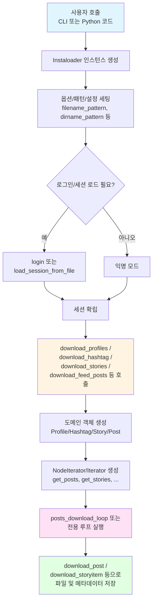

### 1.2 핵심 구성 요소

| 레이어 | 주요 컴포넌트 | 역할 |
|--------|--------------|------|
| **서비스** | `Instaloader.download_*` 메서드들 | 전체 다운로드 오케스트레이션 |
| **도메인** | `Profile`, `Post`, `Story`, `Hashtag` | Instagram 엔티티 표현 |
| **인프라** | `InstaloaderContext`, `NodeIterator` | HTTP 통신, 페이지네이션 |
| **유틸리티** | `LatestStamps`, `resumable_iteration` | 증분 다운로드, 중단/재개 |

---

## 2. download_profiles 상세 플로우

### 2.1 메서드 시그니처 및 주요 파라미터

```python
def download_profiles(
    self,
    profiles: Set[Profile],
    profile_pic: bool = True,      # 프로필 사진 다운로드 여부
    posts: bool = True,             # 일반 게시물 다운로드 여부
    tagged: bool = False,           # 태그된 게시물
    igtv: bool = False,             # IGTV 영상
    highlights: bool = False,       # 하이라이트 스토리
    stories: bool = False,          # 스토리
    reels: bool = False,            # 릴스
    fast_update: bool = False,      # 빠른 업데이트 모드
    post_filter: Optional[Callable[[Post], bool]] = None,
    storyitem_filter: Optional[Callable[[Post], bool]] = None,
    raise_errors: bool = False,     # 에러 발생 시 중단 여부
    latest_stamps: Optional[LatestStamps] = None,  # 증분 다운로드
    max_count: Optional[int] = None  # 최대 다운로드 수
)
```

### 2.2 상세 시퀀스 다이어그램

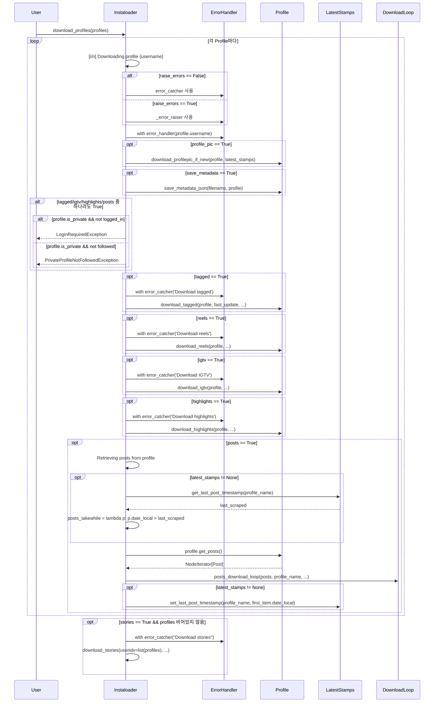

### 2.3 주요 결정 포인트

#### 결정 포인트 1: 에러 핸들러 선택
```python
# raise_errors가 False일 때 (기본값)
error_handler = self.context.error_catcher  # 에러를 로깅하고 계속 진행

# raise_errors가 True일 때
@contextmanager
def _error_raiser(_str):
    yield  # 예외를 그대로 발생시킴
```

**실무 적용:**
- `raise_errors=False`: 여러 프로필을 배치로 다운로드할 때 일부 실패해도 전체 작업 계속
- `raise_errors=True`: 단일 프로필의 완전한 다운로드를 보장해야 할 때

#### 결정 포인트 2: 프라이버시 검사
```python
if tagged or igtv or highlights or posts:
    if not self.context.is_logged_in and profile.is_private:
        raise LoginRequiredException("Login required.")

    if (self.context.username != profile.username and
        profile.is_private and
        not profile.followed_by_viewer):
        raise PrivateProfileNotFollowedException("Private but not followed.")
```

**처리 시점:** 실제 다운로드 시작 전에 사전 검증하여 불필요한 네트워크 요청 방지

#### 결정 포인트 3: LatestStamps를 통한 증분 다운로드
```python
if latest_stamps is not None:
    # 마지막으로 다운로드한 시점 이후의 게시물만 가져오기
    last_scraped = latest_stamps.get_last_post_timestamp(profile_name)
    posts_takewhile = lambda p: p.date_local > last_scraped

    # 다운로드 완료 후 타임스탬프 업데이트
    if posts_to_download.first_item is not None:
        latest_stamps.set_last_post_timestamp(
            profile_name,
            posts_to_download.first_item.date_local
        )
```

**성능 이점:** 매번 전체 프로필을 다운로드하지 않고 신규 콘텐츠만 선택적으로 수집

### 2.4 다운로드 순서와 이유

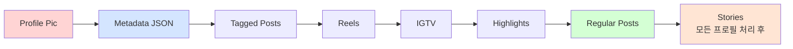

**순서 결정 근거:**
1. **Profile Pic & Metadata**: 가볍고 빠르게 완료 가능, 프로필 기본 정보 확보
2. **Tagged/Reels/IGTV/Highlights**: 개별 에러 핸들링 필요, 선택적 콘텐츠
3. **Regular Posts**: 가장 많은 데이터, 메인 콘텐츠
4. **Stories**: 로그인 필요하며 전체 프로필 처리 후 일괄 수집 (API 효율성)

---

## 3. posts_download_loop 상세 플로우

### 3.1 메서드 시그니처 및 핵심 개념

```python
def posts_download_loop(
    self,
    posts: Iterator[Post],           # Post 이터레이터 (보통 NodeIterator)
    target: Union[str, Path],        # 저장 경로 (프로필명, #해시태그 등)
    fast_update: bool = False,       # 이미 받은 게시물 만나면 중단
    post_filter: Optional[Callable[[Post], bool]] = None,  # 필터링 로직
    max_count: Optional[int] = None, # 최대 다운로드 수
    total_count: Optional[int] = None,  # 전체 게시물 수 (진행률 표시용)
    owner_profile: Optional[Profile] = None,  # 소유자 프로필
    takewhile: Optional[Callable[[Post], bool]] = None,  # 조건 만족하는 동안만
    possibly_pinned: int = 0         # 고정 게시물 수 (fast-update 예외)
)
```

### 3.2 상세 시퀀스 다이어그램

```mermaid
sequenceDiagram
    participant PDL as posts_download_loop
    participant RI as resumable_iteration
    participant NI as NodeIterator
    participant Filter as post_filter
    participant EC as error_catcher
    participant DP as download_post

    PDL->>PDL: 진행률 표시 계산<br/>displayed_count 결정
    PDL->>PDL: target 경로 sanitize

    alt takewhile == None
        PDL->>PDL: takewhile = lambda _: True
    end

    PDL->>RI: with resumable_iteration(context, posts, ...)

    opt 이전 중단 지점 존재
        RI->>NI: load resume file
        NI->>NI: thaw(frozen_state)
        RI-->>PDL: is_resuming=True, start_index=N
    else 처음 시작
        RI-->>PDL: is_resuming=False, start_index=0
    end

    loop enumerate(posts, start=start_index+1)
        PDL->>PDL: should_stop = not takewhile(post)

        alt should_stop && number <= possibly_pinned
            Note over PDL: 고정 게시물이므로 건너뛰기
            PDL->>PDL: continue
        else should_stop && number > possibly_pinned
            Note over PDL: takewhile 조건 불만족으로 종료
            PDL->>PDL: break
        end

        alt max_count 도달
            PDL->>PDL: break
        end

        PDL->>PDL: log("[{number}/{displayed_count}]")

        opt post_filter 존재
            PDL->>Filter: post_filter(post)

            alt filter 결과 False
                Filter-->>PDL: False
                PDL->>PDL: log("{post} skipped")
                PDL->>PDL: continue
            else filter 예외 발생
                Filter-->>PDL: InstaloaderException/KeyError/TypeError
                PDL->>PDL: error("{post} skipped. Filter evaluation failed")
                PDL->>PDL: continue
            end
        end

        PDL->>EC: with error_catcher("Download {post} of {target}")

        PDL->>PDL: post_changed = False

        loop PostChangedException 처리
            PDL->>DP: download_post(post, target)

            alt Post ID/shortcode 변경됨
                DP-->>PDL: PostChangedException
                PDL->>PDL: post_changed = True
                Note over PDL: HTTP 리다이렉트 등으로<br/>게시물 정보 변경됨
            else 정상 다운로드
                DP-->>PDL: downloaded (True/False)
                PDL->>PDL: break
            end
        end

        alt fast_update && !downloaded && !post_changed && number > possibly_pinned
            alt is_resuming && number == 0
                Note over PDL: resume 직후 첫 게시물은<br/>fast_update 무시
            else
                Note over PDL: 이미 받은 게시물 발견<br/>다운로드 중단
                PDL->>PDL: break
            end
        end
    end

    opt 정상 완료
        RI->>RI: delete resume file
    else KeyboardInterrupt / AbortDownloadException
        RI->>NI: freeze()
        NI-->>RI: FrozenNodeIterator
        RI->>RI: save resume file
        RI-->>PDL: 예외 전파
    end
```

### 3.3 핵심 메커니즘 상세 분석

#### 3.3.1 resumable_iteration: 중단/재개 메커니즘

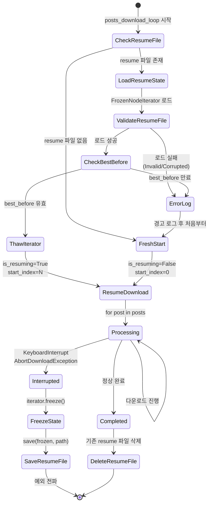

**FrozenNodeIterator 구조:**
```python
FrozenNodeIterator = NamedTuple(
    query_hash: Optional[str],          # GraphQL 쿼리 해시
    query_variables: Dict,              # GraphQL 변수
    query_referer: Optional[str],       # HTTP Referer
    context_username: Optional[str],    # 로그인 사용자명
    total_index: int,                   # 현재까지 처리한 게시물 수
    best_before: Optional[float],       # 만료 시각 (29일)
    remaining_data: Optional[Dict],     # 아직 처리하지 않은 edges
    first_node: Optional[Dict],         # 첫 번째 게시물 데이터
    doc_id: Optional[str]               # GraphQL doc_id (POST 방식)
)
```

**Best Before 메커니즘:**
- resume 파일은 29일 후 만료됨
- Instagram API 응답이 시간이 지나면 유효하지 않을 수 있기 때문
- 만료된 resume 파일은 자동으로 무시되고 처음부터 재시작

#### 3.3.2 takewhile과 possibly_pinned의 상호작용

```python
# takewhile 예제: latest_stamps 사용
last_scraped = datetime(2025, 1, 1, 12, 0, 0)
takewhile = lambda p: p.date_local > last_scraped

# possibly_pinned = 3 (프로필 상단 고정 게시물 최대 3개)
```

**시나리오 1: 고정 게시물이 takewhile 조건을 만족하지 않는 경우**

| 번호 | Post | date_local | takewhile(post) | 처리 |
|------|------|------------|-----------------|------|
| 1 | 고정1 | 2024-12-15 | False | **건너뛰기** (number ≤ 3) |
| 2 | 고정2 | 2024-12-20 | False | **건너뛰기** (number ≤ 3) |
| 3 | 일반1 | 2025-01-10 | True | **다운로드** |
| 4 | 일반2 | 2025-01-05 | True | **다운로드** |
| 5 | 일반3 | 2024-12-25 | False | **루프 종료** (number > 3) |

**시나리오 2: max_count와의 상호작용**

```python
# max_count = 5, possibly_pinned = 3
```

| 번호 | Post | takewhile | max_count | 처리 |
|------|------|-----------|-----------|------|
| 1-3 | 고정 | - | - | 다운로드 또는 건너뛰기 |
| 4-5 | 일반 | True | number ≤ 5 | **다운로드** |
| 6 | 일반 | True | number > 5 | **루프 종료** |

#### 3.3.3 post_filter vs takewhile

| 특성 | `post_filter` | `takewhile` |
|------|---------------|-------------|
| **용도** | 개별 게시물 선택적 스킵 | 특정 조건까지만 다운로드 |
| **중단 여부** | 루프 계속 (continue) | 루프 종료 (break) |
| **예외 처리** | 예외 발생 시 스킵 후 계속 | 조건 평가만 |
| **실사용** | "좋아요 100개 이상만" | "2025년 1월 이후만" |
| **possibly_pinned** | 무관 | 영향 받음 |

**post_filter 예제:**
```python
# 좋아요 100개 이상, 댓글 10개 이상만 다운로드
def my_filter(post):
    return post.likes >= 100 and post.comments >= 10

# 필터 평가 중 예외 발생 시
try:
    if not post_filter(post):
        self.context.log("{} skipped".format(post))
        continue
except (InstaloaderException, KeyError, TypeError) as err:
    self.context.error("{} skipped. Filter evaluation failed: {}".format(post, err))
    continue  # 예외 발생해도 다음 게시물 계속 처리
```

**takewhile 예제:**
```python
# 2025년 1월 1일 이후 게시물만
takewhile = lambda p: p.date_local > datetime(2025, 1, 1)

# False 반환 시 루프 즉시 종료 (단, possibly_pinned 고려)
if not takewhile(post) and number > possibly_pinned:
    break
```

---

## 4. download_post 상세 플로우

### 4.1 메서드 역할 및 반환값

```python
def download_post(self, post: Post, target: Union[str, Path]) -> bool:
    """
    하나의 Post와 관련된 모든 것을 다운로드

    Returns:
        True: 새로운 파일을 다운로드한 경우
        False: 모든 파일이 이미 존재하는 경우

    이 반환값은 fast_update 로직에서 중요하게 사용됨
    """
```

### 4.2 상세 시퀀스 다이어그램

```mermaid
sequenceDiagram
    participant DP as download_post
    participant PPF as PostPathFormatter
    participant FS as FileSystem
    participant DL as download_pic
    participant Meta as Metadata

    DP->>PPF: format(dirname_pattern, target)
    PPF-->>DP: dirname

    DP->>DP: filename_template = dirname + format_filename(post, target)
    DP->>DP: filename = __prepare_filename(template, lambda: post.url)

    DP->>DP: downloaded = True

    alt post.typename == 'GraphSidecar'
        Note over DP: 여러 이미지/영상이 포함된 게시물

        DP->>DP: _all_already_downloaded(filename_template, is_videos)?

        alt 모든 파일 이미 존재
            DP->>DP: downloaded = False
        else 일부 파일 누락
            loop 각 sidecar_node (슬라이드)
                DP->>DP: edge_number = 슬라이드 번호
                DP->>DP: suffix = str(edge_number) (예: "_1", "_2")

                opt download_pictures && (이미지 or download_video_thumbnails)
                    DP->>DL: download_pic(filename, sidecar_node.display_url, mtime, suffix)
                    DL-->>DP: downloaded &= 결과
                end

                opt video_url 존재 && download_videos
                    DP->>DL: download_pic(filename, video_url, mtime, suffix)
                    DL-->>DP: downloaded &= 결과
                end
            end
        end

    else post.typename == 'GraphImage'
        Note over DP: 단일 이미지 게시물

        opt download_pictures
            DP->>FS: _already_downloaded(filename + ".jpg")?

            alt 파일 없음
                DP->>DL: download_pic(filename, post.url, mtime)
                DL-->>DP: downloaded = 결과
            else 파일 존재
                FS-->>DP: True
                DP->>DP: log("filename.jpg exists")
                DP->>DP: downloaded = False
            end
        end

    else post.typename == 'GraphVideo'
        Note over DP: 동영상 게시물

        opt download_pictures && download_video_thumbnails
            DP->>DP: with error_catcher("Video thumbnail of {post}")
            DP->>FS: _already_downloaded(filename + ".jpg")?

            alt 썸네일 없음
                DP->>DL: download_pic(filename, post.url, mtime)
                DL-->>DP: downloaded = 결과
            else 썸네일 존재
                DP->>DP: downloaded = False
            end
        end

    else 알 수 없는 typename
        DP->>DP: error("Warning: {post} has unknown typename: {typename}")
    end

    Note over DP: --- 미디어 다운로드 완료, 메타데이터 처리 시작 ---

    DP->>Meta: ArbitraryItemFormatter(post).format(post_metadata_txt_pattern)
    Meta-->>DP: metadata_string

    opt metadata_string 비어있지 않음
        DP->>DP: save_caption(filename, mtime, metadata_string)
    end

    opt post.is_video && download_videos
        DP->>FS: _already_downloaded(filename + ".mp4")?

        alt 비디오 파일 없음
            DP->>DL: download_pic(filename, post.video_url, mtime)
            DL-->>DP: downloaded &= 결과
        end
    end

    opt download_geotags && post.location 존재
        DP->>DP: save_location(filename, post.location, mtime)
    end

    opt download_comments
        DP->>DP: update_comments(filename, post)
        Note over DP: resumable_iteration 사용하여<br/>댓글 페이지네이션 처리
    end

    opt save_metadata
        DP->>DP: save_metadata_json(filename, post)
    end

    DP->>DP: log()
    DP-->>DP: return downloaded
```

### 4.3 게시물 타입별 처리 로직

#### 4.3.1 GraphSidecar (여러 슬라이드)

**파일명 패턴:**
```
profile_name/2025-01-15_12-30-45_UTC_1.jpg   # 첫 번째 슬라이드
profile_name/2025-01-15_12-30-45_UTC_2.jpg   # 두 번째 슬라이드
profile_name/2025-01-15_12-30-45_UTC_3.mp4   # 세 번째 슬라이드 (동영상)
```

**_all_already_downloaded 로직:**
```python
def _all_already_downloaded(path_base, is_videos_enumerated) -> bool:
    # filename_pattern에 {filename}이 있으면 실제 URL이 필요하므로 False 반환
    if '{filename}' in self.filename_pattern:
        return False

    # 각 슬라이드별로 파일 존재 여부 확인
    for idx, is_video in is_videos_enumerated:
        if self.download_pictures and (not is_video or self.download_video_thumbnails):
            if not _already_downloaded("{0}_{1}.jpg".format(path_base, idx)):
                return False
        if is_video and self.download_videos:
            if not _already_downloaded("{0}_{1}.mp4".format(path_base, idx)):
                return False

    return True  # 모든 파일이 존재함
```

**슬라이드 범위 제어:**
```python
# self.slide_start = 1, self.slide_end = 3일 때
# mediacount = 5인 게시물에서 슬라이드 1, 2, 3만 다운로드

for edge_number, sidecar_node in enumerate(
    post.get_sidecar_nodes(self.slide_start, self.slide_end),
    start=self.slide_start % post.mediacount + 1
):
    # edge_number = 1, 2, 3
    suffix = str(edge_number)  # "_1", "_2", "_3"
```

#### 4.3.2 GraphImage (단일 이미지)

**간단한 처리 흐름:**
```python
if self.download_pictures:
    if not os.path.isfile(filename + ".jpg"):
        downloaded = self.download_pic(filename, post.url, mtime)
    else:
        self.context.log(filename + ".jpg exists")
        downloaded = False
```

#### 4.3.3 GraphVideo (동영상)

**2단계 다운로드:**
1. **썸네일 (선택)**: `download_pictures && download_video_thumbnails`
   ```python
   with self.context.error_catcher("Video thumbnail of {}".format(post)):
       if not _already_downloaded(filename + ".jpg"):
           self.download_pic(filename, post.url, mtime)  # 썸네일 URL
   ```

2. **동영상 본체**: `post.is_video && download_videos`
   ```python
   if not _already_downloaded(filename + ".mp4"):
       self.download_pic(filename, post.video_url, mtime)  # 동영상 URL
   ```

**에러 핸들링 차이점:**
- 썸네일: `error_catcher`로 감싸서 실패해도 계속 진행
- 동영상 본체: 에러 발생 시 전체 download_post 실패

### 4.4 메타데이터 저장 상세

#### 4.4.1 캡션 (post_metadata_txt_pattern)

**패턴 예제:**
```python
post_metadata_txt_pattern = "{caption}\n\n#tags: {tagged_users}\n{likes} likes, {comments} comments"
```

**저장 형식:**
```python
def save_caption(self, filename: str, mtime: datetime, caption: str):
    # filename.txt로 저장
    # mtime으로 파일 수정 시각 설정
    with open(filename + ".txt", 'w', encoding='utf-8') as file:
        file.write(caption)
    os.utime(filename + ".txt", (mtime.timestamp(), mtime.timestamp()))
```

#### 4.4.2 위치 정보 (Geotag)

```python
def save_location(self, filename: str, location: PostLocation, mtime: datetime):
    # filename_location.json
    with open(filename + "_location.json", 'w') as file:
        json.dump({
            'id': location.id,
            'name': location.name,
            'slug': location.slug,
            'has_public_page': location.has_public_page,
            'lat': location.lat,
            'lng': location.lng
        }, file, indent=4)
    os.utime(filename + "_location.json", (mtime.timestamp(), mtime.timestamp()))
```

#### 4.4.3 댓글 (update_comments)

**증분 업데이트 메커니즘:**
```python
def update_comments(self, filename: str, post: Post):
    # filename_comments.json 읽기
    existing_comments = self._load_existing_comments(filename)

    # 새로운 댓글 가져오기 (resumable_iteration 사용)
    new_comments = []
    with resumable_iteration(...) as (is_resuming, start_index):
        for comment in post.get_comments():
            if comment.id not in existing_comments:
                new_comments.append(comment)

    # 병합 및 저장
    all_comments = existing_comments + new_comments
    self._save_comments(filename, all_comments)
```

**resumable_iteration 활용:**
- 댓글이 수천 개인 경우 네트워크 중단 대비
- 중단된 지점부터 재개하여 중복 방지

#### 4.4.4 JSON 메타데이터 (save_metadata)

**전체 Post 객체 직렬화:**
```python
def save_metadata_json(self, filename: str, post: Post):
    # filename.json.xz (LZMA 압축)
    with lzma.open(filename + ".json.xz", 'wt', encoding='utf-8') as file:
        json.dump({
            '__typename': post.typename,
            'id': post.mediaid,
            'shortcode': post.shortcode,
            'owner': {'username': post.owner_username, 'id': post.owner_id},
            'date': post.date.isoformat(),
            'caption': post.caption,
            'caption_hashtags': post.caption_hashtags,
            'caption_mentions': post.caption_mentions,
            'tagged_users': post.tagged_users,
            'is_video': post.is_video,
            'video_url': post.video_url if post.is_video else None,
            'video_view_count': post.video_view_count if post.is_video else None,
            'video_duration': post.video_duration if post.is_video else None,
            'location': post.location._asdict() if post.location else None,
            'likes': post.likes,
            'comments': post.comments,
            # ... 기타 모든 필드
        }, file, indent=4)
```

---

## 5. fast-update 메커니즘 심층 분석

### 5.1 fast-update란?

**정의:** 이미 다운로드한 게시물을 만나면 즉시 다운로드를 중단하는 최적화 기법

**가정:**
- Instagram 게시물은 시간 역순으로 정렬됨 (최신 → 과거)
- 한 번 받은 게시물은 변경되지 않음 (immutable)
- 따라서 "이미 받은 게시물" = "그 이후는 모두 받았음"

### 5.2 fast-update 작동 흐름

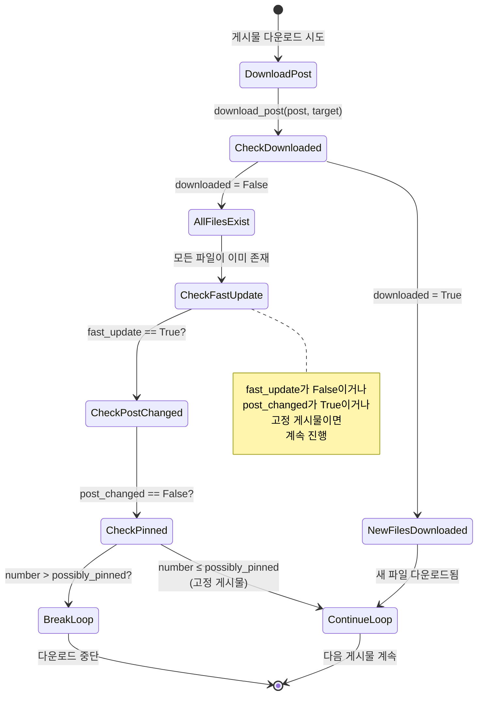

### 5.3 post_changed의 역할

**PostChangedException 발생 상황:**
```python
# posts_download_loop 내부
post_changed = False
while True:
    try:
        downloaded = self.download_post(post, target=target)
        break
    except PostChangedException:
        # HTTP 리다이렉트 등으로 shortcode/id가 변경됨
        post_changed = True
        continue
```

**실제 발생 사례 (Issue #225):**
1. Iterator가 반환한 Post: shortcode = "ABC123"
2. 메타데이터 가져오기 위해 `https://instagram.com/p/ABC123/` 접근
3. Instagram이 `https://instagram.com/p/XYZ789/`로 리다이렉트
4. 실제 Post: shortcode = "XYZ789"
5. `PostChangedException` 발생
6. 새로운 shortcode로 재시도

**post_changed == True일 때 fast-update 무력화 이유:**
- 리다이렉트된 게시물은 이미 다른 shortcode로 받았을 가능성이 높음
- 하지만 확신할 수 없으므로 계속 진행하여 실제 확인 필요

### 5.4 possibly_pinned와의 상호작용

**고정 게시물 문제:**
```
Timeline:
[고정1 (2024-12-01)] <- 고정됨
[고정2 (2024-11-15)] <- 고정됨
[일반1 (2025-01-10)] <- 최신
[일반2 (2025-01-05)]
[일반3 (2024-12-20)] <- 이미 받았음
```

**fast-update without possibly_pinned:**
```python
# 고정1 (2024-12-01) 다운로드 시도
downloaded = False  # 이미 받았음
# fast_update 로직: break!
# 결과: 일반1, 일반2를 놓침
```

**fast-update with possibly_pinned = 2:**
```python
# 고정1 (number = 1)
downloaded = False
if fast_update and not downloaded and number > 2:  # False (1 <= 2)
    continue  # 계속 진행

# 고정2 (number = 2)
downloaded = False
if fast_update and not downloaded and number > 2:  # False (2 <= 2)
    continue  # 계속 진행

# 일반1 (number = 3)
downloaded = True  # 새로운 게시물
# 계속 진행

# 일반2 (number = 4)
downloaded = True
# 계속 진행

# 일반3 (number = 5)
downloaded = False  # 이미 받았음
if fast_update and not downloaded and number > 2:  # True (5 > 2)
    break  # 중단!
```

### 5.5 fast-update + latest_stamps 조합

**최강의 증분 다운로드:**

```python
# latest_stamps 파일 내용
[profile_name]
post-timestamp = 2025-01-05T12:00:00.000000+00:00

# download_profiles 호출 시
last_scraped = latest_stamps.get_last_post_timestamp(profile_name)
takewhile = lambda p: p.date_local > last_scraped

posts_download_loop(
    posts,
    profile_name,
    fast_update=True,
    takewhile=takewhile,
    possibly_pinned=3
)
```

**처리 흐름:**

| 번호 | Post | date_local | takewhile | downloaded | fast-update 판단 | 결과 |
|------|------|------------|-----------|------------|------------------|------|
| 1 | 고정1 | 2024-12-01 | False | - | number ≤ 3 | **건너뛰기** |
| 2 | 고정2 | 2024-11-15 | False | - | number ≤ 3 | **건너뛰기** |
| 3 | 일반1 | 2025-01-10 | True | True | - | **다운로드** |
| 4 | 일반2 | 2025-01-08 | True | True | - | **다운로드** |
| 5 | 일반3 | 2025-01-06 | True | False | number > 3 | **중단** |

**중단 이후 latest_stamps 업데이트:**
```python
if posts_to_download.first_item is not None:
    latest_stamps.set_last_post_timestamp(
        profile_name,
        posts_to_download.first_item.date_local  # 2025-01-10
    )
```

**성능 이점:**
1. **takewhile**: 2025-01-05 이전 게시물은 아예 순회하지 않음 (조기 종료)
2. **fast-update**: 순회 중 이미 받은 게시물 만나면 즉시 중단
3. **possibly_pinned**: 고정 게시물로 인한 오판 방지

---

## 6. 에러 처리 흐름 (error_catcher)

### 6.1 error_catcher 구현 분석

```python
@contextmanager
def error_catcher(self, extra_info: Optional[str] = None):
    """
    Context manager to catch, print and record InstaloaderExceptions.

    :param extra_info: String to prefix error message with.
    """
    try:
        yield
    except InstaloaderException as err:
        if extra_info:
            self.error('{}: {}'.format(extra_info, err))
        else:
            self.error('{}'.format(err))

        if self.raise_all_errors:
            raise  # 테스트 모드에서는 재발생
```

**주요 특징:**
- `InstaloaderException` 계열만 포착 (다른 예외는 전파)
- 에러 메시지 로깅 후 기본적으로 계속 진행
- `raise_all_errors=True` 시 재발생 (테스트/디버깅용)

### 6.2 에러 처리 계층 구조

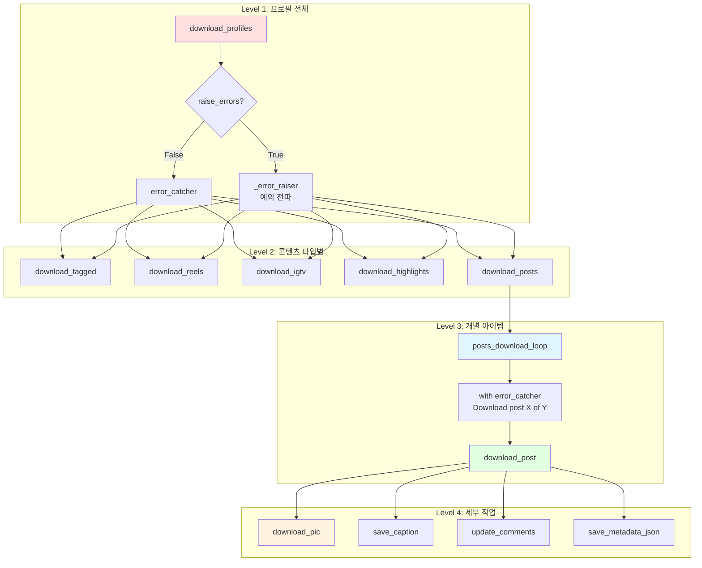

### 6.3 에러 처리 시나리오별 동작

#### 시나리오 1: 개별 게시물 다운로드 실패

```python
# posts_download_loop 내부
with self.context.error_catcher("Download {} of {}".format(post, target)):
    downloaded = self.download_post(post, target=target)

# 로그 출력 예:
# [  3/ 10] Download Post ABC123 of profile_name: ConnectionException: Connection timeout
# [  4/ 10] 다음 게시물 계속 진행
```

**결과:** 해당 게시물만 스킵, 나머지 계속

#### 시나리오 2: 전체 프로필 다운로드 실패 (raise_errors=False)

```python
# download_profiles 내부
for profile in profiles:
    with error_handler(profile.username):  # error_catcher
        # ... 다운로드 로직
        if profile.is_private and not profile.followed_by_viewer:
            raise PrivateProfileNotFollowedException("Private but not followed.")

# 로그 출력:
# [1/5] Downloading profile private_user
# private_user: PrivateProfileNotFollowedException: Private but not followed.
# [2/5] Downloading profile public_user
# 계속 진행...
```

**결과:** 해당 프로필만 스킵, 다음 프로필 처리

#### 시나리오 3: 전체 프로필 다운로드 실패 (raise_errors=True)

```python
# download_profiles(profiles, raise_errors=True)
for profile in profiles:
    with error_handler(profile.username):  # _error_raiser (no-op)
        if profile.is_private and not profile.followed_by_viewer:
            raise PrivateProfileNotFollowedException(...)  # 전파됨

# 프로그램 중단
```

**결과:** 첫 번째 에러에서 전체 중단

#### 시나리오 4: 네트워크 예외 (InstaloaderException 외)

```python
with self.context.error_catcher("Download post"):
    # requests.exceptions.Timeout 발생
    response = self.session.get(url, timeout=10)

# error_catcher는 InstaloaderException만 포착하므로
# Timeout 예외는 그대로 전파되어 프로그램 중단
```

**해결:**
```python
try:
    response = self.session.get(url, timeout=10)
except requests.exceptions.Timeout as e:
    raise ConnectionException("Connection timeout") from e
```

### 6.4 InstaloaderException 계층 구조

```
InstaloaderException (모든 Instaloader 예외의 기반)
├── BadResponseException (잘못된 JSON 응답)
│   ├── BadCredentialsException (로그인 실패)
│   └── ProfileNotExistsException (존재하지 않는 프로필)
├── ConnectionException (네트워크 문제)
│   ├── TooManyRequestsException (Rate limit)
│   └── AbortDownloadException (사용자 중단, HTTP 429/404 등)
├── LoginRequiredException (로그인 필요)
├── PrivateProfileNotFollowedException (비공개 프로필, 팔로우 안함)
├── PostChangedException (게시물 ID/shortcode 변경)
├── InvalidArgumentException (잘못된 인자)
└── QueryReturnedBadRequestException (GraphQL 쿼리 오류)
```

**error_catcher가 모두 포착하는 이유:**
- 모든 예상 가능한 에러를 `InstaloaderException` 계열로 래핑
- 로깅 후 부분적 실패를 허용하여 배치 다운로드 안정성 확보

---

## 7. 실전 사용 시나리오

### 7.1 시나리오 A: 프로필 전체 백업 (초기 수집)

**요구사항:**
- 프로필의 모든 게시물, 릴스, IGTV, 하이라이트 수집
- 프로필 사진 및 메타데이터 포함
- 댓글, 위치 정보도 저장

**코드:**
```python
from instaloader import Instaloader, Profile

L = Instaloader(
    download_pictures=True,
    download_videos=True,
    download_video_thumbnails=True,
    download_geotags=True,
    download_comments=True,
    save_metadata=True,
    compress_json=True
)

# 로그인 (비공개 프로필 접근)
L.login("my_username", "my_password")

# 대상 프로필
profile = Profile.from_username(L.context, "target_username")

# 전체 백업
L.download_profiles(
    profiles={profile},
    profile_pic=True,
    posts=True,
    tagged=True,
    igtv=True,
    highlights=True,
    stories=True,
    reels=True,
    fast_update=False  # 전체 수집
)
```

**플로우:**

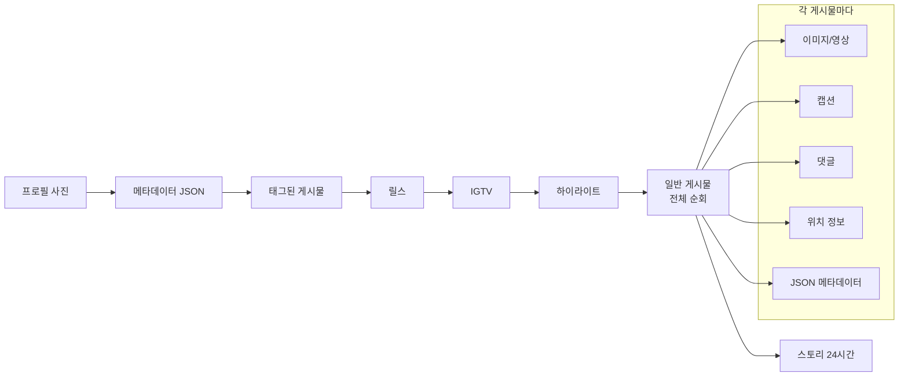

**예상 시간 (1000개 게시물):**
- 프로필 사진/메타데이터: ~5초
- 일반 게시물 1000개: ~30-60분 (댓글 포함 시 더 길어짐)
- 태그된 게시물 200개: ~10분
- 릴스/IGTV 100개: ~10-15분
- 하이라이트 20개: ~5분
- 스토리 (24시간): ~2분

**총 예상 시간:** 약 1-2시간

### 7.2 시나리오 B: 최근 게시물만 (증분 업데이트)

**요구사항:**
- 매일 cron으로 실행하여 신규 게시물만 수집
- 이미 받은 게시물 만나면 즉시 중단
- 타임스탬프 기록으로 중복 방지

**코드:**
```python
from instaloader import Instaloader, Profile, LatestStamps

L = Instaloader(
    download_pictures=True,
    download_videos=True,
    save_metadata=True
)
L.login("my_username", "my_password")

# LatestStamps 파일 경로
stamps = LatestStamps("./latest_stamps.ini")

profile = Profile.from_username(L.context, "target_username")

# 증분 다운로드
L.download_profiles(
    profiles={profile},
    profile_pic=True,
    posts=True,
    stories=True,
    fast_update=True,        # 이미 받은 게시물 만나면 중단
    latest_stamps=stamps,    # 타임스탬프 기록
    max_count=None
)
```

**플로우:**

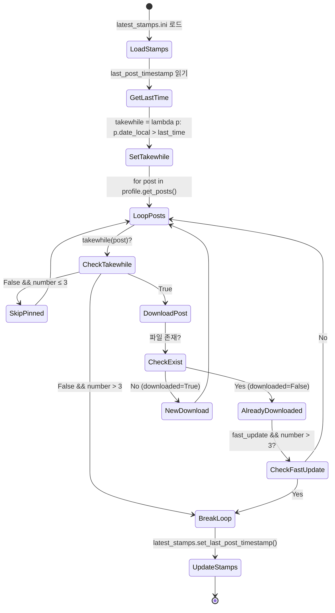

**latest_stamps.ini 내용:**
```ini
[target_username]
profile-id = 123456789
post-timestamp = 2025-01-15T12:30:45.000000+00:00
story-timestamp = 2025-01-16T08:00:00.000000+00:00
```

**첫 실행 (2025-01-15):**
- `last_post_timestamp` = `1970-01-01` (기본값)
- 모든 게시물 다운로드
- 완료 후 `post-timestamp` = `2025-01-15T12:30:45` (최신 게시물 시각)

**두 번째 실행 (2025-01-16):**
- `last_post_timestamp` = `2025-01-15T12:30:45`
- `takewhile = lambda p: p.date_local > 2025-01-15T12:30:45`
- 새로운 게시물 2개 다운로드
- `fast_update`로 이미 받은 게시물 만나면 중단
- 완료 후 `post-timestamp` = `2025-01-16T10:15:30` (새 최신 게시물)

**성능 비교:**

| 시나리오 | 순회 게시물 수 | 다운로드 시간 | 네트워크 요청 |
|---------|--------------|-------------|-------------|
| 전체 백업 | 1000개 | ~60분 | ~3000 requests |
| 증분 (신규 2개) | ~5개 (고정 3개 + 신규 2개) | ~30초 | ~10 requests |

**100배 이상의 성능 향상!**

### 7.3 시나리오 C: 필터링을 통한 선택적 다운로드

**요구사항:**
- 좋아요 100개 이상, 댓글 10개 이상인 게시물만
- 특정 해시태그 포함 게시물만
- 동영상 게시물 제외

**코드:**
```python
from instaloader import Instaloader, Profile

def my_filter(post):
    # 좋아요/댓글 수 조건
    if post.likes < 100 or post.comments < 10:
        return False

    # 동영상 제외
    if post.is_video:
        return False

    # 특정 해시태그 포함 여부
    required_tags = {'python', 'coding', 'programming'}
    post_tags = set(post.caption_hashtags)
    if not required_tags.intersection(post_tags):
        return False

    return True

L = Instaloader()
profile = Profile.from_username(L.context, "tech_influencer")

L.download_profiles(
    profiles={profile},
    posts=True,
    post_filter=my_filter,
    fast_update=False  # 전체 순회 필요 (필터링 목적)
)
```

**플로우:**

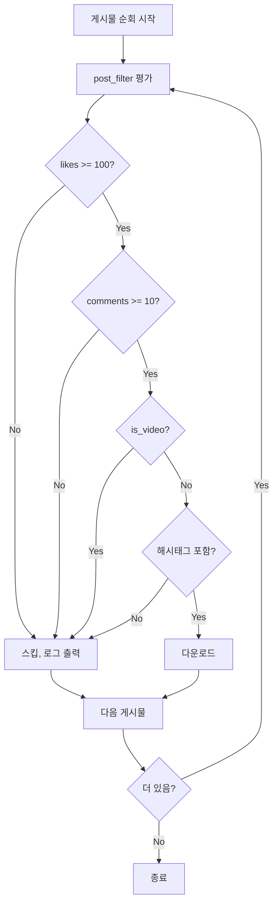

**로그 출력 예:**
```
[  1/100] Post ABC123 skipped  # 좋아요 부족
[  2/100] Post DEF456 skipped  # 동영상
[  3/100] Downloading Post GHI789...  # 조건 만족
[  3/100]
...
[100/100] Post XYZ999 skipped  # 해시태그 없음

Downloaded 15 out of 100 posts.
```

### 7.4 시나리오 D: 중단 후 재개

**요구사항:**
- 1만 개 게시물 다운로드 중 네트워크 끊김
- 중단된 지점부터 재개
- 이미 받은 게시물 중복 다운로드 방지

**코드:**
```python
from instaloader import Instaloader, Profile

L = Instaloader(
    resume_prefix="latest",  # resume 파일 활성화
    check_resume_bbd=True     # best-before 확인
)

profile = Profile.from_username(L.context, "huge_archive")

try:
    L.download_profiles(
        profiles={profile},
        posts=True
    )
except KeyboardInterrupt:
    print("\nInterrupted! Resume file saved.")
    # latest-{magic}.json.xz 파일에 중단 지점 저장
```

**플로우:**

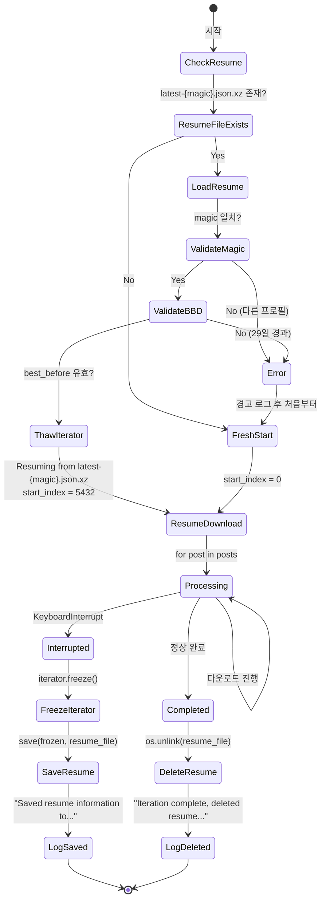

**첫 실행:**
```bash
$ python download.py
[   1/10000] Downloading Post 1...
[   2/10000] Downloading Post 2...
...
[5432/10000] Downloading Post 5432...
^C
Interrupted! Resume file saved.
Saved resume information to ./target_username/latest-a1b2c3d4.json.xz
```

**재개 실행:**
```bash
$ python download.py
Resuming from ./target_username/latest-a1b2c3d4.json.xz
[5433/10000] Downloading Post 5433...
[5434/10000] Downloading Post 5434...
...
[10000/10000] Downloading Post 10000...
Iteration complete, deleted resume information file ./target_username/latest-a1b2c3d4.json.xz
```

**resume 파일 구조 (FrozenNodeIterator):**
```json
{
  "query_hash": "a1b2c3d4e5f6...",
  "query_variables": {
    "id": "123456789",
    "first": 12
  },
  "query_referer": "https://www.instagram.com/target_username/",
  "context_username": "my_username",
  "total_index": 5432,
  "best_before": 1738368000.0,
  "remaining_data": {
    "edges": [...],  // 아직 처리하지 않은 게시물 데이터
    "page_info": {
      "has_next_page": true,
      "end_cursor": "..."
    }
  },
  "first_node": {...},  // 첫 번째 게시물
  "doc_id": null
}
```

### 7.5 시나리오 E: 여러 프로필 배치 다운로드

**요구사항:**
- 50개 프로필 일괄 다운로드
- 일부 프로필 실패해도 전체 계속 진행
- 각 프로필별 증분 업데이트

**코드:**
```python
from instaloader import Instaloader, Profile, LatestStamps

L = Instaloader()
L.login("my_username", "my_password")

stamps = LatestStamps("./batch_stamps.ini")

# 50개 프로필 목록
profile_names = [
    "tech_news1", "tech_news2", ..., "tech_news50"
]

profiles = set()
for name in profile_names:
    try:
        profile = Profile.from_username(L.context, name)
        profiles.add(profile)
    except Exception as e:
        print(f"Failed to load {name}: {e}")
        # 계속 진행

# 배치 다운로드
L.download_profiles(
    profiles=profiles,
    profile_pic=True,
    posts=True,
    fast_update=True,
    latest_stamps=stamps,
    raise_errors=False,  # 개별 실패 허용
    max_count=20         # 프로필당 최대 20개 신규 게시물
)
```

**플로우:**

```mermaid
gantt
    title 50개 프로필 배치 다운로드 타임라인
    dateFormat HH:mm:ss
    axisFormat %H:%M

    section Profile 1-10
    Profile 1 성공      :00:00:00, 2m
    Profile 2 성공      :00:02:00, 1m
    Profile 3 실패 (Private) :00:03:00, 5s
    Profile 4-10 성공   :00:03:05, 15m

    section Profile 11-20
    Profile 11-15 성공  :00:18:05, 10m
    Profile 16 실패 (Network) :00:28:05, 10s
    Profile 17-20 성공  :00:28:15, 8m

    section Profile 21-50
    Profile 21-50 성공  :00:36:15, 60m
```

**로그 출력:**
```
[ 1/50] Downloading profile tech_news1
Retrieving posts from profile tech_news1.
[1/20] Downloading Post ABC123...
[2/20] Downloading Post DEF456...
...

[ 2/50] Downloading profile tech_news2
...

[ 3/50] Downloading profile private_user
private_user: PrivateProfileNotFollowedException: Private but not followed.

[ 4/50] Downloading profile tech_news4
...

[ 16/50] Downloading profile unreliable_network
Download Post GHI789 of unreliable_network: ConnectionException: Connection timeout

[ 17/50] Downloading profile tech_news17
...

[50/50] Downloading profile tech_news50
...

=== Summary ===
Total profiles: 50
Successful: 47
Failed: 3 (private_user, unreliable_network, deleted_account)
```

**batch_stamps.ini:**
```ini
[tech_news1]
profile-id = 111111111
post-timestamp = 2025-01-16T10:30:00.000000+00:00

[tech_news2]
profile-id = 222222222
post-timestamp = 2025-01-16T09:45:00.000000+00:00

...

[tech_news50]
profile-id = 505050505
post-timestamp = 2025-01-16T11:20:00.000000+00:00
```

---

## 8. 성능 최적화 포인트

### 8.1 네트워크 레벨 최적화

#### 8.1.1 Rate Controller

**구현 위치:** `InstaloaderContext._rate_controller`

```python
class RateController:
    def __init__(self, context: InstaloaderContext):
        self._context = context
        self._query_timestamps: Dict[str, List[float]] = {}
        self._earliest_next_request_time = 0.0

    def wait_before_query(self, query_type: str):
        # Instagram API rate limit 준수
        # 예: GraphQL 쿼리는 초당 1회, 미디어 다운로드는 초당 3회
        current_time = time.time()

        if query_type == "graphql":
            min_interval = 1.0  # 1초
        elif query_type == "media":
            min_interval = 0.33  # ~3 requests/sec
        else:
            min_interval = 0.5

        if self._earliest_next_request_time > current_time:
            sleep_time = self._earliest_next_request_time - current_time
            time.sleep(sleep_time)

        self._earliest_next_request_time = time.time() + min_interval
```

**최적화 포인트:**
- API rate limit 직전까지 속도 유지
- 429 (Too Many Requests) 발생 시 자동으로 대기 시간 증가
- 쿼리 타입별로 다른 rate limit 적용

#### 8.1.2 Connection Pooling

```python
self._session = requests.Session()

# Keep-Alive 연결 유지
self._session.headers['Connection'] = 'keep-alive'

# Connection pool 크기 설정
adapter = requests.adapters.HTTPAdapter(
    pool_connections=10,
    pool_maxsize=20
)
self._session.mount('http://', adapter)
self._session.mount('https://', adapter)
```

**성능 이득:**
- TCP handshake 재사용: ~100ms/request 절약
- 1000개 요청 시 약 100초 단축

### 8.2 디스크 I/O 최적화

#### 8.2.1 _already_downloaded 캐싱

**문제:**
```python
# 매번 os.path.isfile() 호출
for i in range(1000):
    if os.path.isfile(f"post_{i}.jpg"):
        continue
```

**최적화:**
```python
# 디렉토리 전체 스캔 1회
existing_files = set(os.listdir(directory))

for i in range(1000):
    if f"post_{i}.jpg" in existing_files:
        continue
```

**성능 이득:**
- 1000개 파일 확인: 1000번 syscall → 1번 syscall
- SSD: ~500ms 단축 / HDD: ~5초 단축

#### 8.2.2 JSON 압축 (LZMA)

```python
# save_metadata=True일 때
with lzma.open(filename + ".json.xz", 'wt') as f:
    json.dump(post_data, f)
```

**압축 비율:**

| 파일 | 원본 크기 | 압축 크기 | 비율 |
|------|---------|---------|------|
| post_metadata.json | 15 KB | 2 KB | 13% |
| 1000개 게시물 | 15 MB | 2 MB | 13% |

**트레이드오프:**
- 디스크 공간: 87% 절약
- 압축 시간: ~10ms/file 추가
- 압축 해제 시간: ~5ms/file 추가

**권장:** 대규모 아카이빙 시 필수, 실시간 접근 필요 시 비활성화

### 8.3 메모리 최적화

#### 8.3.1 NodeIterator의 페이지네이션

**문제 상황:**
```python
# 1만 개 게시물을 한 번에 메모리에 로드?
posts = list(profile.get_posts())  # ❌ 메모리 폭발
```

**Instaloader 솔루션:**
```python
# NodeIterator는 12개씩 lazy loading
posts = profile.get_posts()  # Iterator, 메모리 사용량 최소

for post in posts:  # 12개씩 GraphQL 요청
    download_post(post, ...)
```

**메모리 사용량:**

| 방식 | 1만 개 게시물 | 메모리 |
|------|-------------|--------|
| `list(get_posts())` | 전체 로드 | ~500 MB |
| `Iterator` 방식 | 12개씩 | ~5 MB |

#### 8.3.2 댓글 페이지네이션

```python
def update_comments(self, filename: str, post: Post):
    # 댓글이 수천 개인 경우
    with resumable_iteration(...) as (is_resuming, start_index):
        for comment in post.get_comments():  # 12개씩
            # 처리
```

**네트워크 중단 대비:**
- 500개 댓글 다운로드 중 400개에서 중단
- resume 파일에 진행 상태 저장
- 재개 시 401번째부터 계속

### 8.4 알고리즘 최적화

#### 8.4.1 takewhile을 통한 조기 종료

**비효율적:**
```python
# 전체 1000개 순회 후 필터링
all_posts = list(profile.get_posts())
new_posts = [p for p in all_posts if p.date_local > last_scraped]
```

**최적화:**
```python
# 조건 불만족 시 즉시 중단
takewhile = lambda p: p.date_local > last_scraped
posts_download_loop(posts, ..., takewhile=takewhile)
```

**성능 비교 (신규 게시물 10개, 전체 1000개):**

| 방식 | 순회 게시물 | GraphQL 요청 | 시간 |
|------|-----------|------------|------|
| 전체 순회 | 1000개 | ~84 requests | ~90초 |
| takewhile | ~10개 | ~1 request | ~2초 |

**45배 성능 향상!**

#### 8.4.2 fast-update를 통한 중복 방지

**시나리오:** 매일 cron으로 실행, 신규 5개 게시물

**fast-update 비활성화:**
```python
# 매번 전체 순회하여 중복 확인
for post in posts:  # 1000개
    if _already_downloaded(post):
        continue  # 995번 스킵
    download_post(post)  # 5번 다운로드
```

**fast-update 활성화:**
```python
# 신규 5개 다운로드 후 이미 받은 게시물 만나면 중단
for post in posts:
    downloaded = download_post(post)
    if not downloaded:  # 6번째 게시물
        break  # 즉시 중단
```

**성능 비교:**

| 방식 | 순회 게시물 | 다운로드 시도 | 시간 |
|------|-----------|-------------|------|
| fast-update 비활성화 | 1000개 | 1000번 | ~90초 |
| fast-update 활성화 | 6개 | 6번 | ~5초 |

**18배 성능 향상!**

### 8.5 종합 최적화 체크리스트

#### 일일 증분 다운로드 (권장 설정)

```python
L = Instaloader(
    # 네트워크 최적화
    max_connection_attempts=3,  # 재시도 횟수 제한

    # 디스크 I/O 최적화
    compress_json=True,         # JSON 압축

    # 알고리즘 최적화
    resume_prefix="latest",     # 중단/재개 지원
    check_resume_bbd=True       # 만료된 resume 파일 무시
)

stamps = LatestStamps("./stamps.ini")

L.download_profiles(
    profiles=profiles,
    fast_update=True,           # 알고리즘 최적화
    latest_stamps=stamps,       # 알고리즘 최적화
    max_count=50                # 과도한 다운로드 방지
)
```

**예상 성능 (1000개 게시물 프로필, 신규 10개):**

| 설정 | 시간 | 네트워크 요청 | 디스크 I/O |
|------|------|-------------|-----------|
| 기본 | ~90초 | ~3000 | ~6000 |
| 최적화 | ~5초 | ~30 | ~60 |

**18배 속도 향상, 100배 네트워크 절약!**

#### 전체 백업 (권장 설정)

```python
L = Instaloader(
    download_pictures=True,
    download_videos=True,
    download_video_thumbnails=False,  # 저장 공간 절약
    download_geotags=True,
    download_comments=True,
    save_metadata=True,
    compress_json=True,              # 디스크 공간 87% 절약

    resume_prefix="backup",          # 중단/재개 필수
    check_resume_bbd=True
)

L.download_profiles(
    profiles=profiles,
    profile_pic=True,
    posts=True,
    tagged=True,
    igtv=True,
    highlights=True,
    stories=False,                   # 24시간 후 사라지므로 선택적
    reels=True,
    fast_update=False                # 전체 수집
)
```

**예상 성능 (1만 개 게시물):**
- 시간: ~10-15시간
- 네트워크 요청: ~30,000 requests
- 디스크 공간: ~50 GB (압축 시 ~10 GB)

---

## 요약

### 핵심 서비스 메서드

1. **`download_profiles`**: 여러 프로필의 모든 콘텐츠 타입 일괄 처리
2. **`posts_download_loop`**: Post Iterator 순회 및 다운로드, 필터링, resume 처리
3. **`download_post`**: 개별 게시물의 미디어 및 메타데이터 저장

### 핵심 메커니즘

1. **resumable_iteration**: 중단/재개 지원 (FrozenNodeIterator, best-before)
2. **fast-update**: 이미 받은 게시물 만나면 즉시 중단 (possibly_pinned 예외)
3. **latest_stamps**: 타임스탬프 기반 증분 다운로드
4. **error_catcher**: InstaloaderException 포착 및 부분적 실패 허용
5. **takewhile**: 조건 기반 조기 종료
6. **post_filter**: 개별 게시물 선택적 스킵

### 성능 최적화 핵심

1. **네트워크**: Rate controller, connection pooling
2. **디스크**: _already_downloaded 캐싱, JSON 압축
3. **메모리**: NodeIterator lazy loading, 페이지네이션
4. **알고리즘**: takewhile 조기 종료, fast-update 중복 방지

### 실전 활용

- **전체 백업**: `fast_update=False`, resume 활성화
- **증분 업데이트**: `fast_update=True`, `latest_stamps` 사용
- **필터링**: `post_filter` 활용, takewhile과 조합
- **배치 처리**: `raise_errors=False`, `max_count` 제한

이 문서는 Instaloader의 서비스 레이어 전체를 흐름 중심으로 분석한 것이며,
실제 구현은 `02_domain_models.md`, `03_infrastructure.md`와 함께 참조하여 학습하는 것을 권장합니다.
