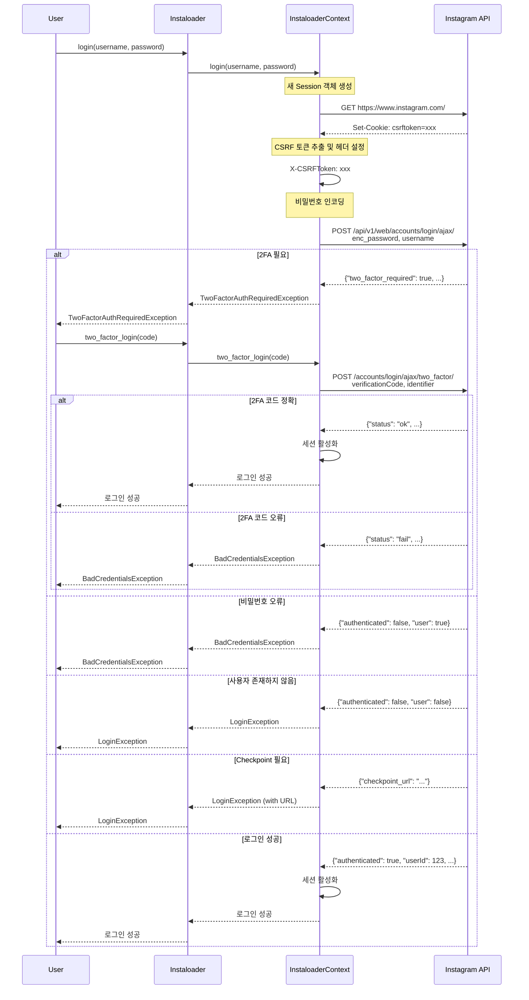
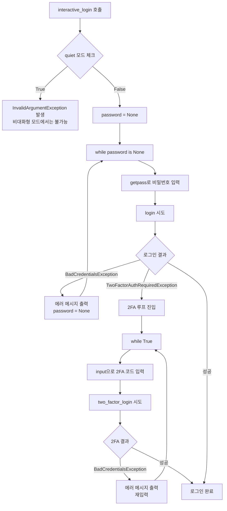
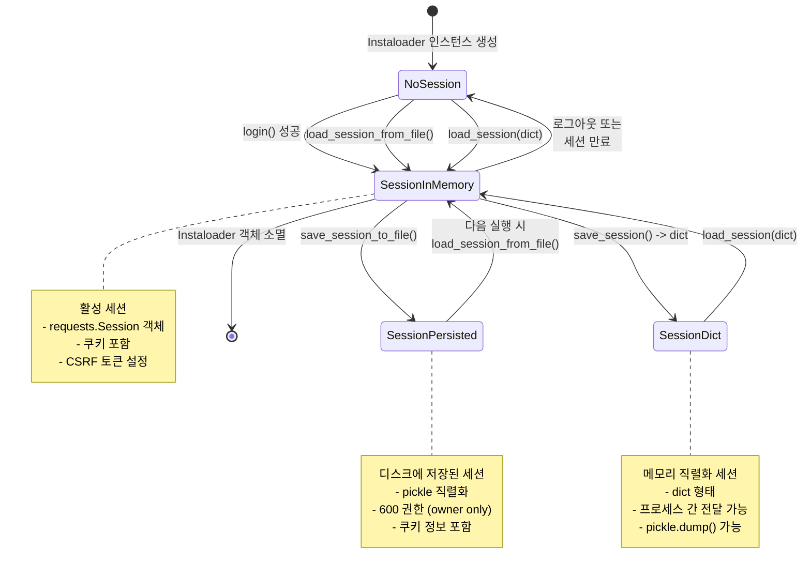

# 인증 및 세션 관리 완전 가이드

## 목차

1. [개요](#1-개요)
2. [아키텍처 및 핵심 컴포넌트](#2-아키텍처-및-핵심-컴포넌트)
3. [로그인 플로우 상세 분석](#3-로그인-플로우-상세-분석)
4. [세션 관리 메커니즘](#4-세션-관리-메커니즘)
5. [실전 사용 예시](#5-실전-사용-예시)
6. [보안 고려사항](#6-보안-고려사항)
7. [에러 처리 및 대응 전략](#7-에러-처리-및-대응-전략)
8. [익명 vs 로그인 모드](#8-익명-vs-로그인-모드)
9. [세션 파일 구조](#9-세션-파일-구조)
10. [고급 활용 패턴](#10-고급-활용-패턴)

---

## 1. 개요

Instaloader는 Instagram의 콘텐츠를 다운로드하기 위한 Python 라이브러리로, 인증 및 세션 관리가 핵심 기능입니다. 이 문서는 대학 수준의 소프트웨어 보안 및 웹 인증 관점에서 Instaloader의 인증 메커니즘을 심층 분석합니다.

### 1.1 학습 목표

- Instagram 로그인 프로토콜의 내부 동작 이해
- 세션 쿠키 기반 인증 메커니즘 파악
- 2단계 인증(2FA) 플로우 구현 방법 습득
- 세션 영속성(persistence) 및 재사용 전략 수립
- 보안 취약점 및 대응 방법 학습

### 1.2 주요 특징

- **쿠키 기반 세션 관리**: requests.Session 객체를 통한 HTTP 쿠키 관리
- **CSRF 토큰 보호**: Instagram API의 CSRF 방어 메커니즘 준수
- **2FA 지원**: Two-Factor Authentication 완전 지원
- **세션 영속성**: 파일 시스템 기반 세션 저장/로드
- **크로스 플랫폼**: Windows, macOS, Linux 환경별 최적화

---

## 2. 아키텍처 및 핵심 컴포넌트

### 2.1 컴포넌트 구조

```
┌─────────────────────────────────────┐
│   Instaloader (High-level API)      │
│  - login()                           │
│  - two_factor_login()                │
│  - interactive_login()               │
│  - save_session_to_file()            │
│  - load_session_from_file()          │
└──────────────┬──────────────────────┘
               │
               │ delegates to
               ▼
┌─────────────────────────────────────┐
│  InstaloaderContext (Low-level)     │
│  - HTTP requests management          │
│  - Session object storage            │
│  - CSRF token handling               │
│  - Cookie jar manipulation           │
└──────────────┬──────────────────────┘
               │
               │ uses
               ▼
┌─────────────────────────────────────┐
│    requests.Session                 │
│  - Cookie storage (CookieJar)        │
│  - HTTP headers management           │
│  - Connection pooling                │
└─────────────────────────────────────┘
```

### 2.2 코드 위치

| 컴포넌트 | 파일 경로 | 주요 역할 |
|---------|---------|---------|
| `Instaloader` | `/workspace/instaloader/instaloader/instaloader.py` | 사용자 대면 API |
| `InstaloaderContext` | `/workspace/instaloader/instaloader/instaloadercontext.py` | 내부 HTTP/세션 관리 |
| 예외 클래스 | `/workspace/instaloader/instaloader/exceptions.py` | 인증 관련 예외 정의 |

### 2.3 세션 저장 경로 정책

Instaloader는 OS별로 다른 디렉토리를 사용합니다:

```python
def _get_config_dir() -> str:
    if platform.system() == "Windows":
        # Windows: %LOCALAPPDATA%\Instaloader
        localappdata = os.getenv("LOCALAPPDATA")
        if localappdata is not None:
            return os.path.join(localappdata, "Instaloader")
        # Fallback: 임시 디렉토리
        return os.path.join(tempfile.gettempdir(), ".instaloader-" + getpass.getuser())
    # Unix: ~/.config/instaloader (XDG Base Directory 준수)
    return os.path.join(os.getenv("XDG_CONFIG_HOME", os.path.expanduser("~/.config")), "instaloader")
```

**실제 경로 예시**:
- **Windows**: `C:\Users\YourName\AppData\Local\Instaloader\session-username`
- **Linux/macOS**: `~/.config/instaloader/session-username`
- **Legacy (v4.4.3 이전)**: `/tmp/.instaloader-username/session-username`

---

## 3. 로그인 플로우 상세 분석

### 3.1 전체 로그인 시퀀스 다이어그램 (2FA 포함)



### 3.2 로그인 구현 상세 분석

#### 3.2.1 비밀번호 인코딩

Instagram은 보안을 위해 비밀번호를 특수한 형식으로 인코딩합니다:

```python
from datetime import datetime

enc_password = '#PWD_INSTAGRAM_BROWSER:0:{}:{}'.format(
    int(datetime.now().timestamp()),
    passwd
)
# 예: #PWD_INSTAGRAM_BROWSER:0:1700000000:mypassword123
```

**형식 분석**:
- `#PWD_INSTAGRAM_BROWSER`: 고정 프리픽스 (브라우저 로그인 식별자)
- `0`: 인코딩 버전
- `1700000000`: Unix 타임스탬프 (replay attack 방지)
- `mypassword123`: 실제 비밀번호 (평문)

#### 3.2.2 CSRF 토큰 관리

```python
# 1단계: Instagram 메인 페이지 방문으로 csrftoken 쿠키 획득
session.get('https://www.instagram.com/')

# 2단계: 쿠키에서 CSRF 토큰 추출
csrf_token = session.cookies.get_dict()['csrftoken']

# 3단계: 요청 헤더에 CSRF 토큰 추가
session.headers.update({'X-CSRFToken': csrf_token})

# 4단계: 로그인 POST 요청
login_response = session.post(
    'https://www.instagram.com/api/v1/web/accounts/login/ajax/',
    data={'enc_password': enc_password, 'username': user}
)
```

**보안 의의**:
- CSRF(Cross-Site Request Forgery) 공격 방어
- 쿠키의 토큰과 헤더의 토큰 일치 확인
- Same-Origin Policy 강화

### 3.3 Interactive Login 플로우



**코드 예시**:

```python
def interactive_login(self, username: str) -> None:
    if self.context.quiet:
        raise InvalidArgumentException("Quiet mode requires given password or valid session file.")

    try:
        password = None
        while password is None:
            password = getpass.getpass(prompt="Enter Instagram password for %s: " % username)
            try:
                self.login(username, password)
            except BadCredentialsException as err:
                print(err, file=sys.stderr)
                password = None  # 재입력 요구

    except TwoFactorAuthRequiredException:
        while True:
            try:
                code = input("Enter 2FA verification code: ")
                self.two_factor_login(code)
                break
            except BadCredentialsException as err:
                print(err, file=sys.stderr)
                # 루프 계속 - 재입력
```

---

## 4. 세션 관리 메커니즘

### 4.1 세션 상태 다이어그램



### 4.2 세션 저장/로드 메서드 비교

| 메서드 | 입력 | 출력 | 사용 사례 |
|--------|------|------|----------|
| `save_session()` | - | `dict` | 프로세스 간 세션 전달 |
| `load_session(username, dict)` | `str`, `dict` | - | dict로부터 세션 복원 |
| `save_session_to_file(filename)` | `Optional[str]` | - | 디스크에 영구 저장 |
| `load_session_from_file(username, filename)` | `str`, `Optional[str]` | - | 디스크에서 세션 로드 |

### 4.3 세션 저장 내부 구현

#### 4.3.1 save_session() - Dictionary 저장

```python
# InstaloaderContext.save_session()
def save_session(self):
    """requests.Session의 쿠키를 dict로 변환"""
    return requests.utils.dict_from_cookiejar(self._session.cookies)
```

**반환값 구조**:
```python
{
    'sessionid': 'IGSCxxx...xxx',  # 세션 ID (가장 중요)
    'csrftoken': 'abc123...',      # CSRF 토큰
    'ds_user_id': '12345678',      # 사용자 ID
    'mid': 'YXBjZW...',            # Machine ID
    'ig_vw': '1920',               # Viewport width
    'ig_cb': '1',                  # Cookie banner
    # ... 기타 쿠키들
}
```

#### 4.3.2 save_session_to_file() - 파일 저장

```python
# Instaloader.save_session_to_file()
@_requires_login
def save_session_to_file(self, filename: Optional[str] = None) -> None:
    if filename is None:
        filename = get_default_session_filename(self.context.username)

    # 디렉토리 생성 및 권한 설정
    dirname = os.path.dirname(filename)
    if dirname != '' and not os.path.exists(dirname):
        os.makedirs(dirname)
        os.chmod(dirname, 0o700)  # rwx------

    # 파일 저장 및 권한 설정
    with open(filename, 'wb') as sessionfile:
        os.chmod(filename, 0o600)  # rw-------
        self.context.save_session_to_file(sessionfile)

# InstaloaderContext.save_session_to_file()
def save_session_to_file(self, sessionfile):
    pickle.dump(self.save_session(), sessionfile)
```

**보안 특징**:
- **디렉토리 권한**: `700` (소유자만 읽기/쓰기/실행)
- **파일 권한**: `600` (소유자만 읽기/쓰기)
- **직렬화 방식**: Python pickle (바이너리)

#### 4.3.3 load_session_from_file() - 파일 로드

```python
def load_session_from_file(self, username: str, filename: Optional[str] = None) -> None:
    if filename is None:
        filename = get_default_session_filename(username)
        # Legacy fallback (v4.4.3 이전)
        if not os.path.exists(filename):
            filename = get_legacy_session_filename(username)

    with open(filename, 'rb') as sessionfile:
        self.context.load_session_from_file(username, sessionfile)
        self.context.log("Loaded session from %s." % filename)
```

**Fallback 전략**:
1. 새로운 경로 시도: `~/.config/instaloader/session-username`
2. 실패 시 legacy 경로 시도: `/tmp/.instaloader-user/session-username`
3. 둘 다 없으면 `FileNotFoundError` 발생

---

## 5. 실전 사용 예시

### 5.1 CLI 모드

#### 5.1.1 기본 로그인

```bash
# 최초 로그인 (대화형)
instaloader --login=your_username profile some_profile

# 프롬프트:
# Enter Instagram password for your_username: [입력]
# (2FA 활성화 시)
# Enter 2FA verification code: [코드 입력]

# 세션이 저장되므로 이후 실행 시 비밀번호 불필요
instaloader --login=your_username :feed
```

#### 5.1.2 세션 파일 명시

```bash
# 커스텀 세션 파일 사용
instaloader --login=your_username --sessionfile=./custom_session profile target_profile

# 여러 계정 관리
instaloader --login=account1 --sessionfile=./session_account1 :feed
instaloader --login=account2 --sessionfile=./session_account2 :saved
```

#### 5.1.3 비대화형 스크립트

```bash
#!/bin/bash
# cron job이나 자동화에 사용

# 세션 파일이 있다고 가정
instaloader --login=bot_account --quiet :feed

# 에러 처리
if [ $? -ne 0 ]; then
    echo "Session expired or error occurred" >&2
    # 재로그인 로직 또는 알림
fi
```

### 5.2 Python API 모드

#### 5.2.1 기본 패턴 - 세션 재사용

```python
import instaloader

# Instaloader 인스턴스 생성
L = instaloader.Instaloader()

USERNAME = "your_username"

try:
    # 저장된 세션 로드 시도
    L.load_session_from_file(USERNAME)
    print(f"Loaded session for {USERNAME}")

except FileNotFoundError:
    # 세션 파일이 없으면 로그인
    print(f"No session file found. Logging in...")
    PASSWORD = input("Password: ")

    try:
        L.login(USERNAME, PASSWORD)
    except instaloader.TwoFactorAuthRequiredException:
        code = input("Enter 2FA code: ")
        L.two_factor_login(code)

    # 세션 저장 (다음 실행을 위해)
    L.save_session_to_file()
    print("Session saved!")

# 로그인 상태 확인
logged_in_user = L.test_login()
print(f"Logged in as: {logged_in_user}")

# 이제 인증이 필요한 작업 수행 가능
for post in L.get_feed_posts():
    print(f"Feed post: {post.shortcode}")
    # ...
```

#### 5.2.2 고급 패턴 - 다중 계정 관리

```python
import instaloader
import os
from typing import Dict

class MultiAccountManager:
    def __init__(self, session_dir: str = "./sessions"):
        self.session_dir = session_dir
        os.makedirs(session_dir, exist_ok=True)
        self.instances: Dict[str, instaloader.Instaloader] = {}

    def get_session_path(self, username: str) -> str:
        return os.path.join(self.session_dir, f"session-{username}")

    def login(self, username: str, password: str = None) -> instaloader.Instaloader:
        """계정으로 로그인 또는 세션 로드"""
        if username in self.instances:
            return self.instances[username]

        L = instaloader.Instaloader()
        session_file = self.get_session_path(username)

        try:
            # 세션 파일 로드 시도
            L.load_session_from_file(username, session_file)
            print(f"[{username}] Loaded existing session")

        except FileNotFoundError:
            # 새로 로그인
            if password is None:
                password = input(f"Password for {username}: ")

            try:
                L.login(username, password)
            except instaloader.TwoFactorAuthRequiredException:
                code = input(f"2FA code for {username}: ")
                L.two_factor_login(code)

            # 세션 저장
            L.save_session_to_file(session_file)
            print(f"[{username}] Logged in and saved session")

        self.instances[username] = L
        return L

    def download_with_account(self, username: str, target: str):
        """특정 계정으로 다운로드"""
        L = self.login(username)
        profile = instaloader.Profile.from_username(L.context, target)
        L.download_profile(profile, profile_pic=False)

# 사용 예시
manager = MultiAccountManager()

# 여러 계정으로 작업
manager.download_with_account("main_account", "target1")
manager.download_with_account("backup_account", "target2")
```

#### 5.2.3 세션 검증 및 자동 갱신

```python
import instaloader
from datetime import datetime, timedelta

class SessionManager:
    def __init__(self, username: str, password: str = None):
        self.username = username
        self.password = password
        self.loader = instaloader.Instaloader()
        self.last_validated = None
        self.validation_interval = timedelta(hours=1)

    def ensure_logged_in(self) -> bool:
        """세션 유효성 검사 및 필요시 재로그인"""
        # 주기적 검증
        if (self.last_validated and
            datetime.now() - self.last_validated < self.validation_interval):
            return True

        # 세션 검증
        if self.loader.test_login() == self.username:
            self.last_validated = datetime.now()
            return True

        # 세션 무효 - 재로그인 시도
        print("Session expired. Re-authenticating...")
        return self.login()

    def login(self) -> bool:
        """로그인 수행"""
        try:
            self.loader.load_session_from_file(self.username)

            # 검증
            if self.loader.test_login() == self.username:
                self.last_validated = datetime.now()
                return True
            else:
                # 세션 파일이 있지만 무효
                raise FileNotFoundError("Invalid session")

        except FileNotFoundError:
            # 새로 로그인
            if self.password is None:
                raise ValueError("Password required for initial login")

            try:
                self.loader.login(self.username, self.password)
            except instaloader.TwoFactorAuthRequiredException:
                code = input("2FA code: ")
                self.loader.two_factor_login(code)

            self.loader.save_session_to_file()
            self.last_validated = datetime.now()
            return True

    def download_profile(self, target: str):
        """안전한 프로필 다운로드"""
        if not self.ensure_logged_in():
            raise Exception("Failed to authenticate")

        profile = instaloader.Profile.from_username(self.loader.context, target)
        self.loader.download_profile(profile)

# 사용 예시
manager = SessionManager("my_account", "my_password")
manager.download_profile("target_profile")

# 1시간 후 재호출 시 자동으로 세션 검증
manager.download_profile("another_profile")
```

#### 5.2.4 프로세스 간 세션 공유

```python
import instaloader
import pickle
import multiprocessing

def download_worker(username: str, session_data: dict, target: str):
    """워커 프로세스에서 실행"""
    L = instaloader.Instaloader()

    # 부모 프로세스에서 전달받은 세션 복원
    L.load_session(username, session_data)

    print(f"Worker: Downloading {target}")
    profile = instaloader.Profile.from_username(L.context, target)
    L.download_profile(profile, profile_pic=False)

def main():
    # 메인 프로세스에서 로그인
    L = instaloader.Instaloader()
    L.load_session_from_file("my_account")

    # 세션을 dict로 저장
    session_data = L.save_session()
    username = L.context.username

    # 여러 워커 프로세스 생성
    targets = ["profile1", "profile2", "profile3"]

    with multiprocessing.Pool(3) as pool:
        pool.starmap(download_worker,
                     [(username, session_data, t) for t in targets])

if __name__ == "__main__":
    main()
```

---

## 6. 보안 고려사항

### 6.1 파일 시스템 권한

#### 6.1.1 권한 설정 상세

```python
# 세션 디렉토리 권한: 700 (rwx------)
os.chmod(dirname, 0o700)

# 세션 파일 권한: 600 (rw-------)
os.chmod(filename, 0o600)
```

**Unix 권한 분석**:
```
소유자(Owner)  그룹(Group)  기타(Others)
    rwx           ---          ---
    421           000          000
     7             0            0
```

- **읽기(r=4)**: 파일 내용 읽기 가능
- **쓰기(w=2)**: 파일 수정 가능
- **실행(x=1)**: (디렉토리의 경우) 진입 가능

**보안 의의**:
- 다른 사용자가 세션 쿠키를 읽을 수 없음
- 멀티유저 시스템에서 중요
- 공유 서버 환경에서 필수

#### 6.1.2 OS별 권한 처리 차이

| OS | 권한 시스템 | Instaloader 대응 |
|----|-----------|----------------|
| **Linux/macOS** | POSIX 권한 (chmod) | `os.chmod(file, 0o600)` 완전 지원 |
| **Windows** | ACL (Access Control List) | `os.chmod()` 부분 지원, NTFS ACL 미설정 |

**Windows 보안 강화**:
```python
import os
import stat

# Windows에서 추가 보안
if os.name == 'nt':  # Windows
    import win32security
    import ntsecuritycon as con

    # 현재 사용자만 접근 가능하도록 ACL 설정
    user, domain, type = win32security.LookupAccountName("", os.getlogin())
    sd = win32security.GetFileSecurity(filename, win32security.DACL_SECURITY_INFORMATION)
    dacl = win32security.ACL()
    dacl.AddAccessAllowedAce(win32security.ACL_REVISION, con.FILE_ALL_ACCESS, user)
    sd.SetSecurityDescriptorDacl(1, dacl, 0)
    win32security.SetFileSecurity(filename, win32security.DACL_SECURITY_INFORMATION, sd)
```

### 6.2 세션 만료 처리

#### 6.2.1 세션 수명

Instagram 세션은 영구적이지 않습니다:
- **일반적 수명**: 약 90일 (활동 없을 시)
- **보안 이벤트**: 비밀번호 변경 시 즉시 무효화
- **IP 변경**: 의심스러운 IP에서 접속 시 재인증 요구 가능

#### 6.2.2 세션 검증 전략

```python
def validate_session(loader: instaloader.Instaloader, username: str) -> bool:
    """세션 유효성 검사"""
    try:
        # test_login()은 GraphQL 쿼리로 현재 사용자 확인
        current_user = loader.test_login()

        if current_user == username:
            return True
        elif current_user is None:
            print("Session expired or invalid")
            return False
        else:
            print(f"Warning: Logged in as {current_user}, expected {username}")
            return False

    except Exception as e:
        print(f"Session validation failed: {e}")
        return False

# 사용 예시
L = instaloader.Instaloader()
L.load_session_from_file("my_account")

if not validate_session(L, "my_account"):
    # 재로그인 필요
    L.login("my_account", password)
    L.save_session_to_file()
```

### 6.3 비밀번호 관리

#### 6.3.1 환경 변수 사용 (권장)

```python
import os
import instaloader

USERNAME = os.environ.get("INSTA_USERNAME")
PASSWORD = os.environ.get("INSTA_PASSWORD")

if not USERNAME or not PASSWORD:
    raise ValueError("Set INSTA_USERNAME and INSTA_PASSWORD environment variables")

L = instaloader.Instaloader()
try:
    L.load_session_from_file(USERNAME)
except FileNotFoundError:
    L.login(USERNAME, PASSWORD)
    L.save_session_to_file()
```

```bash
# .env 파일 (버전 관리 제외!)
INSTA_USERNAME=my_account
INSTA_PASSWORD=my_secure_password

# 실행
export $(cat .env | xargs)
python script.py
```

#### 6.3.2 Keyring 사용 (고급)

```python
import keyring
import instaloader

USERNAME = "my_account"

# 비밀번호 저장 (최초 1회)
# keyring.set_password("instaloader", USERNAME, "my_password")

# 비밀번호 조회
password = keyring.get_password("instaloader", USERNAME)

L = instaloader.Instaloader()
try:
    L.load_session_from_file(USERNAME)
except FileNotFoundError:
    L.login(USERNAME, password)
    L.save_session_to_file()
```

**장점**:
- OS의 안전한 자격 증명 저장소 사용
- macOS: Keychain
- Windows: Credential Manager
- Linux: Secret Service API (GNOME Keyring 등)

### 6.4 네트워크 보안

#### 6.4.1 HTTPS 강제

```python
# Instaloader는 항상 HTTPS 사용
# 모든 요청은 https://www.instagram.com 으로 전송

# HTTP는 자동으로 HTTPS로 업그레이드됨
```

#### 6.4.2 프록시 환경에서 사용

```python
import instaloader

L = instaloader.Instaloader()

# 프록시 설정
L.context._session.proxies = {
    'http': 'http://proxy.example.com:8080',
    'https': 'https://proxy.example.com:8080',
}

# SSL 검증 (프록시가 자체 서명 인증서 사용 시)
# 주의: 보안 위험 - 프로덕션에서는 적절한 CA 인증서 사용
# L.context._session.verify = False  # 비추천

# 더 나은 방법: 프록시 CA 인증서 지정
L.context._session.verify = '/path/to/proxy-ca-cert.pem'
```

### 6.5 Rate Limiting 및 탐지 회피

```python
import instaloader
import time

L = instaloader.Instaloader(
    download_videos=False,
    download_video_thumbnails=False,
    download_geotags=False,
    download_comments=False,
    save_metadata=True,
    compress_json=False,
    post_metadata_txt_pattern='',
    max_connection_attempts=3,
    request_timeout=300,
    rate_controller=lambda ctx: instaloader.RateController(ctx, max_sleep_time=30)
)

# 요청 간 지연 추가
L.context.sleep_multiplier = 2.0  # 기본 지연 시간의 2배

# 로그인
L.load_session_from_file("my_account")

# 다운로드 시 자동으로 rate limiting 적용
for post in profile.get_posts():
    L.download_post(post, target=profile.username)
    time.sleep(5)  # 추가 지연
```

---

## 7. 에러 처리 및 대응 전략

### 7.1 예외 계층 구조

```
Exception
│
└── InstaloaderException (베이스 예외)
    │
    ├── LoginException (로그인 일반 에러)
    │   ├── BadCredentialsException (비밀번호 오류)
    │   └── TwoFactorAuthRequiredException (2FA 필요)
    │
    ├── LoginRequiredException (로그인 필요한 기능 호출)
    │
    ├── ConnectionException (네트워크 에러)
    │   ├── QueryReturnedNotFoundException (404)
    │   └── TooManyRequestsException (429 - Rate Limit)
    │
    ├── PrivateProfileNotFollowedException (비공개 계정)
    │
    └── InvalidArgumentException (잘못된 인자)
```

### 7.2 에러별 대응 전략

#### 7.2.1 BadCredentialsException

**원인**:
- 잘못된 비밀번호
- 잘못된 2FA 코드

**대응**:
```python
import instaloader
import sys

L = instaloader.Instaloader()

max_attempts = 3
for attempt in range(max_attempts):
    try:
        password = input(f"Password (attempt {attempt+1}/{max_attempts}): ")
        L.login("my_account", password)
        break  # 성공

    except instaloader.BadCredentialsException as e:
        print(f"Error: {e}", file=sys.stderr)
        if attempt == max_attempts - 1:
            print("Max attempts reached. Exiting.", file=sys.stderr)
            sys.exit(1)

    except instaloader.TwoFactorAuthRequiredException:
        # 2FA 처리
        code = input("2FA code: ")
        try:
            L.two_factor_login(code)
            break
        except instaloader.BadCredentialsException as e:
            print(f"Invalid 2FA code: {e}", file=sys.stderr)

# 성공 시 세션 저장
L.save_session_to_file()
```

#### 7.2.2 TwoFactorAuthRequiredException

**원인**:
- 계정에 2FA가 활성화되어 있음

**대응**:
```python
import instaloader

L = instaloader.Instaloader()

try:
    L.login("my_account", "my_password")

except instaloader.TwoFactorAuthRequiredException:
    print("2FA is enabled for this account")

    # 방법 1: 직접 입력
    code = input("Enter 2FA code from your app: ")
    L.two_factor_login(code)

    # 방법 2: SMS 또는 이메일로 코드 받기
    # (Instagram 앱에서 설정 필요)

except instaloader.LoginException as e:
    print(f"Login failed: {e}")
    sys.exit(1)

# 세션 저장
L.save_session_to_file()
print("Logged in successfully with 2FA")
```

#### 7.2.3 LoginException

**원인**:
- 사용자 이름이 존재하지 않음
- Checkpoint 필요 (의심스러운 로그인)
- Instagram 응답 형식 변경
- 네트워크 오류

**대응**:
```python
import instaloader
import re

L = instaloader.Instaloader()

try:
    L.login("my_account", "my_password")

except instaloader.LoginException as e:
    error_msg = str(e)

    # Checkpoint URL 추출
    checkpoint_match = re.search(r'checkpoint_url.*?(https://\S+)', error_msg)
    if checkpoint_match:
        checkpoint_url = checkpoint_match.group(1)
        print(f"Checkpoint required!")
        print(f"Please visit: {checkpoint_url}")
        print("Follow the instructions, then run the script again.")
        sys.exit(1)

    # 사용자 존재하지 않음
    if "does not exist" in error_msg.lower():
        print(f"User 'my_account' does not exist")
        sys.exit(1)

    # 기타 에러
    print(f"Login error: {error_msg}")
    sys.exit(1)
```

#### 7.2.4 LoginRequiredException

**원인**:
- 로그인하지 않은 상태에서 인증 필요 기능 호출

**대응**:
```python
import instaloader

L = instaloader.Instaloader()

# 세션 로드 시도
try:
    L.load_session_from_file("my_account")
except FileNotFoundError:
    print("No session found. Please login first.")
    # 로그인 로직
    # ...

# 안전한 기능 호출
try:
    for post in L.get_feed_posts():
        print(post.shortcode)

except instaloader.LoginRequiredException:
    print("This operation requires login")
    print("Session may have expired. Please re-authenticate.")
    # 재로그인 로직
    # ...
```

#### 7.2.5 TooManyRequestsException

**원인**:
- Instagram의 Rate Limit 초과 (429 Too Many Requests)

**대응**:
```python
import instaloader
import time

L = instaloader.Instaloader()
L.load_session_from_file("my_account")

def download_with_retry(profile_name: str, max_retries: int = 3):
    """Rate limit 고려한 다운로드"""
    for retry in range(max_retries):
        try:
            profile = instaloader.Profile.from_username(L.context, profile_name)
            L.download_profile(profile)
            return True

        except instaloader.TooManyRequestsException as e:
            if retry < max_retries - 1:
                # 지수 백오프
                wait_time = 60 * (2 ** retry)  # 60초, 120초, 240초
                print(f"Rate limited. Waiting {wait_time} seconds...")
                time.sleep(wait_time)
            else:
                print(f"Failed after {max_retries} retries: {e}")
                return False

        except instaloader.ConnectionException as e:
            print(f"Connection error: {e}")
            return False

    return False

# 사용
download_with_retry("target_profile")
```

#### 7.2.6 PrivateProfileNotFollowedException

**원인**:
- 비공개 계정을 팔로우하지 않은 상태에서 접근

**대응**:
```python
import instaloader

L = instaloader.Instaloader()
L.load_session_from_file("my_account")

try:
    profile = instaloader.Profile.from_username(L.context, "private_account")

    if profile.is_private:
        print(f"{profile.username} is private")

        if not profile.followed_by_viewer:
            print("You are not following this account")
            print("Follow the account on Instagram, then try again")
        else:
            # 팔로우 중이지만 에러 발생 - 세션 문제 가능성
            print("Session may be invalid. Try re-logging in.")

    L.download_profile(profile)

except instaloader.PrivateProfileNotFollowedException as e:
    print(f"Cannot access private profile: {e}")
    print("Follow the account first on Instagram app")
```

### 7.3 종합 에러 핸들링 템플릿

```python
import instaloader
import sys
import time
from typing import Optional

class RobustInstaloader:
    def __init__(self, username: str, password: Optional[str] = None):
        self.username = username
        self.password = password
        self.loader = instaloader.Instaloader()
        self.max_login_attempts = 3
        self.max_download_retries = 3

    def login(self) -> bool:
        """강건한 로그인"""
        # 1. 세션 파일 시도
        try:
            self.loader.load_session_from_file(self.username)
            if self.loader.test_login() == self.username:
                print(f"Loaded valid session for {self.username}")
                return True
        except FileNotFoundError:
            pass

        # 2. 비밀번호 로그인
        if self.password is None:
            print("No valid session and no password provided")
            return False

        for attempt in range(self.max_login_attempts):
            try:
                self.loader.login(self.username, self.password)
                self.loader.save_session_to_file()
                print(f"Logged in as {self.username}")
                return True

            except instaloader.BadCredentialsException:
                print(f"Bad credentials (attempt {attempt+1}/{self.max_login_attempts})")
                if attempt == self.max_login_attempts - 1:
                    return False

            except instaloader.TwoFactorAuthRequiredException:
                code = input("2FA code: ")
                try:
                    self.loader.two_factor_login(code)
                    self.loader.save_session_to_file()
                    print(f"Logged in with 2FA")
                    return True
                except instaloader.BadCredentialsException:
                    print("Invalid 2FA code")
                    if attempt == self.max_login_attempts - 1:
                        return False

            except instaloader.LoginException as e:
                print(f"Login error: {e}")
                return False

        return False

    def download_profile(self, target: str) -> bool:
        """강건한 프로필 다운로드"""
        for retry in range(self.max_download_retries):
            try:
                profile = instaloader.Profile.from_username(
                    self.loader.context, target
                )

                # 비공개 계정 체크
                if profile.is_private and not profile.followed_by_viewer:
                    print(f"{target} is private and not followed")
                    return False

                self.loader.download_profile(profile)
                return True

            except instaloader.LoginRequiredException:
                print("Login required. Re-authenticating...")
                if not self.login():
                    return False

            except instaloader.TooManyRequestsException:
                wait = 60 * (2 ** retry)
                print(f"Rate limited. Waiting {wait}s...")
                time.sleep(wait)

            except instaloader.ConnectionException as e:
                print(f"Connection error: {e}")
                if retry < self.max_download_retries - 1:
                    time.sleep(10)
                else:
                    return False

            except Exception as e:
                print(f"Unexpected error: {e}")
                return False

        return False

# 사용 예시
downloader = RobustInstaloader("my_account", "my_password")
if downloader.login():
    downloader.download_profile("target_profile")
```

---

## 8. 익명 vs 로그인 모드

### 8.1 기능 비교표

| 기능 | 익명 모드 | 로그인 모드 | 비고 |
|------|----------|-----------|------|
| **프로필 다운로드** | 제한적 | 완전 | 공개 프로필만 vs 팔로우한 비공개 프로필 포함 |
| **해시태그 검색** | ❌ | ✅ | Instagram 정책 변경으로 로그인 필수 |
| **위치 기반 검색** | ❌ | ✅ | 로그인 필수 |
| **스토리** | ❌ | ✅ | 로그인 필수 |
| **하이라이트** | ❌ | ✅ | 로그인 필수 |
| **피드(Feed)** | ❌ | ✅ | 로그인 필수 |
| **저장된 게시물** | ❌ | ✅ | 로그인 필수 |
| **팔로워 목록** | ❌ | ✅ | 로그인 및 팔로우 필요 |
| **팔로잉 목록** | ❌ | ✅ | 로그인 및 팔로우 필요 |
| **댓글** | 제한적 | ✅ | 일부는 익명으로 가능하나 불안정 |
| **좋아요 수** | ✅ | ✅ | 공개 정보 |
| **지오태그** | ❌ | ✅ | 로그인 필수 |
| **IGTV** | 제한적 | ✅ | 로그인 권장 |
| **Reels** | 제한적 | ✅ | 로그인 권장 |
| **Rate Limit** | 매우 엄격 | 상대적 완화 | 로그인 시 더 많은 요청 허용 |

### 8.2 @_requires_login 데코레이터

```python
def _requires_login(func: Callable) -> Callable:
    """로그인 필수 함수 데코레이터"""
    @wraps(func)
    def call(instaloader, *args, **kwargs):
        if not instaloader.context.is_logged_in:
            raise LoginRequiredException("Login required.")
        return func(instaloader, *args, **kwargs)
    return call
```

**데코레이트된 주요 메서드**:
```python
@_requires_login
def save_session_to_file(self, filename: Optional[str] = None) -> None:
    # 세션 저장 (로그인 상태에서만)
    pass

@_requires_login
def get_feed_posts(self) -> Iterator[Post]:
    # 피드 가져오기
    pass

@_requires_login
def download_feed_posts(self, max_count: Optional[int] = None, ...):
    # 피드 다운로드
    pass

@_requires_login
def download_saved_posts(self, max_count: Optional[int] = None, ...):
    # 저장된 게시물 다운로드
    pass
```

### 8.3 익명 모드 사용 사례

```python
import instaloader

# 익명 모드 (로그인 없이)
L = instaloader.Instaloader()

# 공개 프로필 다운로드 (작동할 수 있음)
try:
    profile = instaloader.Profile.from_username(L.context, "public_account")
    L.download_profile(profile, profile_pic=True)
    print("Downloaded public profile anonymously")
except Exception as e:
    print(f"Failed: {e}")
    print("Instagram may require login for this operation")
```

**주의사항**:
- Instagram의 정책은 지속적으로 변경됨
- 과거에는 가능했던 익명 작업이 로그인 필수로 변경되는 추세
- 안정적인 작업을 위해서는 로그인 사용 권장

### 8.4 로그인 모드 권장 사항

**항상 로그인이 필요한 경우**:
1. 프로덕션 환경 스크립트
2. 자동화된 다운로드 작업
3. 비공개 계정 접근
4. 대량 데이터 수집
5. 안정적인 Rate Limit 관리

**익명 모드 사용 가능한 경우** (보장 없음):
1. 일회성 테스트
2. 공개 프로필 단일 다운로드
3. Instagram API 변경 사항 확인

---

## 9. 세션 파일 구조

### 9.1 파일 형식

세션 파일은 **Python pickle 형식**으로 저장됩니다.

```python
import pickle
import requests

# 세션 저장 (내부적으로)
session_dict = requests.utils.dict_from_cookiejar(session.cookies)
with open('session-username', 'wb') as f:
    pickle.dump(session_dict, f)
```

### 9.2 세션 딕셔너리 구조

```python
{
    'sessionid': 'IGSCxxxxxxxxxxxxxxxxxxxxxxxxxxx%3Axxxxxxxxxxxxxxxxxxxxx%3A...',
    'csrftoken': 'abcdefghijklmnopqrstuvwxyz1234567890ABCD',
    'ds_user_id': '12345678901',
    'mid': 'YXBjZWRmZ2hpamtsbW5vcHFyc3R1dnd4eXowMTIzNDU2Nzg5',
    'ig_did': 'XXXXXXXX-XXXX-XXXX-XXXX-XXXXXXXXXXXX',
    'ig_nrcb': '1',
    'rur': '"VLL\\05412345678901\\0541234567890:01f...',
    'ig_vw': '1920',
    'ig_cb': '1',
    'ig_pr': '1',
}
```

**주요 쿠키 설명**:

| 쿠키 이름 | 설명 | 보안 중요도 |
|----------|------|-----------|
| `sessionid` | **세션 식별자** - 가장 중요한 쿠키 | 🔴 매우 높음 |
| `csrftoken` | CSRF 공격 방지 토큰 | 🟡 높음 |
| `ds_user_id` | 사용자 ID (숫자) | 🟢 낮음 |
| `mid` | Machine ID - 디바이스 식별자 | 🟡 중간 |
| `ig_did` | Instagram Device ID | 🟡 중간 |
| `rur` | Region/Data Center routing | 🟢 낮음 |

### 9.3 세션 파일 분석 도구

```python
import pickle
import instaloader

def analyze_session_file(filename: str):
    """세션 파일 내용 분석"""
    try:
        with open(filename, 'rb') as f:
            session_data = pickle.load(f)

        print(f"=== Session File Analysis: {filename} ===\n")

        # 주요 정보 추출
        if 'ds_user_id' in session_data:
            print(f"User ID: {session_data['ds_user_id']}")

        if 'sessionid' in session_data:
            sid = session_data['sessionid']
            print(f"Session ID: {sid[:20]}...{sid[-20:]}")  # 보안상 일부만 출력

        if 'csrftoken' in session_data:
            print(f"CSRF Token: {session_data['csrftoken']}")

        # 모든 쿠키 나열
        print(f"\nTotal cookies: {len(session_data)}")
        print("Cookie names:")
        for key in session_data.keys():
            print(f"  - {key}")

        # 세션 검증 시도
        print("\n=== Validation ===")
        L = instaloader.Instaloader()
        L.load_session("unknown", session_data)  # username은 검증 시 추출됨

        username = L.test_login()
        if username:
            print(f"✅ Session is valid for user: {username}")
        else:
            print("❌ Session is invalid or expired")

    except FileNotFoundError:
        print(f"Error: File {filename} not found")
    except Exception as e:
        print(f"Error analyzing session: {e}")

# 사용 예시
analyze_session_file(instaloader.get_default_session_filename("my_account"))
```

**출력 예시**:
```
=== Session File Analysis: ~/.config/instaloader/session-my_account ===

User ID: 12345678901
Session ID: IGSCxxxxxxxxxxx...xxxxxxxxxxxxxxxxxx
CSRF Token: abcdefghijklmnopqrstuvwxyz1234567890ABCD

Total cookies: 9
Cookie names:
  - sessionid
  - csrftoken
  - ds_user_id
  - mid
  - ig_did
  - rur
  - ig_vw
  - ig_cb
  - ig_pr

=== Validation ===
✅ Session is valid for user: my_account
```

### 9.4 세션 파일 보안 검사

```python
import os
import stat

def check_session_security(filename: str):
    """세션 파일 보안 검사"""
    if not os.path.exists(filename):
        print(f"❌ File does not exist: {filename}")
        return

    # 파일 권한 확인
    st = os.stat(filename)
    mode = st.st_mode

    print(f"=== Security Check: {filename} ===\n")

    # 권한 분석
    owner_read = bool(mode & stat.S_IRUSR)
    owner_write = bool(mode & stat.S_IWUSR)
    owner_exec = bool(mode & stat.S_IXUSR)

    group_read = bool(mode & stat.S_IRGRP)
    group_write = bool(mode & stat.S_IWGRP)
    group_exec = bool(mode & stat.S_IXGRP)

    other_read = bool(mode & stat.S_IROTH)
    other_write = bool(mode & stat.S_IWOTH)
    other_exec = bool(mode & stat.S_IXOTH)

    # 권한 출력
    perms = f"{'r' if owner_read else '-'}{'w' if owner_write else '-'}{'x' if owner_exec else '-'}" + \
            f"{'r' if group_read else '-'}{'w' if group_write else '-'}{'x' if group_exec else '-'}" + \
            f"{'r' if other_read else '-'}{'w' if other_write else '-'}{'x' if other_exec else '-'}"

    print(f"Permissions: {perms} ({oct(stat.S_IMODE(mode))})")

    # 보안 검사
    issues = []
    if group_read or group_write or group_exec:
        issues.append("⚠️  Group has access")
    if other_read or other_write or other_exec:
        issues.append("⚠️  Others have access")
    if not owner_read or not owner_write:
        issues.append("⚠️  Owner cannot read/write")

    if issues:
        print("\n🔴 Security Issues:")
        for issue in issues:
            print(f"  {issue}")
        print("\n💡 Recommended: chmod 600 (rw-------)")
    else:
        print("\n✅ Permissions are secure (600 or similar)")

    # 파일 크기
    print(f"\nFile size: {st.st_size} bytes")

# 사용 예시
check_session_security(
    instaloader.get_default_session_filename("my_account")
)
```

### 9.5 세션 파일 마이그레이션

```python
import os
import shutil
import instaloader

def migrate_legacy_session(username: str):
    """Legacy 세션 파일을 새 위치로 마이그레이션"""
    legacy_path = instaloader.get_legacy_session_filename(username)
    new_path = instaloader.get_default_session_filename(username)

    if not os.path.exists(legacy_path):
        print(f"No legacy session found for {username}")
        return False

    if os.path.exists(new_path):
        print(f"New session already exists for {username}")
        return False

    # 디렉토리 생성
    new_dir = os.path.dirname(new_path)
    os.makedirs(new_dir, exist_ok=True)
    os.chmod(new_dir, 0o700)

    # 파일 복사
    shutil.copy2(legacy_path, new_path)
    os.chmod(new_path, 0o600)

    print(f"✅ Migrated session:")
    print(f"  From: {legacy_path}")
    print(f"  To:   {new_path}")

    # 검증
    L = instaloader.Instaloader()
    L.load_session_from_file(username, new_path)
    if L.test_login() == username:
        print(f"✅ Session validated for {username}")

        # Legacy 파일 삭제 여부 확인
        response = input("Delete legacy session file? (y/n): ")
        if response.lower() == 'y':
            os.remove(legacy_path)
            print("Legacy file deleted")
    else:
        print("❌ Session validation failed")
        os.remove(new_path)
        return False

    return True

# 사용 예시
migrate_legacy_session("my_account")
```

---

## 10. 고급 활용 패턴

### 10.1 세션 풀링 (다중 계정 관리)

```python
import instaloader
from typing import Dict, List
import threading

class SessionPool:
    """여러 계정의 세션을 관리하는 풀"""

    def __init__(self):
        self.sessions: Dict[str, instaloader.Instaloader] = {}
        self.lock = threading.Lock()

    def add_account(self, username: str, password: str = None) -> bool:
        """계정 추가"""
        with self.lock:
            if username in self.sessions:
                return True

            L = instaloader.Instaloader()

            try:
                L.load_session_from_file(username)
            except FileNotFoundError:
                if password is None:
                    return False

                try:
                    L.login(username, password)
                except instaloader.TwoFactorAuthRequiredException:
                    code = input(f"2FA code for {username}: ")
                    L.two_factor_login(code)

                L.save_session_to_file()

            # 검증
            if L.test_login() != username:
                return False

            self.sessions[username] = L
            return True

    def get_session(self, username: str) -> instaloader.Instaloader:
        """세션 가져오기"""
        with self.lock:
            return self.sessions.get(username)

    def round_robin_download(self, targets: List[str]):
        """여러 계정을 번갈아가며 다운로드 (Rate Limit 회피)"""
        if not self.sessions:
            print("No accounts in pool")
            return

        accounts = list(self.sessions.keys())
        account_idx = 0

        for target in targets:
            # 다음 계정 선택
            username = accounts[account_idx]
            L = self.sessions[username]

            print(f"[{username}] Downloading {target}")
            try:
                profile = instaloader.Profile.from_username(L.context, target)
                L.download_profile(profile, profile_pic=False)
            except Exception as e:
                print(f"Error: {e}")

            # 다음 계정으로 로테이션
            account_idx = (account_idx + 1) % len(accounts)

# 사용 예시
pool = SessionPool()
pool.add_account("account1", "password1")
pool.add_account("account2", "password2")
pool.add_account("account3", "password3")

targets = ["profile1", "profile2", "profile3", "profile4", "profile5"]
pool.round_robin_download(targets)
```

### 10.2 세션 자동 갱신

```python
import instaloader
import threading
import time
from datetime import datetime, timedelta

class AutoRefreshSession:
    """주기적으로 세션을 검증하고 갱신하는 래퍼"""

    def __init__(self, username: str, password: str,
                 check_interval: int = 3600):  # 1시간마다
        self.username = username
        self.password = password
        self.check_interval = check_interval
        self.loader = instaloader.Instaloader()
        self.last_check = None
        self.refresh_thread = None
        self.running = False

        # 초기 로그인
        self._ensure_logged_in()

        # 백그라운드 갱신 시작
        self.start_auto_refresh()

    def _ensure_logged_in(self) -> bool:
        """로그인 상태 확인 및 필요 시 재로그인"""
        try:
            self.loader.load_session_from_file(self.username)

            if self.loader.test_login() == self.username:
                self.last_check = datetime.now()
                return True
        except:
            pass

        # 재로그인 필요
        try:
            self.loader.login(self.username, self.password)
            self.loader.save_session_to_file()
            self.last_check = datetime.now()
            return True
        except Exception as e:
            print(f"Login failed: {e}")
            return False

    def _refresh_worker(self):
        """백그라운드 갱신 스레드"""
        while self.running:
            time.sleep(self.check_interval)

            print(f"[{datetime.now()}] Checking session...")
            if not self._ensure_logged_in():
                print("Session refresh failed!")
            else:
                print("Session is valid")

    def start_auto_refresh(self):
        """자동 갱신 시작"""
        if self.running:
            return

        self.running = True
        self.refresh_thread = threading.Thread(
            target=self._refresh_worker,
            daemon=True
        )
        self.refresh_thread.start()

    def stop_auto_refresh(self):
        """자동 갱신 중지"""
        self.running = False
        if self.refresh_thread:
            self.refresh_thread.join()

    def download_profile(self, target: str):
        """안전한 프로필 다운로드"""
        self._ensure_logged_in()
        profile = instaloader.Profile.from_username(
            self.loader.context, target
        )
        self.loader.download_profile(profile)

# 사용 예시
session = AutoRefreshSession("my_account", "my_password", check_interval=1800)

# 작업 수행 - 백그라운드에서 자동으로 세션 검증됨
session.download_profile("target1")
time.sleep(7200)  # 2시간 후에도 세션 유효
session.download_profile("target2")

session.stop_auto_refresh()
```

### 10.3 분산 시스템에서의 세션 공유

```python
import instaloader
import redis
import pickle
import json

class RedisSessionStore:
    """Redis를 사용한 세션 공유"""

    def __init__(self, redis_host: str = 'localhost', redis_port: int = 6379):
        self.redis = redis.Redis(host=redis_host, port=redis_port, db=0)
        self.ttl = 86400 * 7  # 7일

    def save_session(self, username: str, loader: instaloader.Instaloader):
        """세션을 Redis에 저장"""
        session_data = loader.save_session()

        key = f"instaloader:session:{username}"
        value = pickle.dumps(session_data)

        self.redis.setex(key, self.ttl, value)
        print(f"Saved session to Redis: {username}")

    def load_session(self, username: str) -> instaloader.Instaloader:
        """Redis에서 세션 로드"""
        key = f"instaloader:session:{username}"
        value = self.redis.get(key)

        if value is None:
            raise FileNotFoundError(f"No session for {username}")

        session_data = pickle.loads(value)

        L = instaloader.Instaloader()
        L.load_session(username, session_data)

        print(f"Loaded session from Redis: {username}")
        return L

    def login_and_save(self, username: str, password: str) -> instaloader.Instaloader:
        """로그인하고 Redis에 저장"""
        L = instaloader.Instaloader()

        try:
            L.login(username, password)
        except instaloader.TwoFactorAuthRequiredException:
            code = input("2FA code: ")
            L.two_factor_login(code)

        self.save_session(username, L)
        return L

# 사용 예시 - Worker 1
store = RedisSessionStore('redis.example.com')
L = store.login_and_save("my_account", "my_password")

# 사용 예시 - Worker 2 (다른 머신)
store = RedisSessionStore('redis.example.com')
L = store.load_session("my_account")  # 로그인 없이 세션 재사용
profile = instaloader.Profile.from_username(L.context, "target")
L.download_profile(profile)
```

### 10.4 세션 암호화 (고급 보안)

```python
import instaloader
import pickle
from cryptography.fernet import Fernet
import os

class EncryptedSessionManager:
    """암호화된 세션 파일 관리"""

    def __init__(self, key: bytes = None):
        if key is None:
            # 환경 변수에서 키 로드 또는 생성
            key_str = os.environ.get('INSTALOADER_ENCRYPTION_KEY')
            if key_str:
                self.key = key_str.encode()
            else:
                self.key = Fernet.generate_key()
                print(f"Generated new key: {self.key.decode()}")
                print("Save this key in INSTALOADER_ENCRYPTION_KEY env var")
        else:
            self.key = key

        self.cipher = Fernet(self.key)

    def save_encrypted_session(self, username: str,
                               loader: instaloader.Instaloader,
                               filename: str = None):
        """암호화하여 세션 저장"""
        if filename is None:
            filename = f"encrypted_session_{username}.bin"

        # 세션 직렬화
        session_data = loader.save_session()
        pickled = pickle.dumps(session_data)

        # 암호화
        encrypted = self.cipher.encrypt(pickled)

        # 파일 저장
        with open(filename, 'wb') as f:
            f.write(encrypted)

        os.chmod(filename, 0o600)
        print(f"Saved encrypted session: {filename}")

    def load_encrypted_session(self, username: str,
                               filename: str = None) -> instaloader.Instaloader:
        """암호화된 세션 로드"""
        if filename is None:
            filename = f"encrypted_session_{username}.bin"

        # 파일 읽기
        with open(filename, 'rb') as f:
            encrypted = f.read()

        # 복호화
        try:
            pickled = self.cipher.decrypt(encrypted)
        except Exception as e:
            raise ValueError(f"Decryption failed (wrong key?): {e}")

        # 역직렬화
        session_data = pickle.loads(pickled)

        # Instaloader 세션 복원
        L = instaloader.Instaloader()
        L.load_session(username, session_data)

        print(f"Loaded encrypted session: {filename}")
        return L

# 사용 예시
# 1. 키 생성 (한 번만)
key = Fernet.generate_key()
print(f"Save this key securely: {key.decode()}")

# 2. 세션 저장
manager = EncryptedSessionManager(key)
L = instaloader.Instaloader()
L.login("my_account", "my_password")
manager.save_encrypted_session("my_account", L)

# 3. 나중에 세션 로드
manager = EncryptedSessionManager(key)
L = manager.load_encrypted_session("my_account")
```

---

## 11. 요약 및 베스트 프랙티스

### 11.1 핵심 요약

1. **인증 메커니즘**
   - 쿠키 기반 세션 관리
   - CSRF 토큰 필수
   - 2FA 완전 지원

2. **세션 영속성**
   - 파일 기반: `save_session_to_file()` / `load_session_from_file()`
   - Dict 기반: `save_session()` / `load_session()`
   - OS별 경로: Windows (`%LOCALAPPDATA%`), Unix (`~/.config`)

3. **보안**
   - 파일 권한 600 (owner only)
   - 비밀번호는 환경 변수 또는 keyring 사용
   - 세션 정기 검증 (`test_login()`)

4. **에러 처리**
   - `BadCredentialsException`: 비밀번호/2FA 오류
   - `TwoFactorAuthRequiredException`: 2FA 필요
   - `LoginRequiredException`: 로그인 필요한 기능 호출
   - `TooManyRequestsException`: Rate limit 초과

### 11.2 베스트 프랙티스

#### 프로덕션 환경

```python
import instaloader
import os
import sys
import time

# 1. 환경 변수로 자격 증명 관리
USERNAME = os.environ.get("INSTA_USERNAME")
PASSWORD = os.environ.get("INSTA_PASSWORD")

if not USERNAME:
    print("Error: INSTA_USERNAME not set", file=sys.stderr)
    sys.exit(1)

# 2. Instaloader 설정 최적화
L = instaloader.Instaloader(
    quiet=False,
    user_agent=None,
    dirname_pattern="{target}",
    filename_pattern="{date_utc}_UTC_{shortcode}",
    download_videos=True,
    download_video_thumbnails=True,
    download_geotags=False,
    download_comments=False,
    save_metadata=True,
    compress_json=False,
    max_connection_attempts=3,
)

# 3. 세션 관리
try:
    L.load_session_from_file(USERNAME)

    # 세션 검증
    if L.test_login() != USERNAME:
        raise ValueError("Session invalid")

    print(f"✅ Loaded session for {USERNAME}")

except (FileNotFoundError, ValueError):
    if not PASSWORD:
        print("Error: INSTA_PASSWORD not set and no valid session",
              file=sys.stderr)
        sys.exit(1)

    print("🔄 Logging in...")
    try:
        L.login(USERNAME, PASSWORD)
    except instaloader.TwoFactorAuthRequiredException:
        code = input("2FA code: ")
        L.two_factor_login(code)

    L.save_session_to_file()
    print(f"✅ Logged in as {USERNAME}")

# 4. 에러 처리를 통한 안전한 작업
def safe_download(target: str, max_retries: int = 3):
    for attempt in range(max_retries):
        try:
            profile = instaloader.Profile.from_username(L.context, target)
            L.download_profile(profile)
            return True

        except instaloader.TooManyRequestsException:
            wait = 60 * (2 ** attempt)
            print(f"⏳ Rate limited. Waiting {wait}s...")
            time.sleep(wait)

        except instaloader.PrivateProfileNotFollowedException:
            print(f"⚠️  {target} is private and not followed")
            return False

        except Exception as e:
            print(f"❌ Error: {e}")
            if attempt == max_retries - 1:
                return False
            time.sleep(10)

    return False

# 5. 실행
targets = ["profile1", "profile2", "profile3"]
for target in targets:
    print(f"\n📥 Downloading {target}")
    safe_download(target)
    time.sleep(5)  # Rate limit 준수
```

### 11.3 학습 체크리스트

- [ ] Instagram 로그인 API 엔드포인트 이해
- [ ] CSRF 토큰의 역할 및 동작 원리 파악
- [ ] 2FA 플로우 구현 방법 숙지
- [ ] 세션 쿠키 구조 및 중요 쿠키 식별
- [ ] 파일 권한 설정의 보안 의의 이해
- [ ] OS별 세션 저장 경로 차이점 파악
- [ ] 주요 예외 타입 및 대응 방법 숙지
- [ ] 로그인 필수 기능과 익명 가능 기능 구분
- [ ] 세션 영속성 전략 (파일 vs dict) 선택 기준 이해
- [ ] Rate limiting 회피 및 에러 복구 전략 수립

---

## 참고 자료

- [Instaloader 공식 문서](https://instaloader.github.io/)
- [Instagram Web API 분석](https://www.instagram.com/developer/)
- [CSRF 토큰 메커니즘](https://owasp.org/www-community/attacks/csrf)
- [Python requests 라이브러리](https://docs.python-requests.org/)
- [XDG Base Directory Specification](https://specifications.freedesktop.org/basedir-spec/basedir-spec-latest.html)

---

**문서 버전**: 2.0
**최종 수정일**: 2025-11-18
**대상 독자**: 대학 수준 소프트웨어 보안/웹 개발 학습자
