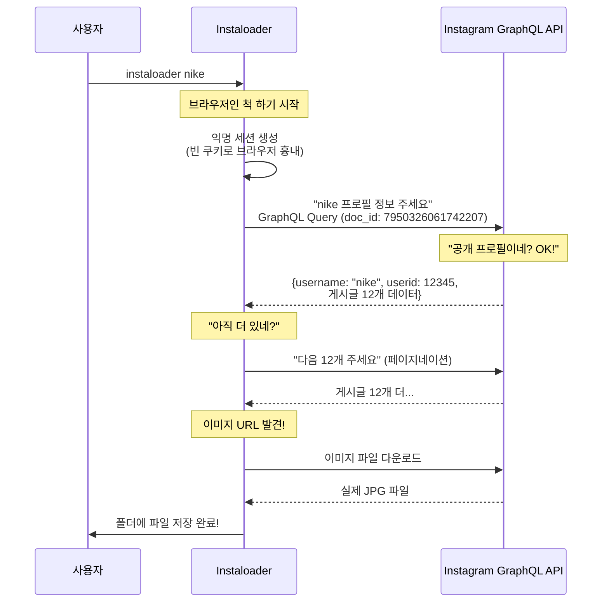
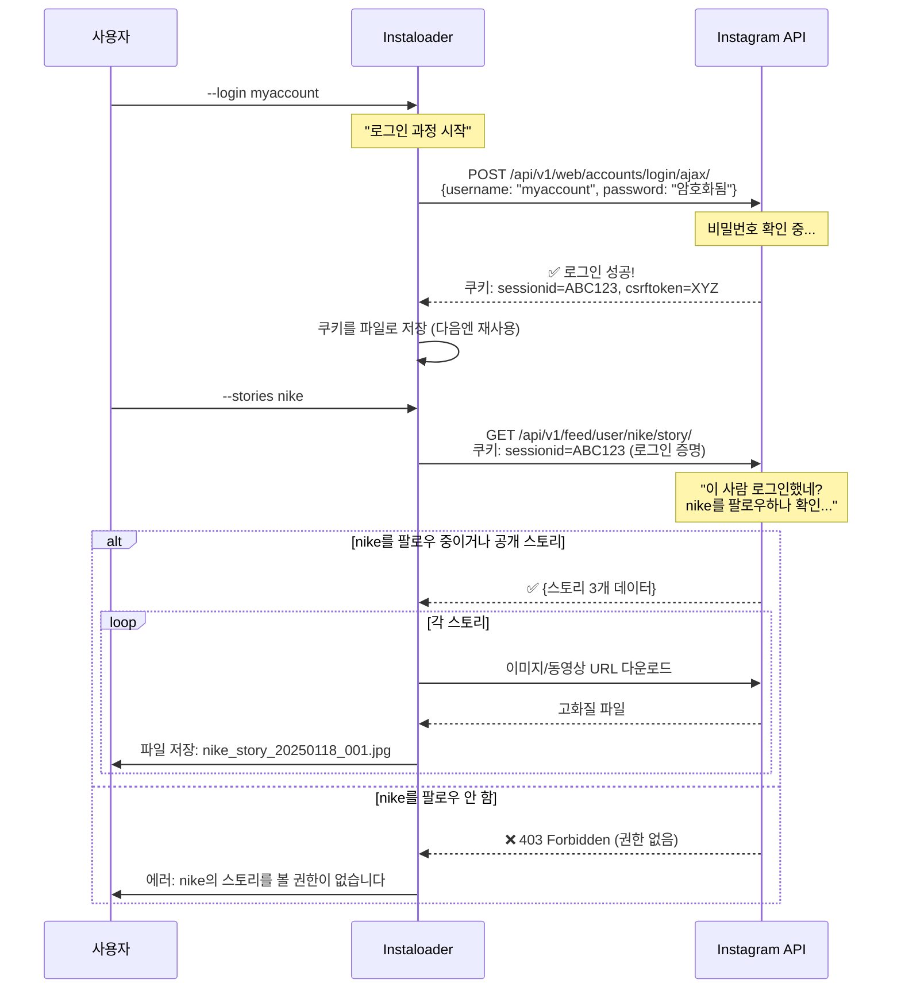
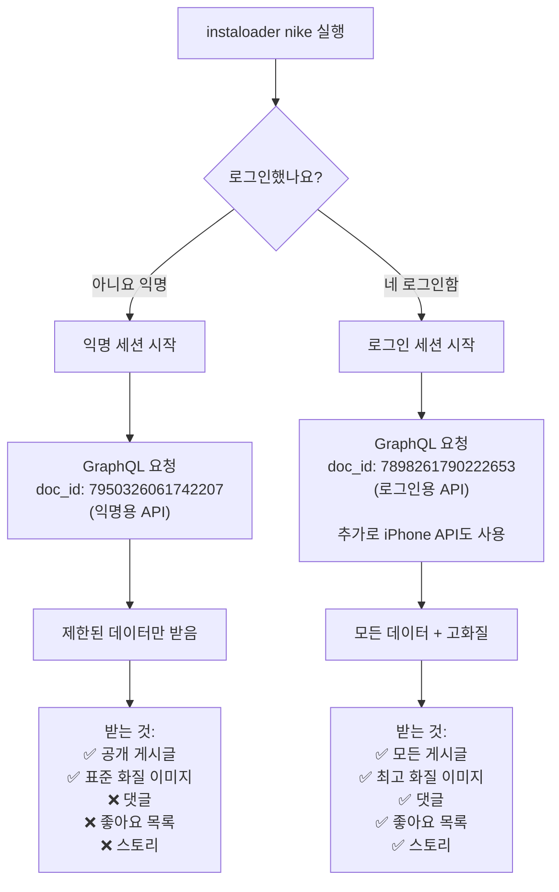
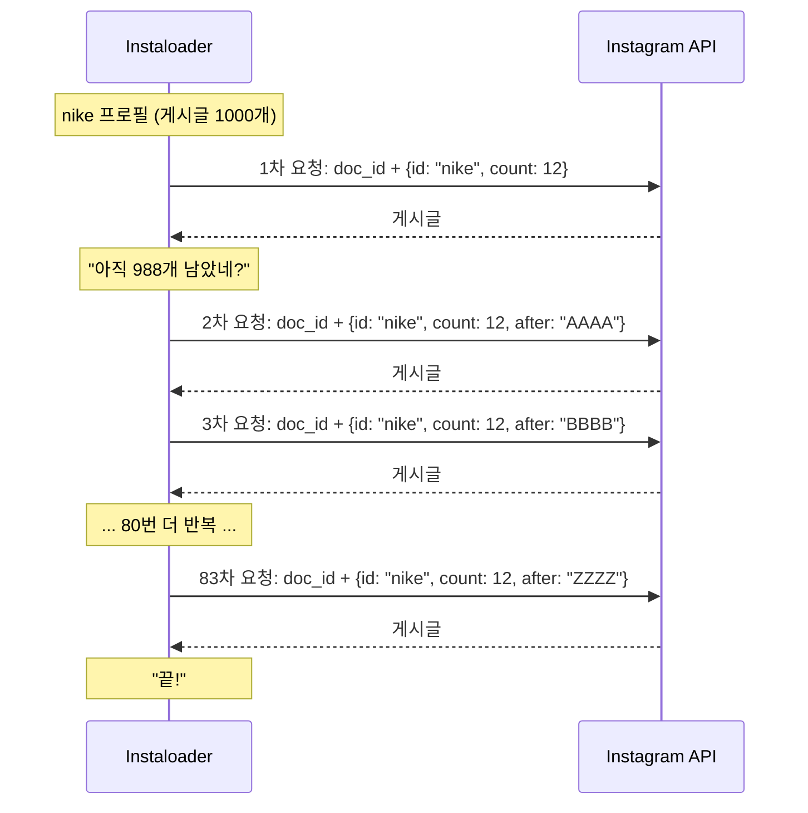
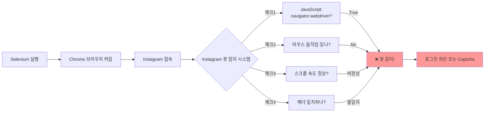
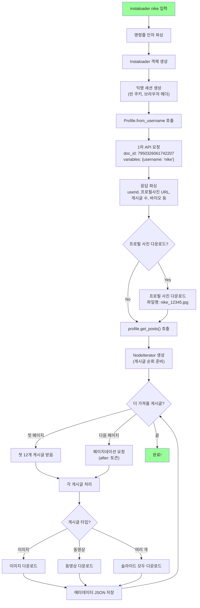
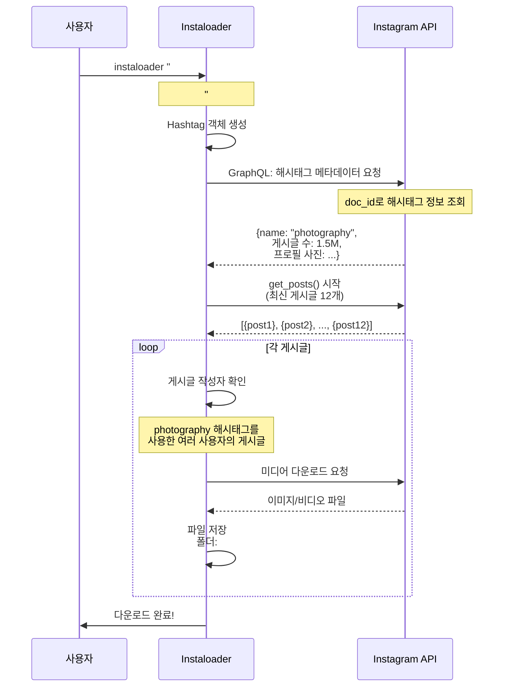
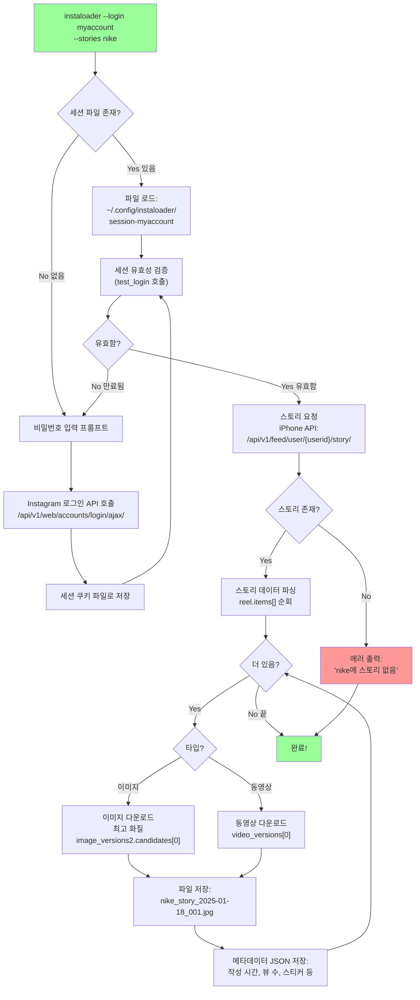
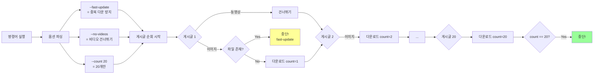

# Instaloader 기능별 심층 분석

## 목차
1. [익명 다운로드는 어떻게 가능한가?](#1-익명-다운로드는-어떻게-가능한가)
2. [로그인이 필수인 기능들과 그 이유](#2-로그인이-필수인-기능들과-그-이유)
3. [핵심 메커니즘: GraphQL API 활용](#3-핵심-메커니즘-graphql-api-활용)
4. [Selenium과의 차이점](#4-selenium과의-차이점)
5. [기능별 실행 플로우](#5-기능별-실행-플로우)

---

## 1. 익명 다운로드는 어떻게 가능한가?

### 1.1 기본 사용법의 비밀

```bash
# 로그인 없이 프로필 전체 다운로드
instaloader nike
```

**"어떻게 로그인 없이 다른 사람의 게시글, 이미지, 동영상을 모두 가져올 수 있을까?"**

#### 핵심 원리: Instagram은 사실 웹에 데이터를 공개하고 있음

우리가 웹 브라우저로 Instagram을 방문하면, 페이지가 보이기 위해서는 **뒤에서 데이터를 가져오는 작업**이 필요함.

예를 들어:
1. 크롬 브라우저로 `instagram.com/nike`를 방문함
2. 브라우저는 Instagram 서버에 "nike의 게시글 좀 보여줘"라고 요청함
3. Instagram은 **GraphQL API**라는 통로를 통해 데이터를 JSON 형태로 줌
4. 브라우저가 받은 JSON 데이터를 예쁘게 꾸며서 우리에게 보여줌

**Instaloader의 핵심 아이디어:**
> "브라우저가 하는 3번 과정을 우리가 직접 하면 되지 않을까?"

즉, HTML을 파싱할 필요 없이 **Instagram이 브라우저에게 주는 순수한 데이터를 직접 받아오는 것**임.



#### 코드 레벨로 보는 동작 원리

**1단계: 브라우저처럼 위장하기** ([instaloadercontext.py:201-211](../insta/instaloader/instaloadercontext.py#L201-L211))

```python
def get_anonymous_session(self) -> requests.Session:
    """익명 세션 = 로그인 안 한 브라우저 흉내내기"""
    session = requests.Session()  # HTTP 요청을 보낼 도구

    # Instagram이 기대하는 쿠키들을 빈 값으로 세팅
    # (실제 브라우저도 처음 방문하면 이렇게 빈 쿠키를 보냄)
    session.cookies.update({
        'sessionid': '',      # 로그인 ID: 비어있음 = 익명
        'mid': '',            # 머신 ID: 어떤 PC인지
        'ig_pr': '1',         # Instagram 설정값들
        'ig_vw': '1920',      # 화면 너비: 1920px
        'csrftoken': '',      # 보안 토큰
        'ds_user_id': ''      # 유저 ID: 비어있음 = 익명
    })

    # 브라우저처럼 보이는 헤더 추가
    session.headers.update(self._default_http_header(empty_session_only=True))
    return session
```

💡 **왜 이렇게 하면 될까?**
- Instagram은 공개 프로필의 경우 **익명 사용자에게도 데이터를 제공**함
- 웹사이트가 작동하려면 어쩔 수 없이 제공해야 함 (안 그러면 검색엔진도 못 읽음)
- 단, "너 봇 아니지?" 확인을 위해 **브라우저처럼 보여야 함**

**2단계: Instagram에게 데이터 요청하기** ([instaloadercontext.py:498-529](../insta/instaloader/instaloadercontext.py#L498-L529))

```python
def graphql_query(self, query_hash: str, variables: Dict[str, Any]) -> Dict[str, Any]:
    """
    GraphQL API 호출 = Instagram의 데이터 창고에 접근

    Args:
        query_hash: 어떤 데이터를 원하는지 (일종의 메뉴 번호)
        variables: 상세 조건 (예: 사용자 ID, 몇 개 가져올지)
    """
    # 요청 조건을 JSON 문자열로 변환
    variables_json = json.dumps(variables, separators=(',', ':'))

    # Instagram API 엔드포인트에 요청
    resp_json = self.get_json(
        'graphql/query',  # API 주소
        params={
            'query_hash': query_hash,      # 메뉴 번호
            'variables': variables_json     # 상세 주문
        },
        session=tmpsession
    )
    return resp_json  # Instagram이 준 데이터 반환
```

**3단계: 프로필의 게시글 가져오기** ([structures.py:1204-1236](../insta/instaloader/structures.py#L1204-L1236))

```python
def get_posts(self) -> NodeIterator[Post]:
    """프로필의 모든 게시글을 순회하며 가져오기"""

    # 현재 로그인 상태인지 확인
    logged_in = self._context.is_logged_in

    return NodeIterator(
        context=self._context,

        # 핵심: 로그인 여부에 따라 다른 데이터 경로 사용
        edge_extractor=(
            # 로그인했으면 이 경로에서 데이터 추출
            (lambda d: d["data"]["xdt_api__v1__feed__user_timeline_graphql_connection"])
            if logged_in
            # 익명이면 이 경로에서 데이터 추출
            else (lambda d: d["data"]["user"]["edge_owner_to_timeline_media"])
        ),

        query_variables={
            "data": {"count": 12, ...},  # 한 번에 12개씩 가져옴
            # 로그인: username으로 검색, 익명: userid로 검색
            **({"username": self.username} if logged_in else {"id": self.userid}),
        },

        # 💡 여기가 핵심!
        # 로그인 여부에 따라 다른 "메뉴 번호"(doc_id) 사용
        doc_id="7898261790222653" if logged_in else "7950326061742207",
        query_hash=None,

        # 익명일 때는 첫 페이지 데이터를 미리 받아옴
        first_data=(None if logged_in else self._metadata("edge_owner_to_timeline_media")),
    )
```

💡 **여기서 중요한 점:**
- `doc_id="7950326061742207"` 이라는 숫자는 Instagram이 정해놓은 **"익명 사용자용 프로필 게시글 조회 API"**의 식별번호임
- Instagram 개발자들이 만든 수백 개의 API 중 하나임
- 브라우저 개발자 도구(F12)로 네트워크 탭을 보면 이 요청들이 실제로 날아가는 걸 볼 수 있음

### 1.2 왜 차단되지 않을까?

#### 이유 1: 공식 API를 사용하기 때문

Instagram 입장에서는 **Instaloader의 요청과 브라우저의 요청을 구별할 수 없음**.

```
일반 브라우저:
  크롬 → Instagram API → "7950326061742207" 호출 → 데이터 받음

Instaloader:
  Python → Instagram API → "7950326061742207" 호출 → 데이터 받음
```

둘 다 똑같은 API를 호출하고 있음! 차이점은 받은 데이터를 어떻게 사용하느냐만 다를 뿐.

#### 이유 2: 속도 제한을 지킴 (Rate Limiting)

너무 빨리 요청하면 봇으로 의심받음. Instaloader는 이를 방지함:

```python
class RateController:
    """요청 속도 조절기 - 사람처럼 천천히 행동하기"""

    def wait_before_query(self, query_type: str):
        # 요청 전에 1~3초 랜덤하게 대기
        if self.sleep:
            time.sleep(random.uniform(1, 3))
        # 💡 일정한 간격이 아니라 랜덤! → 사람처럼 보임

    def handle_429(self, query_type: str):
        # Instagram이 "너무 많이 요청했어!"라고 하면
        self.error("Rate limit hit, waiting...")
        time.sleep(600)  # 10분 대기하고 다시 시도
```

💡 **현실 비유:**
- 나쁜 봇: 1초에 100번 클릭 → 즉시 차단
- Instaloader: 요청 → 2초 대기 → 요청 → 3초 대기 → ... (사람처럼 행동)

#### 이유 3: 브라우저처럼 보이는 헤더

```python
def _default_http_header(self) -> Dict[str, str]:
    """실제 브라우저가 보내는 것과 똑같은 헤더"""
    return {
        # 크롬 브라우저라고 주장
        'User-Agent': 'Mozilla/5.0 (X11; Linux x86_64) AppleWebKit/537.36 '
                      '(KHTML, like Gecko) Chrome/142.0.0.0 Safari/537.36',
        'Accept-Encoding': 'gzip, deflate',  # 압축 지원
        'Accept-Language': 'en-US,en;q=0.8', # 영어 선호
        'X-Instagram-AJAX': '1',              # Instagram 전용 헤더
        'X-Requested-With': 'XMLHttpRequest', # AJAX 요청임을 표시
        'Referer': 'https://www.instagram.com/', # 어디서 왔는지
    }
```

이 헤더들은 실제 크롬 브라우저가 보내는 것을 그대로 따라한 것임.

---

## 2. 로그인이 필수인 기능들과 그 이유

### 2.1 왜 어떤 건 로그인 없이 되고, 어떤 건 안 될까?

#### Instagram의 데이터 공개 정책

Instagram은 데이터를 3단계로 나눔:

```
1. 완전 공개 데이터
   - 공개 프로필의 게시글 목록
   - 게시글 이미지 (표준 화질)
   - 기본 프로필 정보 (이름, 바이오)
   → 익명으로 접근 가능 ✅

2. 제한적 공개 데이터
   - 댓글 내용
   - 좋아요 누른 사람 목록
   - 고화질 이미지
   → 로그인 필요 🔐

3. 완전 비공개 데이터
   - 스토리
   - 하이라이트
   - 비공개 계정 게시글
   - 저장한 게시물
   → 로그인 + 권한 필요 🔐🔐
```

### 2.2 로그인 필수 기능 목록과 이유

| 기능 | 명령어 | 왜 로그인이 필요할까? |
|------|--------|---------------------|
| **스토리 다운로드** | `--stories` | 스토리는 24시간 후 사라짐 → Instagram이 신원 확인하려고 함 |
| **비공개 프로필** | (자동) | 팔로워만 볼 수 있게 설정했으니 당연히 로그인 필요 |
| **하이라이트** | `--highlights` | 스토리 모음집 → 스토리와 동일한 정책 |
| **댓글 가져오기** | 자동 | 스팸 방지 목적, 익명 크롤링 막기 위함 |
| **좋아요 목록** | `post.get_likes()` | 프라이버시 보호 (누가 좋아요 눌렀는지는 민감 정보) |
| **저장된 게시물** | `--saved` | 본인만 볼 수 있는 개인 북마크 |
| **고화질 미디어** | (자동) | 로그인하면 iPhone API 사용 가능 → 원본 화질 제공 |

### 2.3 스토리 다운로드는 어떻게 작동할까?

```bash
instaloader --login myaccount --stories nike
```



#### 로그인 과정 상세 분석

**1단계: CSRF 토큰 받아오기**
```python
def login(self, user, passwd):
    """Instagram 로그인 과정"""

    # 먼저 Instagram 홈페이지 방문 (토큰 받기 위해)
    session.get('https://www.instagram.com/')

    # 받은 쿠키에서 CSRF 토큰 추출
    # CSRF = 보안 공격 방지용 임시 토큰
    csrf_token = session.cookies.get_dict()['csrftoken']
    session.headers.update({'X-CSRFToken': csrf_token})
```

💡 **CSRF 토큰이 뭘까?**
- 웹사이트가 "이 요청이 진짜 우리 사이트에서 온 거 맞아?"를 확인하는 방법
- 비유: 콘서트 입장 팔찌 (들어올 때 받고, 나갔다 들어올 때 확인)

**2단계: 비밀번호 암호화해서 보내기**
```python
    # 비밀번호를 그대로 보내면 위험! 암호화함
    # 형식: #PWD_INSTAGRAM_BROWSER:0:현재시각:비밀번호
    enc_password = '#PWD_INSTAGRAM_BROWSER:0:{}:{}'.format(
        int(datetime.now().timestamp()),  # 현재 시각 (초 단위)
        passwd
    )

    # 로그인 API 호출
    login = session.post(
        'https://www.instagram.com/api/v1/web/accounts/login/ajax/',
        data={
            'enc_password': enc_password,
            'username': user
        }
    )
```

**3단계: 세션 저장 (다음부터는 로그인 안 해도 됨)**
```python
    # 로그인 성공! sessionid 쿠키 받음
    # 이 쿠키만 있으면 "나 로그인한 사람이야" 증명 가능
    self._session = session
    self.username = user

    # 나중에 이 세션을 파일로 저장할 수 있음
    # → 다음 실행 때 비밀번호 다시 입력 안 해도 됨
```

💡 **세션 쿠키 = 영화관 팔찌**
- 한 번 표 끊으면 팔찌 받음
- 화장실 갔다 와도 팔찌만 보여주면 됨 (표 다시 안 끊어도 됨)
- Instaloader는 이 팔찌를 파일로 저장해서 다음에도 사용

### 2.4 익명 vs 로그인: 무엇이 다를까?



#### 코드에서 어떻게 분기될까?

**예시 1: 이미지 화질 선택**
```python
@property
def url(self) -> str:
    """게시글 이미지 URL 가져오기"""

    # 조건: 이미지 + 로그인함 + iPhone API 지원
    if (self.typename == "GraphImage" and
        self._context.iphone_support and
        self._context.is_logged_in):
        try:
            # 로그인했으면 iPhone API에서 최고 화질 가져옴
            # image_versions2.candidates[0] = 가장 높은 해상도
            return self._iphone_struct['image_versions2']['candidates'][0]['url']
        except:
            pass

    # 익명이면 표준 화질 (display_url)
    # 브라우저에서 보이는 것과 같은 화질
    return self._field('display_url')
```

💡 **비유:**
- 익명: 유튜브 480p 화질 (공짜)
- 로그인: 유튜브 4K 화질 (프리미엄 멤버십)

**예시 2: 댓글 가져오기**
```python
def get_comments(self):
    """게시글의 댓글 가져오기"""

    # 첫 번째 체크: 로그인 안 했으면 바로 에러
    if not self._context.is_logged_in:
        raise LoginRequiredException("댓글을 보려면 로그인이 필요합니다")

    # 로그인했으면 댓글 API 호출...
```

**예시 3: 비공개 프로필 체크**
```python
if profile.is_private:
    # 비공개 프로필 발견!

    if not self.context.is_logged_in:
        # 로그인 안 했으면 볼 수 없음
        raise LoginRequiredException("이 프로필은 로그인이 필요합니다")

    # 로그인은 했는데...
    if not profile.followed_by_viewer and self.context.username != profile.username:
        # 팔로우 안 했고 본인 계정도 아니면 볼 수 없음
        raise PrivateProfileNotFollowedException("비공개 계정이라 팔로우가 필요합니다")
```

💡 **체크 순서:**
1. 공개 프로필인가? → 익명도 OK
2. 비공개인데 로그인 안 함? → ❌
3. 로그인했는데 팔로우 안 함? → ❌
4. 팔로우함 또는 본인 계정? → ✅

---

## 3. 핵심 메커니즘: GraphQL API 활용

### 3.1 GraphQL이 뭘까? (쉽게 설명)

#### 전통적인 REST API vs GraphQL

**REST API (옛날 방식):**
```
사용자 정보를 얻으려면:
GET /api/user/123         → {id, name, email, phone, address, ...}

게시글을 얻으려면:
GET /api/user/123/posts   → [{post1}, {post2}, ...]

댓글을 얻으려면:
GET /api/post/456/comments → [{comment1}, comment2}, ...]
```
→ 3번의 요청 필요, 필요 없는 데이터도 많이 받음

**GraphQL (새로운 방식, Instagram이 사용):**
```
한 번에 원하는 것만 요청:
POST /graphql/query
{
  user(id: 123) {
    name
    posts(first: 10) {
      image_url
      comments {
        text
      }
    }
  }
}
```
→ 1번 요청으로 끝, 필요한 것만 정확히 받음

💡 **현실 비유:**
- REST API = 식당에서 세트 메뉴만 주문 가능 (A세트: 햄버거+콜라+감자튀김, 싫어도 다 받음)
- GraphQL = 원하는 것만 골라담기 (햄버거만, 콜라만, 감자튀김 빼고 등)

### 3.2 Instagram의 GraphQL 구조

Instagram은 수백 개의 "미리 만들어진 쿼리"를 제공함. 각각에 고유 번호(doc_id)가 있음:

```python
# Instagram이 정해놓은 쿼리 목록 (일부)

"7950326061742207"  # 익명으로 프로필 게시글 조회
"7898261790222653"  # 로그인해서 프로필 게시글 조회
"8845758582119845"  # 특정 게시글 상세 정보
"7845543455542541"  # 릴스 조회
"f883d95537fbcd400f466f63d42bd8a1"  # 저장한 게시물
```

💡 **비유: 패스트푸드 메뉴판**
- 1번: 불고기버거 세트
- 2번: 치킨버거 세트
- 3번: 새우버거 세트
- doc_id는 이 "메뉴 번호"와 같음

### 3.3 실제 요청 과정 보기

**Python 코드가 보내는 요청:**
```python
def doc_id_graphql_query(self, doc_id: str, variables: Dict[str, Any]) -> Dict[str, Any]:
    """
    doc_id를 사용한 GraphQL 쿼리

    Args:
        doc_id: 어떤 쿼리인지 (메뉴 번호)
        variables: 상세 옵션 (사이즈, 맵기 등)
    """
    # 옵션을 JSON 문자열로 변환
    variables_json = json.dumps(variables, separators=(',', ':'))

    # Instagram API에 POST 요청
    resp_json = self.get_json(
        'graphql/query',  # Instagram API 주소
        params={
            'variables': variables_json,     # 상세 옵션
            'doc_id': doc_id,                # 메뉴 번호
            'server_timestamps': 'true'      # 시간 정보 포함
        },
        use_post=True  # POST 방식 사용
    )
    return resp_json
```

**실제 HTTP 요청 (네트워크로 날아가는 것):**
```
POST https://www.instagram.com/graphql/query
Content-Type: application/x-www-form-urlencoded
Cookie: sessionid=...; csrftoken=...;
User-Agent: Mozilla/5.0 ...

doc_id=7950326061742207
&variables={"id":"25025320","count":12}
&server_timestamps=true
```

**Instagram이 응답하는 데이터:**
```json
{
  "data": {
    "user": {
      "id": "25025320",
      "username": "nike",
      "full_name": "Nike",
      "edge_owner_to_timeline_media": {
        "count": 1234,
        "edges": [
          {
            "node": {
              "shortcode": "ABC123xyz",
              "display_url": "https://scontent.cdninstagram.com/.../photo.jpg",
              "is_video": false,
              "taken_at_timestamp": 1705622400,
              "edge_liked_by": {"count": 52341},
              "edge_media_to_caption": {
                "edges": [{"node": {"text": "Just Do It"}}]
              }
            }
          }
          // ... 11개 더
        ],
        "page_info": {
          "has_next_page": true,
          "end_cursor": "QVFBa... (다음 페이지 토큰)"
        }
      }
    }
  }
}
```

### 3.4 페이지네이션: 게시글 1000개를 어떻게 다 가져올까?

Instagram은 한 번에 12개씩만 줌. 1000개를 받으려면 83번 요청해야 함.



**코드로 보는 페이지네이션:**
```python
class NodeIterator:
    """게시글을 하나씩 순회하는 반복자"""

    def __iter__(self):
        # 첫 페이지 요청
        data = self._query()  # Instagram API 호출

        # 첫 페이지의 게시글들 반환
        for edge in data['edges']:
            yield self._node_wrapper(edge['node'])

        # 다음 페이지가 있는 동안 계속 반복
        while data['page_info']['has_next_page']:
            # 다음 페이지 토큰을 변수에 추가
            self._query_variables['after'] = data['page_info']['end_cursor']

            # 다음 페이지 요청
            data = self._query()

            # 받은 게시글들 반환
            for edge in data['edges']:
                yield self._node_wrapper(edge['node'])

        # has_next_page가 false면 루프 종료 → 끝!
```

💡 **비유: 도서관에서 책 빌리기**
- 한 번에 12권씩만 대출 가능
- 1권째~12권째: 첫 방문, "다음 12권 예약" 쪽지 받음
- 13권째~24권째: 쪽지 제시, 또 "다음 12권 예약" 쪽지 받음
- 반복...
- 마지막 책: "더 이상 없음" 쪽지 받음

---

## 4. Selenium과의 차이점

### 4.1 왜 Selenium으로 하면 막힐까?

#### Selenium의 접근 방식



**Selenium이 걸리는 이유들:**

**1. navigator.webdriver 속성**
```javascript
// Instagram이 실행하는 JavaScript 코드
if (navigator.webdriver === true) {
    // "어? 이 사람 Selenium 쓰네?"
    console.log("봇 감지!");
    showCaptcha();
}
```

실제 브라우저: `navigator.webdriver = undefined`
Selenium: `navigator.webdriver = true` ← 이게 문제!

**2. 비정상적 행동 패턴**
```python
# Selenium 코드 예시
driver.get("https://instagram.com/nike")
time.sleep(0.1)  # 너무 짧음!
driver.find_element_by_class_name("post").click()
time.sleep(0.1)  # 너무 짧음!
driver.find_element_by_class_name("next").click()
# 0.1초마다 클릭 → 사람이 아님!
```

**3. 마우스 움직임 없음**
- 실제 사람: 마우스 움직임 → 클릭 → 스크롤 (자연스러움)
- Selenium: 클릭만 일어남 (마우스 궤적 없음)

**4. 리소스 낭비**
- Selenium은 전체 브라우저를 실행 → 메모리 500MB+
- JavaScript, CSS, 이미지 전부 렌더링 → 느림
- 우리는 JSON 데이터만 필요한데...

### 4.2 Instaloader는 어떻게 다를까?

#### 핵심 차이점

| 관점 | Selenium | Instaloader |
|------|----------|-------------|
| **무엇을 실행?** | Chrome/Firefox 브라우저 전체 | Python HTTP 요청만 |
| **데이터 수집 방법** | HTML 파싱 (BeautifulSoup 등) | JSON 직접 받기 |
| **Instagram 입장** | "브라우저 + 봇 = 의심" | "그냥 브라우저처럼 보임" |
| **속도** | 게시글 1개당 5~10초 | 게시글 1개당 0.5초 |
| **메모리** | 500MB+ | 50MB |
| **차단 위험** | 높음 ⚠️ | 낮음 ✅ |

#### Instaloader의 우회 전략

**전략 1: 브라우저를 실행하지 않음**
```python
# Selenium (브라우저 필요)
from selenium import webdriver
driver = webdriver.Chrome()  # Chrome 실행 (무거움)
driver.get("https://instagram.com/nike")

# Instaloader (브라우저 불필요)
import requests
session = requests.Session()  # 가벼움
response = session.get("https://instagram.com/graphql/query?...")
```

💡 **비유:**
- Selenium = 자동차 전체를 운전해서 마트 가기
- Instaloader = 전화로 배달 주문하기 (더 빠르고 효율적)

**전략 2: 실제 브라우저의 헤더 완벽 복사**
```python
def _default_http_header(self) -> Dict[str, str]:
    """Chrome 브라우저가 보내는 것과 100% 동일한 헤더"""
    return {
        # 크롬 142 버전이라고 주장
        'User-Agent': 'Mozilla/5.0 (X11; Linux x86_64) '
                      'AppleWebKit/537.36 (KHTML, like Gecko) '
                      'Chrome/142.0.0.0 Safari/537.36',

        # 브라우저가 지원하는 압축 방식
        'Accept-Encoding': 'gzip, deflate',

        # 선호하는 언어
        'Accept-Language': 'en-US,en;q=0.8',

        # Instagram 전용 헤더들
        'X-Instagram-AJAX': '1',
        'X-Requested-With': 'XMLHttpRequest',

        # 어디서 왔는지
        'Referer': 'https://www.instagram.com/',

        # ... 실제 브라우저의 모든 헤더 포함
    }
```

이 헤더들은 실제로 크롬 개발자 도구(F12)에서 복사한 것임!

**전략 3: 사람처럼 행동하기**
```python
def do_sleep(self):
    """사람처럼 불규칙하게 대기"""
    if self.sleep:
        # 1~3초 사이 랜덤 대기
        wait_time = random.uniform(1, 3)
        time.sleep(wait_time)

# 사용 예:
게시글 1 다운로드 → 2.3초 대기 ✅
게시글 2 다운로드 → 1.7초 대기 ✅
게시글 3 다운로드 → 2.8초 대기 ✅
# 불규칙 → 사람처럼 보임!

# Selenium (나쁜 예):
게시글 1 다운로드 → 1초 대기 ❌
게시글 2 다운로드 → 1초 대기 ❌
게시글 3 다운로드 → 1초 대기 ❌
# 너무 규칙적 → 봇으로 보임!
```

**전략 4: 세션 재사용 (로그인 반복 안 함)**
```python
def save_session_to_file(self, sessionfile):
    """로그인 쿠키를 파일로 저장"""
    pickle.dump(self.save_session(), sessionfile)

# 첫 실행:
instaloader --login myaccount --stories nike
# → 비밀번호 입력, 세션 파일 저장 (~/.config/instaloader/session-myaccount)

# 다음 실행 (몇 주 후):
instaloader --login myaccount --stories nike
# → 비밀번호 입력 안 함! 저장된 세션 재사용
```

Selenium은 매번 로그인 → 의심받음
Instaloader는 한 번 로그인 → 오래 사용 → 정상 사용자로 보임

**전략 5: 에러 자동 처리**
```python
def get_json(self, path, params):
    """JSON 받기 (에러 자동 처리)"""
    try:
        # API 요청
        response = session.get(url)
        return response.json()

    except TooManyRequestsException:  # 429 에러
        # Instagram: "너무 많이 요청했어!"
        print("요청 한도 초과, 10분 대기 중...")
        time.sleep(600)  # 10분 대기
        return self.get_json(path, params)  # 다시 시도

    except ConnectionException:  # 네트워크 오류
        # 최대 3번까지 재시도
        if attempt < 3:
            time.sleep(5)
            return self.get_json(path, params)
```

Selenium은 에러나면 멈춤 → 사람이 직접 처리
Instaloader는 에러나면 자동으로 대기/재시도 → 안정적

### 4.3 비교 요약

```mermaid
flowchart TD
    subgraph Selenium
        S1[Chrome 실행 500MB] --> S2[Instagram 접속]
        S2 --> S3[JavaScript 실행]
        S3 --> S4[HTML 렌더링]
        S4 --> S5[BeautifulSoup 파싱]
        S5 --> S6[❌ navigator.webdriver 감지]
        S6 --> S7[차단!]
        style S7 fill:#f99
    end

    subgraph Instaloader
        I1[requests 모듈 50MB] --> I2[GraphQL API 호출]
        I2 --> I3[JSON 직접 받음]
        I3 --> I4[✅ 브라우저처럼 보임]
        I4 --> I5[데이터 저장]
        style I5 fill:#9f9
    end
```



---

## 5. 기능별 실행 플로우

### 5.1 기본 프로필 다운로드 상세 플로우

```bash
instaloader nike
```

이 한 줄 명령어가 내부에서 어떻게 작동하는지 단계별로 보자:



**코드로 보는 실행 과정:**

```python
# 1단계: 초기화
loader = Instaloader(
    download_comments=False,  # 댓글 다운 안 함 (익명이라 불가능)
    download_geotags=False,   # 위치 정보 안 함
    save_metadata=True        # JSON 메타데이터는 저장
)

# 2단계: 프로필 객체 생성
profile = Profile.from_username(loader.context, "nike")
# 내부적으로:
#   - GraphQL API 호출 (doc_id: 7950326061742207)
#   - Instagram이 응답: {userid: 12345, username: "nike", ...}

# 3단계: 프로필 사진 다운로드
loader.download_profilepic(profile)
# 파일 생성: ./nike/2025-01-18_12-34-56_UTC_profile_pic.jpg

# 4단계: 게시글 순회
for post in profile.get_posts():
    # 각 게시글마다:

    # 4-1: 게시글 타입 확인
    if post.typename == "GraphImage":
        # 단일 이미지
        url = post.url  # 이미지 URL
        loader.download_pic(filename, url, ...)

    elif post.typename == "GraphVideo":
        # 동영상
        video_url = post.video_url
        loader.download_pic(filename, video_url, ...)

    elif post.typename == "GraphSidecar":
        # 여러 개 (슬라이드)
        for i, sidecar_node in enumerate(post.get_sidecar_nodes()):
            url = sidecar_node.display_url
            loader.download_pic(f"{filename}_{i+1}", url, ...)

    # 4-2: 메타데이터 저장 (JSON)
    metadata = {
        "shortcode": post.shortcode,
        "caption": post.caption,
        "likes": post.likes,
        "date": post.date.isoformat(),
        ...
    }
    with open(f"{filename}.json", "w") as f:
        json.dump(metadata, f)

    # 4-3: 사람처럼 대기
    loader.context.do_sleep()  # 1~3초 랜덤 대기
```

**생성되는 파일 구조:**
```
./nike/
├── 2025-01-18_12-34-56_UTC_profile_pic.jpg
├── 2025-01-18_10-20-30_UTC.jpg          (게시글 1)
├── 2025-01-18_10-20-30_UTC.json         (메타데이터 1)
├── 2025-01-17_15-40-22_UTC.mp4          (게시글 2, 동영상)
├── 2025-01-17_15-40-22_UTC.json         (메타데이터 2)
├── 2025-01-16_08-15-10_UTC_1.jpg        (게시글 3, 슬라이드 1번)
├── 2025-01-16_08-15-10_UTC_2.jpg        (게시글 3, 슬라이드 2번)
├── 2025-01-16_08-15-10_UTC_3.jpg        (게시글 3, 슬라이드 3번)
└── 2025-01-16_08-15-10_UTC.json         (메타데이터 3)
```

### 5.2 해시태그 다운로드

```bash
instaloader "#photography"
```



**파일 구조:**
```
./#photography/
├── user123_2025-01-18_15-20-30_UTC.jpg
├── user123_2025-01-18_15-20-30_UTC.json
├── photographer_2025-01-18_14-10-15_UTC.jpg
├── photographer_2025-01-18_14-10-15_UTC.json
├── artist_2025-01-18_13-05-42_UTC.jpg
├── artist_2025-01-18_13-05-42_UTC.json
...
```

### 5.3 스토리 다운로드 (로그인 필요)

```bash
instaloader --login myaccount --stories nike
```



**핵심 코드:**
```python
def download_stories(self, userids: List[int], filename_target: str):
    """스토리 다운로드 - 로그인 필수"""

    # 1. 로그인 체크
    if not self.context.is_logged_in:
        raise LoginRequiredException("스토리는 로그인이 필요합니다")

    # 2. 각 사용자별 스토리 가져오기
    for userid in userids:
        # iPhone API 사용 (웹 API보다 데이터 많음)
        story_data = self.context.get_iphone_json(
            path=f'api/v1/feed/user/{userid}/story/',
            params={}
        )

        # 3. 스토리 없으면 건너뛰기
        if not story_data.get('reel'):
            self.context.log(f"{filename_target}에 스토리 없음")
            continue

        # 4. 각 스토리 아이템 처리
        for item in story_data['reel']['items']:
            story_item = StoryItem(self.context, item)

            # 5. 파일명 생성 (시간 포함)
            date_str = story_item.date.strftime('%Y-%m-%d_%H-%M-%S')
            filename = f"{filename_target}_story_{date_str}"

            # 6. 다운로드
            if story_item.is_video:
                # 동영상: 가장 높은 화질
                url = story_item.video_versions[0]['url']
                self.download_pic(filename, url, story_item.date)
            else:
                # 이미지: 가장 높은 해상도
                url = story_item.image_versions2['candidates'][0]['url']
                self.download_pic(filename, url, story_item.date)

            # 7. 메타데이터 저장
            metadata = {
                "date": story_item.date.isoformat(),
                "expiring_at": story_item.expiring_at.isoformat(),
                "view_count": story_item.view_count,
                "has_audio": story_item.has_audio if story_item.is_video else None,
                ...
            }
            self.save_metadata(metadata, filename)
```

### 5.4 옵션 활용 예시

#### 예시 1: 최근 20개만, 비디오 제외

```bash
instaloader --fast-update --no-videos --count 20 nike
```



**코드 로직:**
```python
def download_profile(self, profile, post_filter=None):
    """프로필 다운로드 (옵션 적용)"""

    downloaded_count = 0  # 다운로드한 개수
    max_count = 20        # --count 20
    no_videos = True      # --no-videos
    fast_update = True    # --fast-update

    for post in profile.get_posts():
        # 옵션 1: count 체크
        if downloaded_count >= max_count:
            print(f"{max_count}개 다운로드 완료, 중단")
            break

        # 옵션 2: 비디오 필터
        if no_videos and post.is_video:
            print(f"비디오 건너뛰기: {post.shortcode}")
            continue

        # 파일명 생성
        target_file = f"{post.date}_{post.shortcode}.jpg"

        # 옵션 3: fast_update (이미 있으면 중단)
        if fast_update and os.path.exists(target_file):
            print(f"이미 다운로드됨: {target_file}, 중단")
            break  # 이미 있으면 더 이상 다운로드 안 함

        # 다운로드 실행
        self.download_post(post, target="nike")
        downloaded_count += 1

        # 사람처럼 대기
        self.context.do_sleep()
```

💡 **fast-update의 동작 원리:**
- Instagram 게시글은 **최신순**으로 정렬됨
- 이미 다운로드한 파일을 만나면 = "여기까지는 전에 받았음"
- 더 이상 진행할 필요 없음 → 중단

#### 예시 2: 특정 기간만 다운로드

```bash
# 코드로 필터 적용 (CLI에는 직접 옵션 없음)
from datetime import datetime

loader = Instaloader()
profile = Profile.from_username(loader.context, "nike")

# 2024년 1월의 게시글만
for post in profile.get_posts():
    if post.date.year == 2024 and post.date.month == 1:
        loader.download_post(post, target="nike")
    elif post.date.year < 2024:
        # 2024년 이전이면 중단 (최신순이니까)
        break
```

---

## 6. 핵심 정리

### 6.1 Instaloader가 강력한 5가지 이유

#### 1. 공식 API 활용 → 안정성

```python
# Instaloader의 접근
requests.get('https://www.instagram.com/graphql/query?doc_id=...')
# ↑ Instagram이 공식적으로 제공하는 API

# Selenium의 접근
driver.get('https://www.instagram.com/nike/')
driver.find_element_by_xpath('//div[@class="...")
# ↑ HTML 구조가 바뀌면 작동 안 함
```

💡 **비유:**
- Instaloader = 정문으로 들어감 (공식 입구)
- Selenium = 창문으로 들어감 (비공식, 막힐 수 있음)

#### 2. 지능적 인증 관리 → 편리함

```python
# 첫 실행
instaloader --login myaccount
# 비밀번호 입력: ****
# 세션 저장됨!

# 다음 실행 (며칠 후)
instaloader --login myaccount
# 비밀번호 입력 없음!
# 자동으로 저장된 세션 사용

# 세션 유효 기간: 약 90일
# 만료되면 자동으로 재로그인 요청
```

#### 3. Rate Limiting 내장 → 차단 방지

```python
# 429 에러 자동 처리
try:
    data = get_json(...)
except TooManyRequestsException:
    print("요청 한도 초과, 10분 대기...")
    time.sleep(600)  # 자동 대기
    data = get_json(...)  # 자동 재시도

# 랜덤 대기로 봇 탐지 회피
time.sleep(random.uniform(1, 3))  # 1~3초 랜덤
```

#### 4. 고화질 미디어 → 품질

```python
# 익명: 표준 화질 (웹에서 보이는 것)
url = post.display_url
# 해상도: 1080x1080

# 로그인: 최고 화질 (iPhone API)
url = post._iphone_struct['image_versions2']['candidates'][0]['url']
# 해상도: 4000x4000 (원본!)
```

💡 **비교:**
- 익명 = YouTube 720p
- 로그인 = YouTube 4K

#### 5. 안정적 에러 핸들링 → 무인 운영 가능

```python
# 에러가 나도 계속 진행
for post in profile.get_posts():
    try:
        loader.download_post(post, target="nike")
    except Exception as e:
        # 에러 로그에 기록하고 다음으로
        loader.context.error(f"에러: {e}")
        continue  # 다음 게시글 계속 진행

# 프로그램 종료 시 모든 에러 요약 출력
loader.context.close()
# "3개의 에러 발생:
#  1. 게시글 ABC123: 네트워크 타임아웃
#  2. 게시글 DEF456: 파일 저장 실패
#  3. 게시글 GHI789: 동영상 URL 없음"
```

→ 1000개 게시글 다운로드 중 3개 실패해도 나머지 997개는 성공!

### 6.2 Selenium이 실패하는 3가지 이유

#### 1. 봇 탐지 시스템에 걸림

```javascript
// Instagram이 실행하는 봇 탐지 코드
if (navigator.webdriver) {
    // Selenium 감지!
    blockUser();
}

if (noMouseMovement() && fastClicking()) {
    // 비정상 행동 감지!
    showCaptcha();
}
```

#### 2. 너무 복잡하고 무거움

```
Selenium 실행 과정:
1. Chrome 브라우저 실행 (500MB 메모리)
2. JavaScript 엔진 초기화
3. HTML 다운로드
4. CSS 다운로드
5. 이미지 렌더링
6. JavaScript 실행
7. DOM 생성
8. BeautifulSoup로 파싱
9. 데이터 추출
→ 총 5~10초

Instaloader 실행 과정:
1. HTTP 요청
2. JSON 받기
3. 데이터 추출
→ 총 0.5초
```

#### 3. 유지보수 어려움

```html
<!-- Instagram이 HTML 구조 변경 -->
<!-- 변경 전 -->
<div class="post-container">
  
</div>

<!-- 변경 후 -->
<div class="content-wrapper">
  <picture class="media-element">
    
  </picture>
</div>
```

```python
# Selenium 코드 (깨짐)
img = driver.find_element_by_class_name("post-image")
# ❌ 에러: 클래스명이 바뀌어서 못 찾음!

# Instaloader (영향 없음)
data = get_json(..., doc_id="7950326061742207")
url = data['data']['user']['edge_owner_to_timeline_media']['edges'][0]['node']['display_url']
# ✅ JSON 구조는 안 바뀜!
```

### 6.3 언제 로그인이 필요한가?

| 기능 | 익명 (로그인 없음) | 로그인 |
|------|:-----------------:|:------:|
| **공개 프로필 게시글** | ✅ 가능 | ✅ 가능 (더 빠름) |
| **비공개 프로필** | ❌ 불가능 | ✅ 가능 (팔로우 시) |
| **스토리** | ❌ 불가능 | ✅ 가능 |
| **하이라이트** | ❌ 불가능 | ✅ 가능 |
| **댓글** | ❌ 불가능 | ✅ 가능 |
| **좋아요 목록** | ❌ 불가능 | ✅ 가능 |
| **고화질 미디어** | ❌ 표준 화질만 | ✅ 최고 화질 |
| **저장된 게시물** | ❌ 불가능 | ✅ 가능 (본인만) |
| **릴스** | ✅ 가능 | ✅ 가능 |
| **해시태그** | ✅ 가능 | ✅ 가능 |
| **위치 태그** | ✅ 가능 | ✅ 가능 |

💡 **간단 규칙:**
- **공개 정보** → 익명 OK
- **개인 정보, 일시적 콘텐츠** → 로그인 필요
- **최고 품질** → 로그인 필요

---

## 참고: 주요 Doc ID 목록

Instagram API의 "메뉴판"이라고 생각하면 됨:

```python
# 프로필 관련
ANONYMOUS_PROFILE_POSTS = "7950326061742207"  # 익명으로 게시글 보기
LOGGED_IN_PROFILE_POSTS = "7898261790222653"  # 로그인해서 게시글 보기
PROFILE_METADATA = "7c16654f22c819fb63d1183034a5162f"  # 프로필 정보

# 게시글 관련
POST_DETAIL = "8845758582119845"  # 게시글 상세 정보
REELS = "7845543455542541"        # 릴스 목록
SAVED_POSTS = "f883d95537fbcd400f466f63d42bd8a1"  # 저장한 게시물
TAGGED_POSTS = "e31a871f7301132ceaab56507a66bbb7"  # 태그된 게시물

# 인증 관련
LOGIN_TEST = "d6f4427fbe92d846298cf93df0b937d3"  # 로그인 상태 확인
```

💡 **이 숫자들은 Instagram이 API를 업데이트하면 바뀔 수 있음**
- Instaloader 개발자들이 주기적으로 업데이트함
- 만약 갑자기 안 되면 → Instaloader 최신 버전으로 업데이트 필요

---

## 마치며

이제 `instaloader nike` 같은 간단한 명령어 뒤에서 벌어지는 복잡한 과정을 완전히 이해했을 것임!

핵심 요약:
1. **Instagram의 공개 GraphQL API를 직접 호출**함 (브라우저 중간 단계 건너뛰기)
2. **브라우저처럼 위장**하여 차단 회피함
3. **로그인은 선택사항**이지만, 하면 더 많은 데이터와 고화질을 받을 수 있음
4. **Selenium보다 10배 빠르고 안정적**임
